# Obsah:

- *Budete schopni vysvětlit, jaká je topologie vícevrstvé neuronové sítě.*
- *Dozvíte se, jak probíhá dopředné (feedforward) šíření signálu.*
- *Dozvíte se, jaký je princip adaptačního algoritmu backpropagation.*

#### Topologie vícevrstvé sítě

Vícevrstvá neuronová síť je tvořena minimálně třemi vrstvami neuronů: vstupní, výstupní a alespoň jednou vnitřní vrstvou. Vždy mezi dvěma sousedními vrstvami se pak nachází tzv. úplné propojení neuronů, tedy každý neuron nižší vrstvy je spojen se všemi neurony vrstvy vyšší.

Bias odpovídá váhové hodnotě přiřazené spojení mezi daným neuronem a fiktivním neuronem, jehož aktivace je vždy 1.

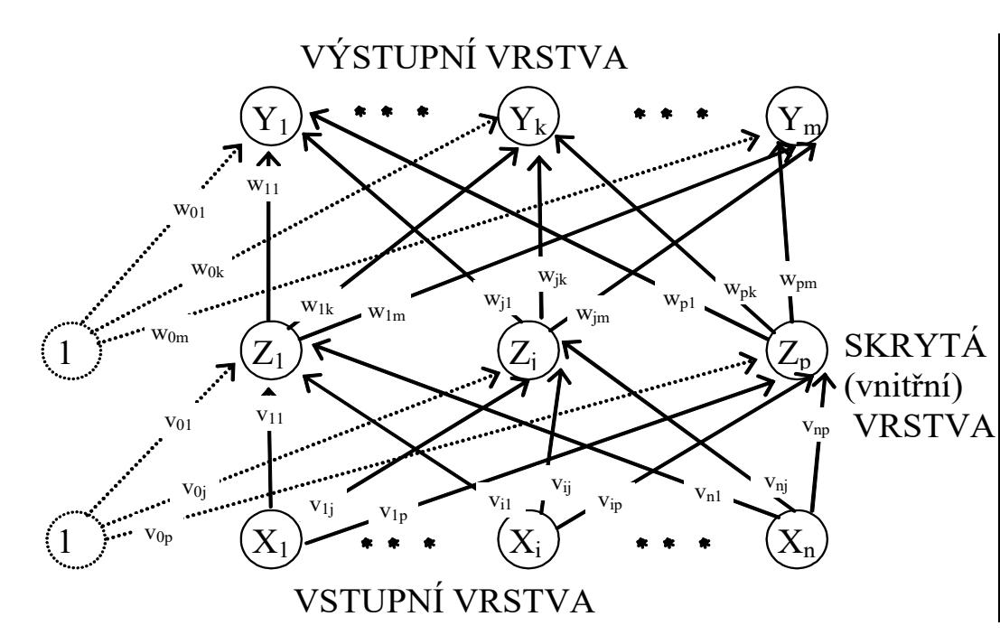

# Standardní metoda backpropagation

Adaptační algoritmus **zpětného šíření chyby**  (*backpropagation*).

#### **Samotný algoritmus obsahuje tři etapy**:

- dopředné (*feedforward*) šíření vstupního signálu tréninkového vzoru
- zpětné šíření chyby
- aktualizace váhových hodnot na spojeních

#### Dopředného (feedforward) šíření signálu

- Během dopředného šíření signálu obdrží každý **neuron ve vstupní vrstvě**  $(X_i, i = 1,..., n)$  **vstupní signál**  $(x_i)$  a zprostředkuje jeho **přenos** ke všem **neuronům vnitřní vrstvy**  $(Z_1, ..., Z_p)$ .
- Každý **neuron ve vnitřní vrstvě** vypočítá svou **aktivaci** ( $z_j$ ) a **pošle** tento signál všem **neuronům ve výstupní vrstvě**.
- Každý neuron ve výstupní vrstvě vypočítá svou aktivaci (yk), která odpovídá jeho skutečnému výstupu (k. neuronu) po předložení vstupního vzoru.
- V podstatě tímto způsobem získáme odezvu neuronové sítě na vstupní podnět daný excitací neuronů vstupní vrstvy.

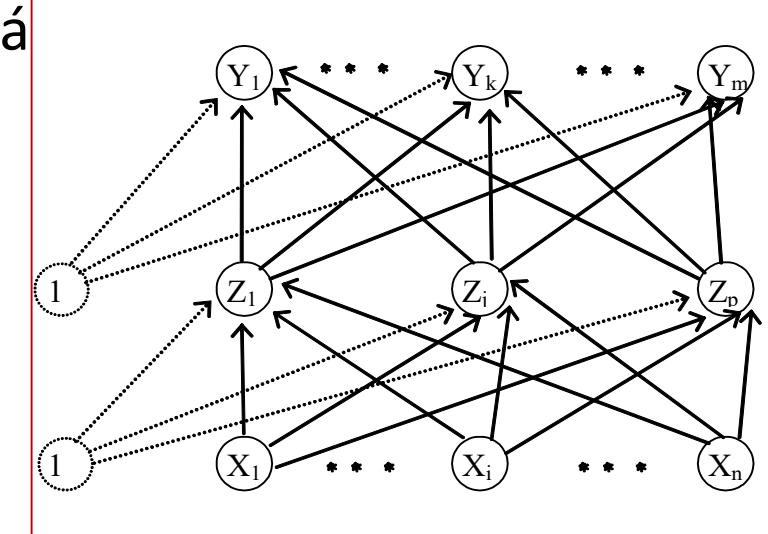

## Dopředného (*feedforward)* šíření signálu

Takovým způsobem probíhá **šíření signálů i v biologickém systému**, kde *vstupní vrstva* může být tvořena např. *zrakovými buňkami* a ve **výstupní vrstvě mozku** jsou pak **identifikovány jednotlivé objekty** sledování.

Otázkou zůstává to nejdůležitější, **jakým způsobem jsou stanoveny synaptické váhy** vedoucí ke korektní odezvě na vstupní signál?

Proces stanovení synaptických vah je spjat s pojmem **učení (adaptace)** neuronové sítě.

## Generalizace (zobecnění)

Neuronová síť je schopna **na základě naučeného usuzovat na jevy**, které **nebyly součástí učení**, které však **lze** nějakým způsobem z naučeného **odvodit**.

tj. je schopna *generalizace* (zobecnění*)* nad naučeným materiálem.

#### Trénovací množina

- je nutná k naučení neuronové sítě.
- Trénovací množina obsahuje prvky popisující řešenou problematiku
- Každý vzor trénovací množiny popisuje jakým způsobem jsou excitovány neurony vstupní a výstupní vrstvy.
- Formálně můžeme za trénovací množinu *T* považovat množinu *q* prvků (vzorů), které jsou definovány uspořádanými dvojicemi následujícím způsobem :

$$T = \left\{ \left( \mathbf{x}_{k}, \mathbf{t}_{k} \right) \middle| \mathbf{x}_{k} \in \left\{ 0, 1 \right\}^{n}, \mathbf{t}_{k} \in \left\{ 0, 1 \right\}^{m}, k = 1, \dots, q \right\}$$

kde *q* počet **vzorů** trénovací množiny

 $\mathbf{x}_k$  vektor excitací **vstupní vrstvy** tvořené n neurony

**t**k vektor excitací **výstupní vrstvy** tvořené *m* neurony

- je metoda, která umožňuje **adaptaci** neuronové sítě nad danou **trénovací množinou**.
- *Backpropagation* v překladu znamená **metodu zpětného šíření**.
- Adaptace spočívá v **opačném šíření informace** směrem **od vrstev vyšších k vrstvám nižším**.
- Během adaptace neuronové sítě metodou jsou **srovnávány vypočítané aktivace** *yk* s **definovanými výstupními hodnotami** *tk* pro **každý neuron** ve výstupní vrstvě a pro **každý tréninkový vzor**.

- Na základě tohoto srovnání je **definována chyba neuronové sítě**,
- pro kterou je vypočítán **faktor** *k* (*k = 1, ..., m*). *k* , jež **odpovídá části chyby**, která se **šíří zpětně** z neuronu *Yk* **ke všem neuronům předcházející vrstvy** majícím s tímto neuronem **definované spojení**.

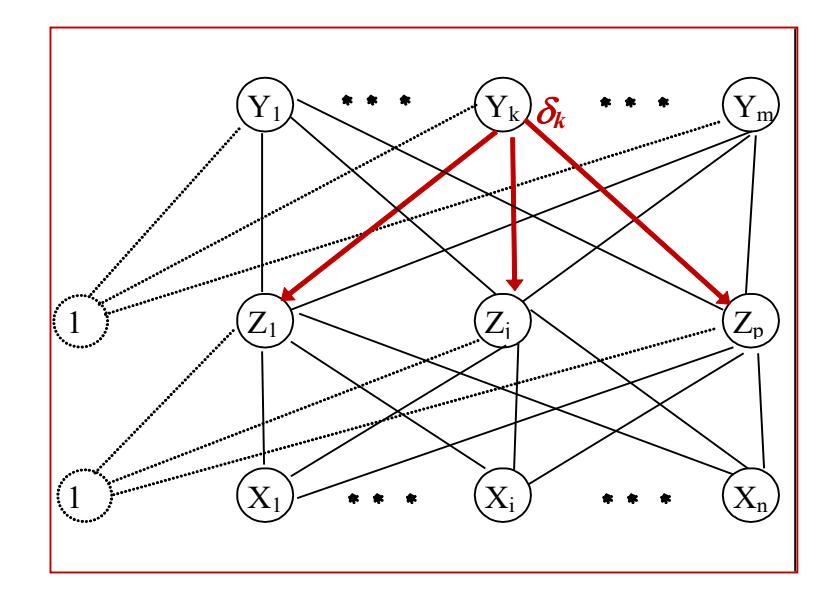

• Podobně lze definovat i **faktor** *j* (j *= 1, ..., p*), který je **části chyby šířené zpětně z neur**onu *Zj* ke **všem neuronům vstupní vrstvy**, jež mají s tímto neuronem **definované spojení**.

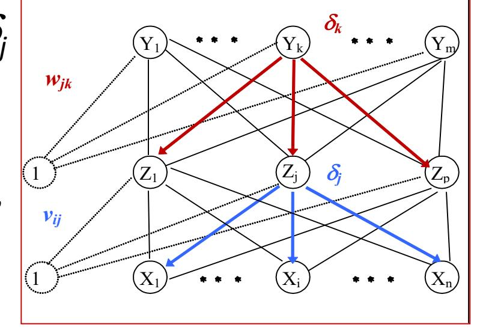

- Úprava váhových hodnot *wjk* na spojeních mezi neurony **vnitřní** a **výstupní vrstvy** závisí na **faktoru** *k* a **aktivacích** *zj* neuronů *Zj* ve **vnitřní vrstvě**.
- Úprava váhových hodnot *vij* na spojeních mezi neurony **vstupní** a **vnitřní vrstvy** závisí na **faktoru** *j* a **aktivacích** *xi* neuronů *Xi* ve **vstupní vrstvě**.

## Aktivační funkce

*Aktivační funkce* pro neuronové sítě s adaptační metodou **backpropagation** musí mít následující **vlastnosti**: musí být **spojitá**, **diferencovatelná** a **monotónně neklesající**. Nejčastěji používanou aktivační funkcí je proto **standardní** (**logická**) **sigmoida**

a **hyperbolický tangens**.

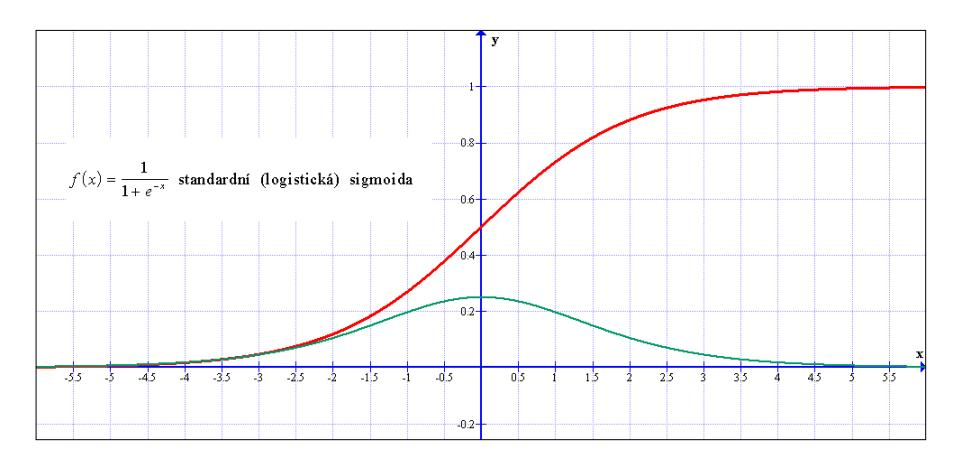

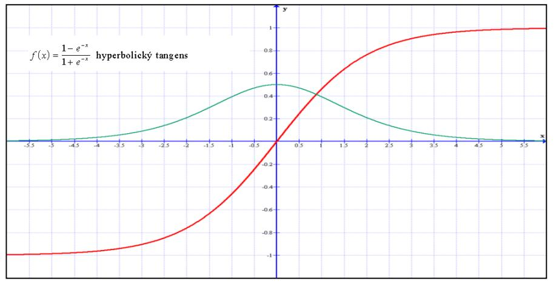

Zeleně jsou zobrazeny jejich první derivace.

#### Chyba sítě

• Chyba sítě E(w) je vzhledem k tréninkové množině definována jako součet parciálních chyb sítě  $E_l(w)$  vzhledem k jednotlivým tréninkovým vzorům (q) a závisí na konfiguraci sítě w:  $E(w) = \sum_{l=1}^{q} E_l(w).$ 

Parciální chyba EI(w) sítě pro I. tréninkový vzor (I = 1, ...,q) je úměrná součtu mocnin odchylek skutečných hodnot výstupu sítě pro vstup I. tréninkového vzoru od požadovaných hodnot výstupů u tohoto vzoru:

$$E_l(\mathbf{w}) = \frac{1}{2} \sum_{k \in V} (y_k - t_k)^2.$$

## Cíl adaptace

- Cílem adaptace je **minimalizace chyby** sítě ve **váhovém prostoru**.
- Vzhledem k tomu, že **chyba** sítě **přímo závisí** na **nelineární složené funkci vícevrstvé sítě**, představuje tento cíl netriviální optimalizační problém.
- Pro jeho řešení se v základním modelu používá nejjednodušší varianta **gradientní metody**, která vyžaduje **diferencovatelnost chybové funkce**.

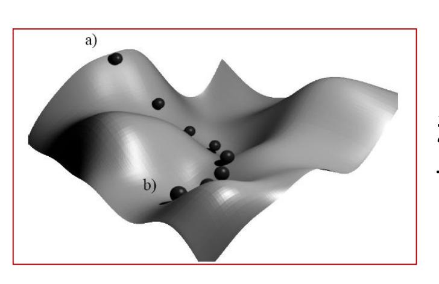

Hlavním **problémem** gradientní metody je, že pokud již nalezne **lokální minimum**, pak toto minimum nemusí být **globální**.

Gradientní pohyb váhového vektoru z bodu na povrchu (a) paraboloidu směrem k nejnižšímu bodu (b).

## Adaptační algoritmus backpropagation

*Krok 0.* Váhové hodnoty a bias jsou inicializovány malými náhodnými čísly.

Přiřazení inicializační hodnoty koeficientu učení .

*Krok 1.* Dokud není splněna **podmínka ukončení výpočtu**, opakovat kroky (2 až 9).

#### **Podmínka ukončení:**

pokud již nenastávají žádné změny váhových hodnot nebo pokud již bylo vykonáno maximálně definované množství váhových změn, stop; jinak, pokračovat.

#### Feedforward:

Krok 3. Aktivovat vstupní neurony  $(X_i, i=1, ...n)$  $x_i = s_i$ .

Krok 4 Vypočítat vstupní hodnoty vnitřních neuronů:  $(Z_i, j=1,..., p)$ :

$$z_{-}in_{j} = v_{0j} + \sum_{i=1}^{n} x_{i}v_{ij}.$$

Stanovení výstupních hodnot vnitřních neuronů

$$z_{j} = f(z_{in_{j}}).$$

Krok 5 Stanovení skutečných výstupních hodnoty signálu neuronové sítě  $(Y_k, k=1, ..., m)$ :

$$y_{i}n_{k} = w_{0k} + \sum_{j=1}^{p} z_{j} w_{jk},$$
  
 $y_{k} = f(y_{i}n_{k}).$ 

Krok 6 Ke každému neuronu ve výstupní vrstvě  $(Y_k, k=1, ..., m) \text{ je přiřazena hodnota očekávaného}$  výstupu pro vstupní tréninkový vzor. Dále je vypočteno  $\delta_k = (t_k - y_k) f'(y_{-} i n_k), \text{ které je součástí váhové}$  korekce  $\Delta w_{jk} = \alpha \ \delta_k z_j \text{ i korekce biasu}$   $\Delta w_{0k} = \alpha \ \delta_k.$ 

Krok 7 Ke každému neuronu ve vnitřní vrstvě (Zj, j=1, ..., p) je přiřazena sumace jeho delta vstupů (tj. z neuronů, které se nacházejí v následující vrstvě),

 $\delta_{-}in_{j} = \sum_{k=1}^{m} \delta_{k}w_{jk}$ . Vynásobením získaných hodnot derivací jejich aktivační funkce obdržíme  $\delta_{j} = \delta_{-}in_{j}f'(z_{-}in_{j})$ , které je součástí váhové korekce  $\Delta v_{ij} = \alpha \delta_{j}x_{i}$  i korekce biasu  $\Delta v_{0j} = \alpha \delta_{j}$ .

#### Aktualizace vah a prahů:

Krok 8 Každý neuron ve výstupní vrstvě  $(Y_k, k=1, ..., m)$  aktualizuje na svých spojeních váhové hodnoty včetně svého biasu (j=0, ..., p):

$$W_{jk}(new) = W_{jk}(old) + \Delta W_{jk}.$$

Každý neuron ve vnitřní vrstvě ( $Z_j$ , j=1, ..., p) aktualizuje na svých spojeních váhové hodnoty včetně svého biasu (i=0, ..., n):

$$v_{ij}(new) = v_{ij}(old) + \Delta v_{ij}.$$

#### Krok 9. Podmínka ukončení:

pokud již nenastávají žádné změny váhových hodnot nebo pokud již bylo vykonáno maximálně definované množství váhových změn, stop; jinak, pokračovat.

- Ačkoliv algoritmus backpropagation je formulován pro **klasický von Neumannovský model počítače**, lze jej **implementovat distribuovaně**.
- Pro každý tréninkový vzor probíhá **nejprve aktivní režim**  pro jeho vstup tak, že informace se v neuronové síti šíří **od vstupu k jejímu výstupu**.
- Výpočet sítě při zpětném chodu probíhá **sekvenčně po vrstvách**, přitom **v rámci jedné vrstvy může probíhat paralelně**.

# $E(\mathbf{w}) = \sum_{l=1}^{q} E_{l}(\mathbf{w}).$

Chyba se šíří zpětně

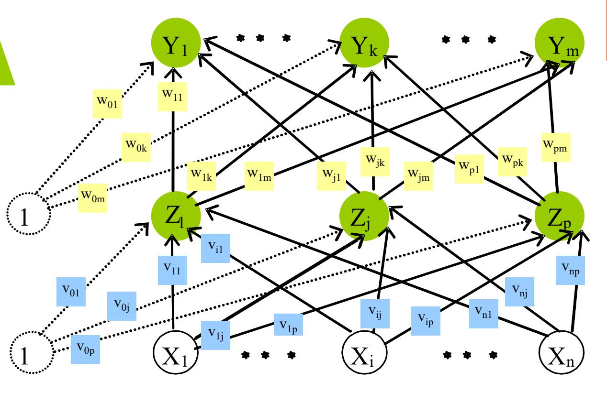

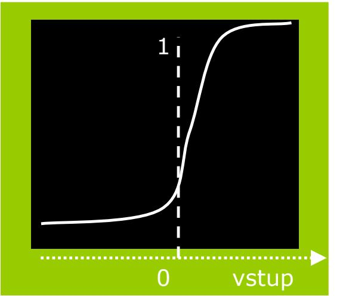

$$\Delta w_{jk} = -\alpha \frac{\partial E}{\partial w_{jk}}$$

$$= \alpha [t_k - y_k] f'(y_i in_k) z_j$$

$$= \alpha \delta_k z_j;$$

$$\Delta v_{ij} = -\alpha \frac{\partial E}{\partial v_{ij}}$$

$$= \alpha f'(z_in_j)x_i \sum_k \delta_k w_{jk},$$

$$= \alpha \delta_j x_i.$$

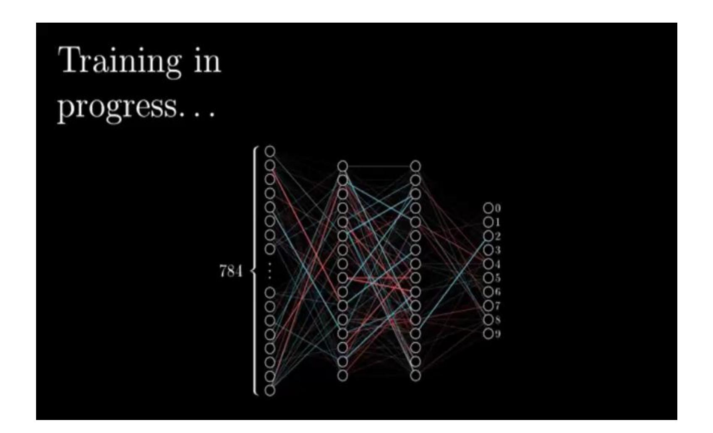

# Backpropagation vs. perceptron

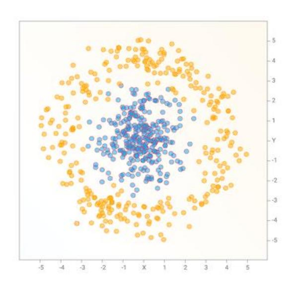

**VÍCEVRSTVÁ NEURONOVÁ SÍŤ**

(převzato z https://blog.otoro.net/assets/20160507/neat\_anim.gif)

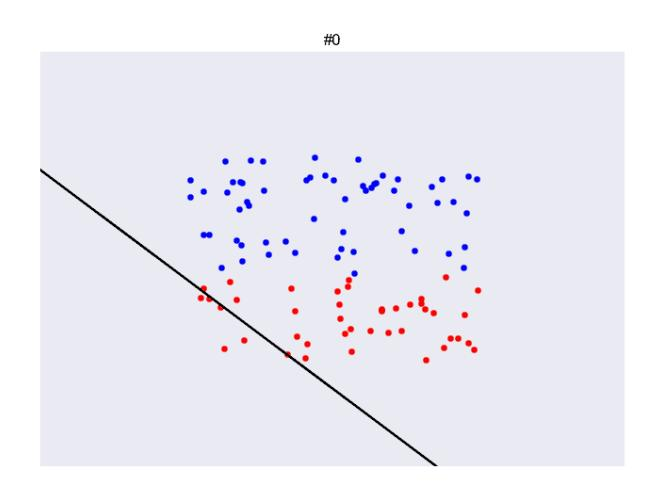

#### **PERCEPTRON**

(převzato z https://www.learnopencv.com/wp-content/uploads/2017/01/SVM-C.gif)

# Ukázka programu (YouTube) klasifikace

# Shrnutí kapitoly

V této kapitole jste se podrobně seznámili s topologií vícevrstvé neuronové sítě a s jejím adaptačním algoritmem **zpětného šíření chyby** (**backpropagation**), jež je nejrozšířenějším adaptačním algoritmem vícevrstvých neuronových sítí.