# OSTRAVSKÁ UNIVERZITA

# NEURONOVÉ SÍTĚ 1 (HLUBOKÉ NEURONOVÉ SÍTĚ)

EVA VOLNÁ

OSTRAVA 2019

Název: Neuronové sítě 1, hluboké neuronové sítě Autoři: doc. RNDr. PaedDr. Eva Volná, PhD.

Vydání: první, 2019

Počet stran: Náklad: Tisk:

Studijní materiály pro distanční kurz: Neuronové sítě 1

Jazyková korektura nebyla provedena, za jazykovou stránku odpovídá autor.

Vydavatel a tisk: Ostravská univerzita

© doc. RNDr. PaedDr. Eva Volná, PhD.

© Ostravská univerzita

ISBN

# NEURONOVÉ SÍTĚ 1 HLUBOKÉ NEURONOVÉ SÍTĚ

## Eva Volná

### **Cíl předmětu**

Seznámit studenta se základy teorie neuronových sítí. Důraz je zde kladen nejen na základní teorii, ale i na schopnost ji aplikovat při řešení příkladů. Tyto učební texty jsou rozšiřujícím materiálem [21].

#### **Po prostudování textu budete znát:**

Tyto učební texty jsou určeny studentům informatiky pro předmět neuronové sítě 1. Jsou v nich vysvětleny základní pojmy z oblasti hlubokých neuronových sítí. V jednotlivých kapitolách jsou postupně vysvětleny základní specifika hlubokých neuronových sítí, a to jejich architektura, aktivní dynamika a adaptivní dynamika.

# **Úvod pro práci s textem pro distanční studium.**

#### **Průvodce studiem:**

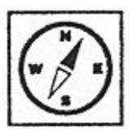

Tyto učební texty jsou rozšiřujícím materiálem [21] . Tento text má sloužit pro potřeby výuky výběrového předmětu NEURONOVÉ SÍTĚ 1 na katedře informatiky a počítačů. Předpokládá znalost základních modelů neuronových sítí a principu adaptačních algoritmů, hlavně backpropagation. Předmět Neuronové sítě 1 má rysy kurzu, ve kterém student získá ucelenější pohled na problematiku umělých neuronových sítí.

#### **V textu jsou dodržena následující pravidla:**

- je specifikován cíl lekce (tedy co by měl student po jejím absolvování umět, znát, pochopit)
- výklad učiva
- důležité pojmy
- úkoly a otázky k textu
- korespondenční úkoly (mohou být sdruženy po více lekcích)

**Vyberte si JEDEN korespondenční úkol, který vypracujete a jeho řešení zašlete nejpozději do konce semestru na adresu [eva.volna@osu.cz](mailto:eva.volna@osu.cz) .**

Pokud máte jakékoliv věcné nebo formální připomínky k textu, kontaktujte autora (eva.volna@osu.cz).

# **Obsah:**

| 1 |                          | HLUBOKÉ NEURONOVÉ SÍTĚ6                                                                                                                  |  |
|---|--------------------------|------------------------------------------------------------------------------------------------------------------------------------------|--|
|   | 1.1 1.2               | HLUBOKÉ UČENÍ 6 ZÁKLADNÍ ROZDĚLENÍ HLUBOKÝCH SÍTÍ7                                                                                 |  |
| 2 |                          | KONVOLUČNÍ NEURONOVÉ SÍTĚ 9                                                                                                        |  |
|   | 2.1 2.2 2.3 2.4 | KONVOLUČNÍ VRSTVA 10 PODVZORKOVACÍ VRSTVA 14 VIZUALIZACE KONVOLUČNÍCH FILTRŮ15 MODELY KONVOLUČNÍCH NEURONOVÝCH SÍTÍ 16 |  |
| 3 |                          | SPECIFIKA UČENÍ HLUBOKÝCH NEURONOVÝCH SÍTÍ21                                                                                             |  |
| 4 |                          | PŘEDTRÉNOVÁNÍ SÍTĚ POMOCÍ AUTOENKODÉRU 26                                                                                             |  |
| 5 |                          | PŘEDTRÉNOVÁNÍ SÍTĚ POMOCÍ OMEZENÉHO BOLTZMANNOVA STROJE32                                                                             |  |
| 6 |                          | NÁSTROJE PRO PRÁCI S HLUBOKÝMI NEURONOVÝMI SÍTĚMI37                                                                                |  |
|   | 6.1 6.2               | FRAMEWORKY PRO PRÁCI S HLUBOKÝMI NEURONOVÝMI SÍTĚMI 37 DATASETY PRO TESTOVÁNÍ ALGORITMŮ Z OBLASTI HLUBOKÉHO UČENÍ39          |  |
| 7 |                          | POUŽITÍ HLUBOKÝCH NEURONOVÝCH SÍTÍ41                                                                                                     |  |
|   |                          | LITERATURA49                                                                                                                             |  |

# **1 Hluboké neuronové sítě**

#### **Cíl:**

Získáte základní přehled o těchto tématech:

- hluboké učení;
- základní rozdělení hlubokých neuronových sítí;

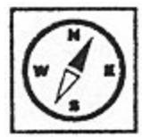

*V této úvodní kapitole se stručně seznámíte se základními charakteristikami hlubokých neuronových sítí a s principy hlubokého učení, a proto je nutné, abyste pochopení této problematiky věnovali zvýšenou pozornost.*

Velkým trendem poslední doby je oblast zvaná *hluboké učení* (Deep Learning). Jedná se o soubor algoritmů využívaných pro strojové učení. Obvykle se používají u neuronových sítí. Neuronové sítě, které obsahují mnoho vrstev a využívají metod hlubokého učení, se nazývají *Deep Neural Networks*. Zatím pro tento název neexistuje ekvivalentní výraz v českém jazyce, můžeme jej však volně přeložit jako hluboké (ve významu mnoho skrytých vrstev) nebo složité (obsahují velké množství skrytých neuronů) neuronové sítě. Obecně lze říct, že čím více skrytých vrstev neuronová síť obsahuje, tím dokáže daný problém abstrahovat do větších detailů a zachytit tak i velmi složité závislosti. Nemůžeme však tvrdit, že pro každou úlohu jsou hluboké sítě lepší a účinnější než sítě s jednou či dvěma skrytými vrstvami.

#### **1.1 Hluboké učení**

Pro lepší pochopení problematiky hlubokých neuronových sítí si uvedeme definice hlubokého učení [1].

- *Hluboké učení* je souhrn technik strojového učení, které využívají mnoho vrstev nelineárního zpracování informací pro jejich transformaci, extrakci rysů, analýzu vzorků a klasifikaci.
- *Hluboké učení* je odvětví strojového učení, jež je založeno na algoritmech pokrývající víceúrovňovou reprezentaci vzorků tak, aby se daly modelovat složité vztahy mezi jednotlivými daty. Funkce vyšší úrovně jsou tak definovány s ohledem na funkce nižší úrovně. Takové hierarchie funkcí se nazývají hluboké architektury. Většina těchto modelů je založena na učení bez učitele.
- *Hluboké učení* je odvětví strojového učení, které je založeno na učení několika úrovní reprezentace, což odpovídá hierarchii vlastností, faktů nebo konceptů, kde jsou jednotlivé závislosti na

vysokých úrovních definovány pomocí závislosti na úrovních nižších. Obdobně mohou závislosti na nižších úrovních pomocí definovat závislosti na vyšších úrovních. Metody hlubokého učení spadají do části strojového učení zabývající se učením reprezentace dat. Jednotlivá data můžeme reprezentovat mnoha způsoby (u obrázků např. samotnými pixely nebo různými důležitými rysy). Některé reprezentace dat nám v závislosti na požadované funkci systému usnadňují jeho naučení. Výzkum v této oblasti strojového učení se snaží definovat, jaká je ideální reprezentace dat a jak daný systém naučit požadované funkce.

• *Hluboké učení* je nová oblast strojového učení, která vznikla za účelem přiblížit strojové učení k jejímu prvotnímu cíli, a to k umělé inteligenci. Dává si za cíl zachytit data na několika úrovních abstrakce a reprezentace, což je velmi důležité u dat jako jsou obrázky, zvuk a text.

#### **1.2 Základní rozdělení hlubokých sítí**

V závislosti na použitých architekturách, metodách učení a využití (např. generování, klasifikace, syntéza, rozpoznávání atd.), můžeme tuto oblast rozdělit do tří kategorií (hluboké sítě s učením bez učitele nebo s generativním učením, hluboké sítě s učením s učitelem a hybridní hluboké sítě) [1].

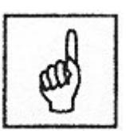

#### **Hluboké sítě s učením bez učitele nebo s generativním učením**

Hluboké neuronové sítě s učením bez učitele nebo s generativním učením jsou určeny k zachycení korelace pozorovaných nebo viditelných dat pro analýzu vzorů nebo pro účely syntézy. Síť se tedy snaží nalézt spojitosti mezi daty na základě samotných dat a nikoli na základě jejich popisu nebo klasifikační třídy.

Nejrozšířenější a nejběžnější modely hlubokých sítí jsou založeny na energii (*Energy–based deep models*). Typickým představitelem hlubokých sítí je však základní model autoenkodéru (*Deep autoencoders*). Dalším významným zástupcem této kategorie je hluboký Boltzmannův stroj (*Deep Boltzmann machine*). Jedná se o zvláštní případ obecného Boltzmannova stroje (Boltzmann machine). Tento model obsahuje mnoho vrstev skrytých proměnných, kde proměnné v rámci jedné vrstvy nejsou vzájemně propojeny. Každá následující vrstva pak zachycuje složitější korelace v datech, a proto mají tyto sítě velký potenciál naučit se složité vnitřní reprezentace dat, což se velmi hodí na řešení úloh založených na rozpoznávání řeči, obrazu atd. Pokud u Hlubokého Boltzmannova stroje omezíme počet skrytých vrstev na jednu, dostaneme omezený Boltzmanův stroj (*Restricted Boltzmann machine*).

#### **Hluboké sítě s učením s učitelem**

Hluboké sítě s učením s učitelem se snaží zachytit závislosti mezi vstupními daty a jejich popisem. Pro takový druh učení jsou vždy přímo nebo nepřímo k dispozici popisy jednotlivých dat. Tyto sítě se někdy nazývají *Discriminative Deep Networks*.

#### **Hybridní hluboké sítě**

Hybridní sítě jsou takové hluboké architektury, které kombinují oba předešlé přístupy. Generativní modely, jež jsou učeny metodami bez učitele, jsou schopny poskytnout inicializační pozici v nelineárním problému odhadu parametrů u modelů hlubokého učení sítě s učitelem.

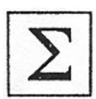

#### **Nejdůležitější probrané pojmy:**

- hluboké učení;
- hluboké sítě s učením bez učitele,
- hluboké sítě s učením s učitelem;
- hybridní hluboké sítě

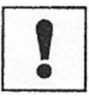

#### **Úkoly a otázky k textu:**

Promyslete si definice hlubokého učení. Srovnejte hluboké neuronové sítě a vícevrstvé neuronové sítě adaptované metodou backpropagation.

# **2 Konvoluční neuronové sítě**

#### **Cíl:**

Získáte základní přehled o těchto tématech:

- konvoluční neuronové sítě;
- konvoluční vrstva;
- podvzorkovací vrstva;
- vizualizace konvolučních filtrů;
- modely konvolučních neuronových sítí.

*V této kapitole se seznámíte s konvolučními neuronovými sítěmi. Tyto sítě jsou schopny extrahovat lokální příznaky ze vstupních dat. Běžně se využívají pro zpracování obrazových dat. Fungují na principu konvoluce a sdílení váhových koeficientů v rámci matic označovaných jako konvoluční jádra. Konvoluční vrstva neuronové sítě obsahuje obecně více filtrů, přičemž filtry vrstev na nižších úrovních slouží jako prosté detektory hran a filtry na úrovních vyšších mohou sloužit pro rozpoznávání komplexnějších struktur. V závěru kapitoly jsou pak zmíněny různé modely konvolučních neuronových sítí (LeNet-5, AlexNet, GoogleNet a ResNet).*

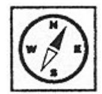

Konvoluční neuronové sítě (CNN) jsou schopny extrahovat lokální příznaky ze vstupních dat. Tyto sítě se běžně využívají pro zpracování obrazových dat a fungují na principu konvoluce a sdílení váhových koeficientů v rámci matic označovaných jako konvoluční jádra. Celá konvoluční vrstva je označována jako konvoluční operátor a definují se u něho vlastnosti:

- velikost kroku konvoluce
- velikost jádra
- velikost rámce nul
- počet výstupů.

Konvoluce používaná konvolučním operátorem je definována jako váhový součet přes část obrazu odpovídajícímu velikosti konvolučního jádra, což je oblast, kterou daný neuron zpracovává. Velikost konvolučního jádra je doporučeno volit jako liché číslo, aby měla síť přesně daný středový bod konvolučního jádra. Krok určuje posun konvolučního jádra po obraze. Rámec nul vytvoří kolem obrazu vstupujícího do konvolučního operátoru okraj s nulovými hodnotami, což může sloužit pro nastavení výstupní velikosti konvolučního operátoru. Počet výstupů definuje počet konvolučních jader, kdy každé jádro může zkoumat jiný typ informace v obraze, například jedno jádro zvýrazní hrany a druhé pouze vodorovné hrany. Výstupem konvolučního operátoru je pod vzorkovaný obraz o rozměrech × , kde

$$H = (H_i - K + 2P)/S + 1$$
  

$$W = (W_i - K + 2P)/S + 1$$
(1)

 resp. jsou výška a šířka vstupního obrazu, *K* je velikost konvolučního jádra, *P* je velikost rámce nul a *S* je velikost kroku konvoluce. V konvoluční neuronové síti je výstup konvolučního operátoru společně se sdíleným biasem vstupem aktivační funkce stejně jako v případě plně propojených vrstev. V rámci konvolučního operátoru je definovaný jeden sdílený bias.

#### **2.1 Konvoluční vrstva**

Konvoluční vrstva je tvořena několika konvolučními filtry. Výstup každého filtru je roven výsledku operace matematické konvoluce, do které vstupují váhy filtru a vstup vrstvy.

#### **Příklad**

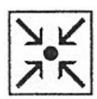

Příklad konvoluce s velikostí jádra 3x3 (*Size: f* = 3), velikostí kroku 1 (*Stride: s = 1*) a velikostí rámce nul roven 0 (*Padding: p = 0*) je uveden na následujících obrázcích 1 – 5.

**Krok 1:** Filtr aplikujte na vstup podle obrázku 1

*Obrázek 1: Krok 1: Konvoluce s velikostí jádra 3x3, velikostí kroku 1 a velikosti rámce nul roven 0 (převzato z [13]).*

**Krok 2:** Přesuňte filtr doprava o jednu pozici (nebo podle nastavení kroku) a opakujte výpočet z předchozího kroku (viz obrázek 1). Výsledek je uveden na obrázku 2.

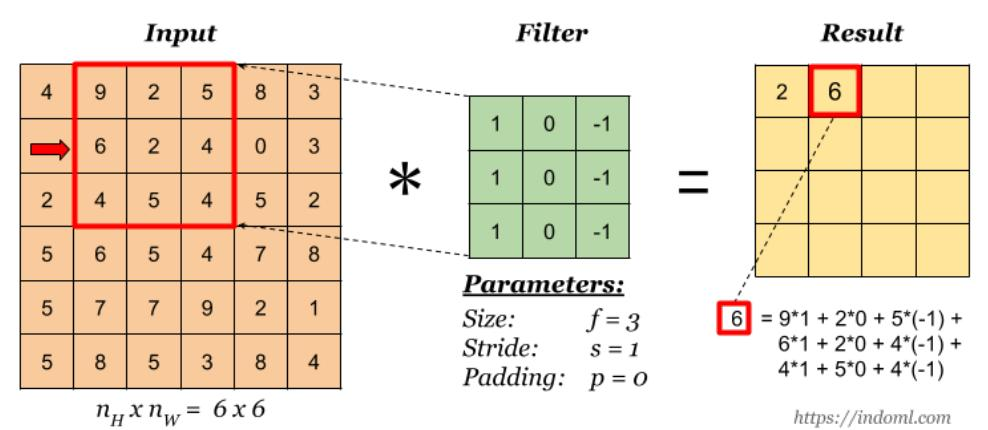

*Obrázek 2: Krok 2: Konvoluce s velikostí jádra 3x3, velikostí kroku 1 a velikosti rámce nul roven 0 (převzato z [13]).*

**Stride** (**krok**) určuje, kolik o kolik buněk se filtr přesune, aby se vypočítala další buňka ve výsledku. Konvoluce s velikostí jádra 3x3, velikostí kroku 2 a velikosti rámce nul roven 0 je uvedena na obrázku 3.

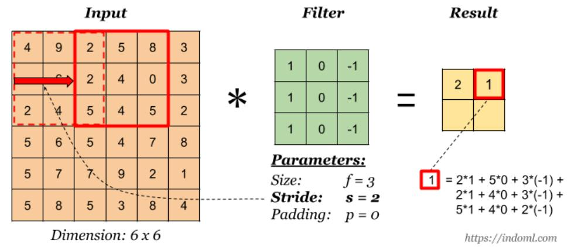

*Obrázek 3: Konvoluce s velikostí jádra 3x3, velikostí kroku 2 a velikosti rámce nul roven 0 (převzato z [13]).*

**Padding** určuje **velikosti rámce nul** kolem vstupu. Jeho nenulová hodnota nám pomáhá udržovat více informací na okraji obrázku. Konvoluce s velikostí jádra 3x3, velikostí kroku 2 a velikosti rámce nul roven 1 je uvedena na obrázku 4.

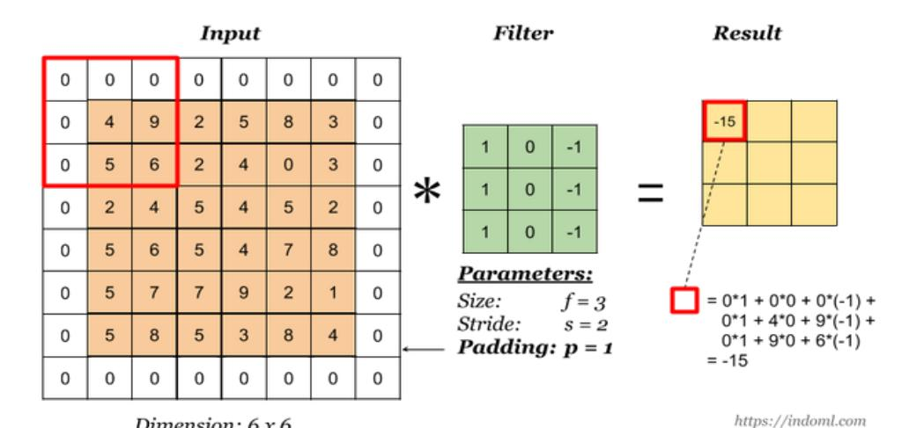

*Obrázek 4: Konvoluce s velikostí jádra 3x3, velikostí kroku 2 a velikosti rámce nul roven 1 (převzato z [13]).*

Pokud má vstup více než jeden kanál (např. obrázek RGB), měl by mít také filtr odpovídající počet kanálů. Chceme-li vypočítat jednu výstupní buňku, pak provedeme konvoluci na každém odpovídajícím kanálu a poté jednotlivé výsledky sečteme, viz obrázek 5.

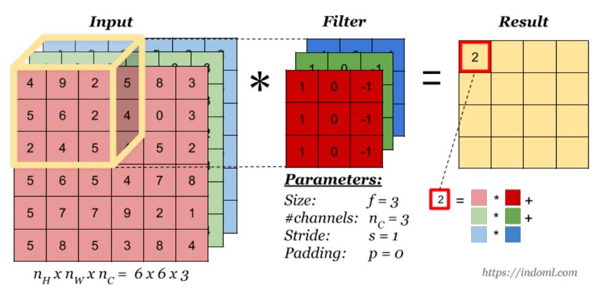

*Obrázek 5: Vstup se 3 kanály (nc=3): konvoluce s velikostí jádra 3x3, velikostí kroku 1 a velikosti rámce nul roven 1 (převzato z [13]).*

**Konvoluční operace s více filtry.** K detekci více rysů můžeme použít více filtrů a výstup pak bude mít stejný počet kanálů jako je počet filtrů, které jsme použili, viz obrázek 6.

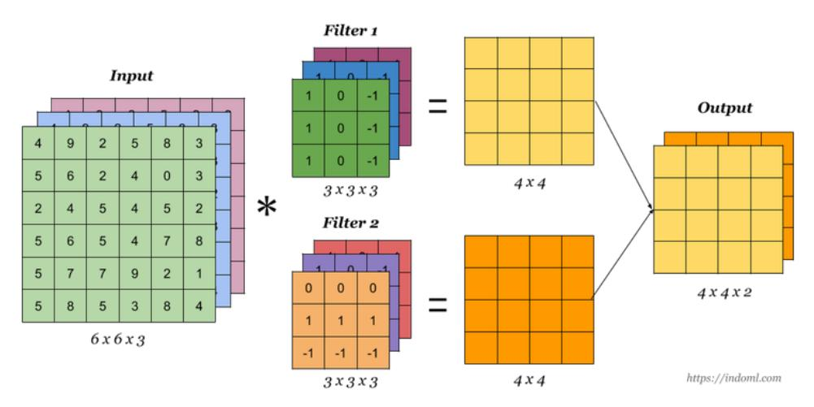

*Obrázek 6: Konvoluční operace s více filtry (převzato z [13].*

Nakonec vytvoříme konvoluční vrstvu. Často ke každému filtru přísluší tzv. bias hodnota *b* ϵ R, která se přičte k výstupu filtru a aktivační funkce, např. *ReLU* (rectified linear unit) nebo *tanh* (hyperbolický tangens), viz obrázek 7.

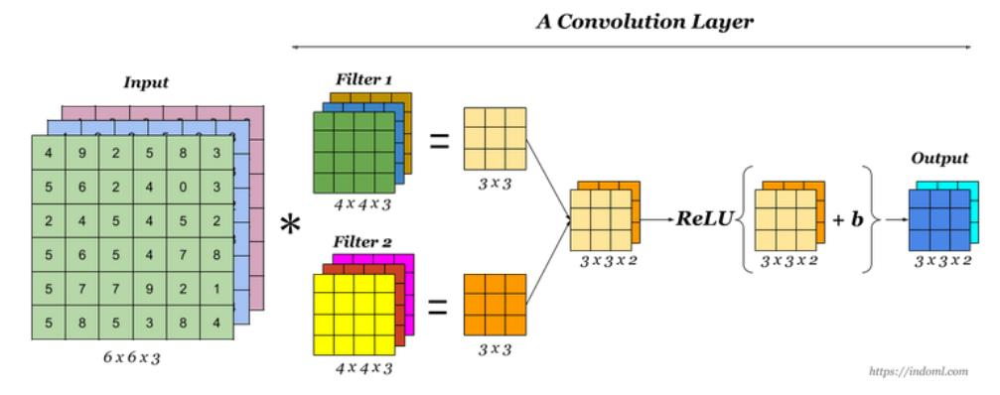

*Obrázek 7: Konvoluční vrstva: konvoluční operace s více filtry (převzato z [13]).*

Jak již bylo zmíněno, konvoluční vrstva neuronové sítě obsahuje obecně více filtrů, přičemž filtry vrstev na nižších úrovních slouží jako prosté detektory hran a filtry na úrovních vyšších mohou sloužit pro rozpoznávání komplexnějších struktur (např. očí, obočí a podobně). Výstupem konvoluční vrstvy jsou mapy příznaků, které jsou tvořeny výstupy jednotlivých konvolučních filtrů. Společně s konvoluční vrstvou se často využívají i jiné vrstvy. Na obrázku 8 je zobrazena síť se třemi konvolučními vrstvami. Zplošťovací vrstva (*flatten layer*) slouží k pouhému zploštění vstupu, resp. transformaci obecně *n*-dimenzionálního pole hodnot do jednodimenzionálního vektoru. Často se nachází před plně propojenou vrstvou, která se obvykle vyskytuje na konci konvoluční

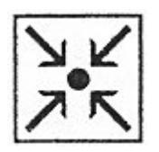

neuronové sítě. Jedná se o vrstvu obsahující neuronů, přičemž každý neuron této vrstvy je připojen na každý neuron vrstvy předchozí. Při klasifikačních úlohách je rovno počtu kategorií, přičemž jeden neuron přísluší jedné kategorii. Cílem vrstvy je nalézt korelace vektoru příznaků z předchozí vrstvy s jednotlivými kategoriemi. Jako aktivační funkce se často využívá logistická regrese funkce softmax.

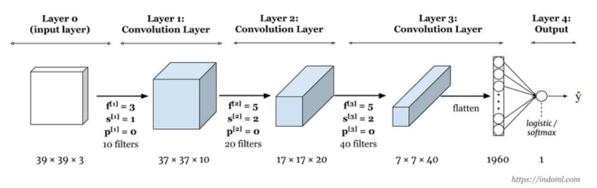

*Obrázek 8: Neuronová síť se třemi konvolučními vrstvami (převzato z [13)].*

Konvoluční operátor zajišťuje učení sítě nezávisle na pozici a transformaci objektu v obraze. Dále díky sdíleným vahám v rámci jader je možné používat větší rozměry obrazů než v případě plně propojených sítí.

#### **2.2 Podvzorkovací vrstva**

Podvzorkovací vrstva (*pooling layer*) slouží k redukci velikosti dat, které obdrží na vstupu. Redukce se provádí pomocí okénka určité velikosti, pomocí kterého se vstup rozdělí na nepřekrývající se čtvercové oblasti a v každé oblasti se nad prvky provede určitá matematické operace. Hodnota, která reprezentuje zpracovanou čtvercovou oblast, bývá většinou průměr nebo maximální hodnota z hodnot v oblasti. Ilustrace činnosti je zobrazena na obrázku 9.

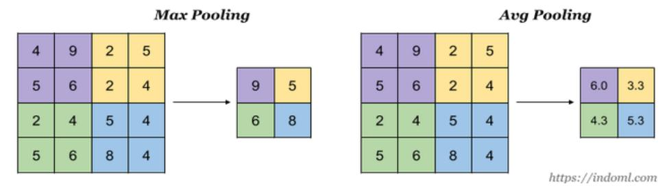

*Obrázek 9: Ilustrace činnosti podvzorkovací vrstvy (převzato z [13]).*

#### **2.3 Vizualizace konvolučních filtrů**

Vizualizace konvolučních filtrů je uvedena na obrázku 10. Při použití každé další konvoluční vrstvy dostávají hledané příznaky jasnější charakter. Nejčastěji jsou vizualizovány naučené filtry. Vizualizace je důležitá k lepšímu pochopení, jak se konvoluční sítě učí. Obrázek 10 obsahuje příklad vizualizací konvolučních filtrů a k nim příslušných snímků. Je zde vidět, že v první konvoluční vrstvě jsou rozpoznávány hrany objektu, ve třetí podobné textury a v páté celé objekty.

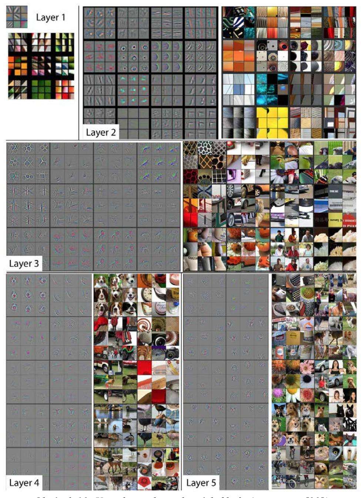

*Obrázek 10: Vizualizace konvolučních filtrů. (převzato z [22]).*

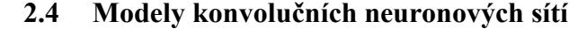

Celá konvoluční síť je tvořena několika konvolučními vrstvami a několika podvzorkovacími (pooling) vrstvami. Výstupy konvolučních vrstev jsou vždy vstupem do aktivační funkce. Pooling vrstva následuje vždy až za konvoluční vrstvou, avšak pooling vrstva může být vynechána a může následovat další konvoluční vrstva. Za těmito vrstvami obvykle následuje plně propojená vrstva, která má význam klasifikátoru.

V případě konvolučních sítí je oblast vstupního obrazu, kterou neuronová sít klasifikuje rovna velikosti výstupu neuronové sítě, viz obrázek 11, tedy vše, co je mimo tuto oblast, neuronová síť nebere v potaz.

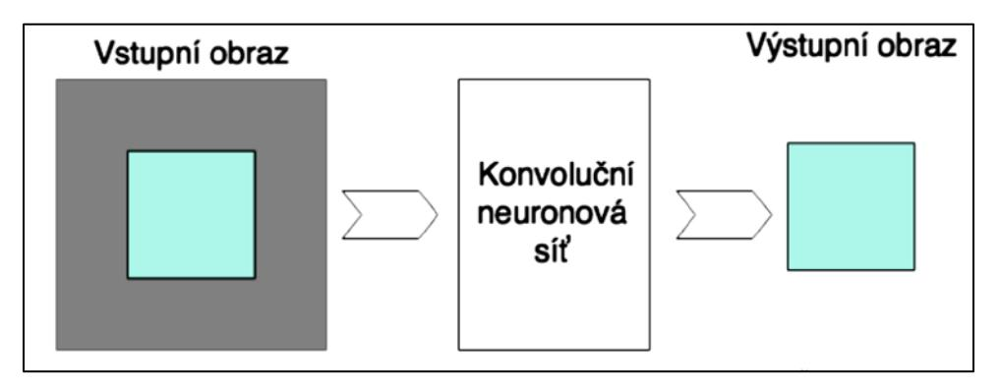

*Obrázek 11: Demonstrace pracovní oblasti, kterou neuronová síť bere v potaz. Šedá barva definuje oblast, která není zahrnuta do vyhodnocení konvoluční neuronovou sítí. Zelená barva definuje oblast, která je zpracována konvoluční neuronovou sítí. (převzato z [7]).*

#### **LeNet-5**

Jako první úspěšná architektura moderních CNN je považován LeNet-5. Tato architektura vznikla v roce 1998 v týmu pod vedením Yanna LeCuna [10] a dodnes představuje základ designu většiny konvenčních CNN. Síť byla určena pro klasifikaci ručně psaných číslic a pro učení využívala algoritmus backpropagation [21]. Původní síť (schéma na obrázku 12) LeNet5 která byla tvořena sedmi výpočetními vrstvami (nepočítaje vstupní vrstvu) a pro podvzorkování využívala průměr.

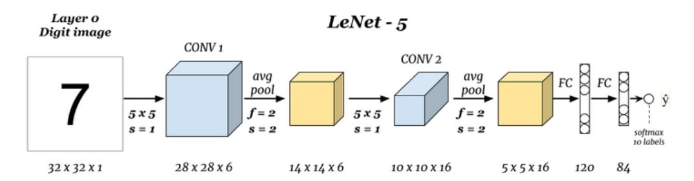

*Obrázek 12: LeNet-5 (převzato z [13]).*

#### **AlexNet**

V roce 2012 byl Alexem Krizhevskym et. al. představen model konvoluční neuronové sítě - AlexNet [9]. AlexNet je strukturou podobný architektuře LeNet, využívá ale větší množství filtrů na jednotlivých vrstvách. Celá architektura (zobrazeno na obrázku 13) se skládá z osmi vrstev. Kvůli limitům tehdejšího hardware byla architektura navržena pro využití dvou paralelních grafických karet. Jednou ze zásadních změn oproti předcházejícím architekturám je využití ReLU jako aktivační funkce neuronů namísto běžně užívané tanh.

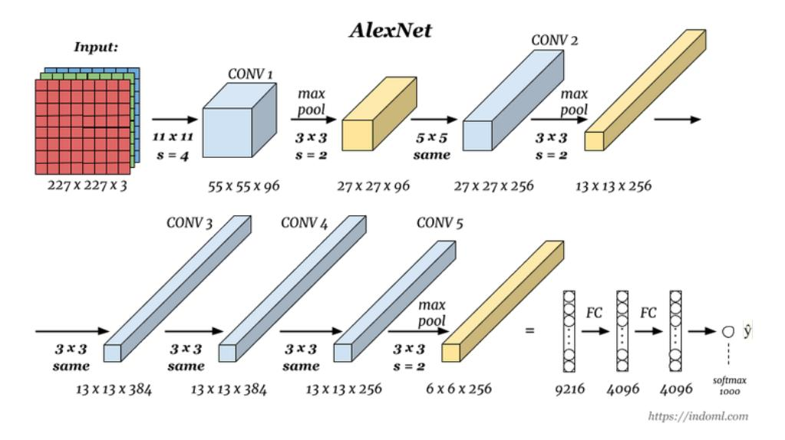

*Obrázek 13: AlexNet (převzato z [13]).*

#### **GoogleNet**

GoogleNet je architektura navržená Christianem Szegedy et. al. z Google Inc. [14] v roce 2014. Architektura je navržená s úmyslem snižování výpočetní náročnosti v porovnání s běžnými CNN. Klíčovým prvkem v této architektuře jsou tzv. Incepční moduly (*inception moduls*), díky kterým došlo ke snížení parametrů v síti. Incepční moduly se skládají z několika souběžných konvolučních vrstev s různými parametry a jsou zakončené propojením těchto vrstev zpět do jednoho toku. Použití více konvolucí s různou velikostí filtrů umožňuje síti hledat v datech rysy s lepší invariancí vůči jejich velikosti. Konvoluční vrstvy 1×1 pak slouží pro snížení objemu dat (a výpočetní náročnosti) před náročnějšími 3×3 a 5×5 konvolucemi. Schéma incepčního modulu použitého v architektuře GoogleNet je vyobrazen na obrázku 14. Sít GoogleNet (obrázek 15) nemá pouze jeden výstup, ale obsahuje celkem tři výstupy, a to po třetí incepční vrstvě, šesté incepční vrstvě a hlavní výstup po sedmé incepční vrstvě, který je zároveň poslední vrstvou celé sítě.

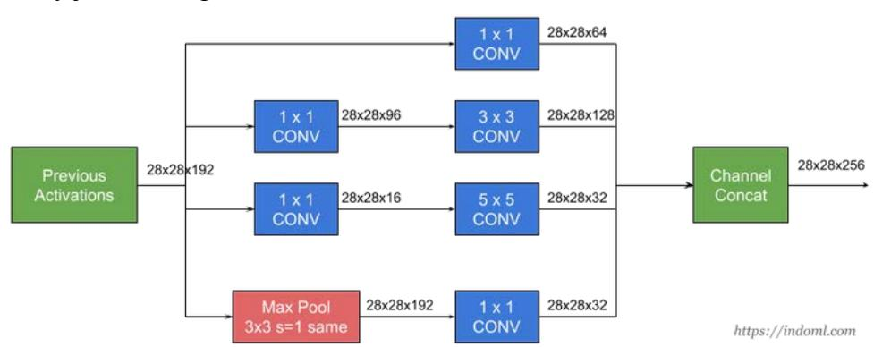

*Obrázek 14: Schéma incepčního modulu (převzato z [13]).*

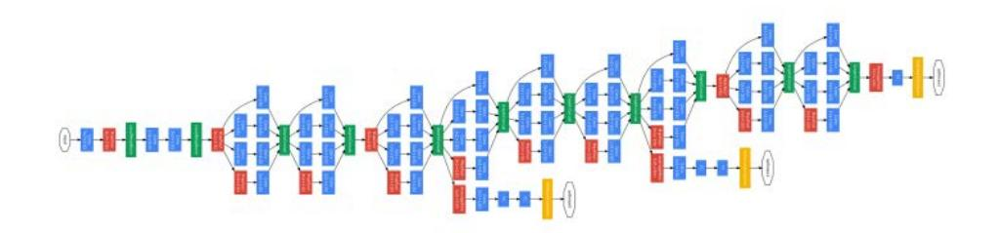

*Obrázek 15: GoogleNet: modrá barva - konvoluční vrstvy, červená barva pooling vrstvy, žlutá barva -softmax, zelená barva - ostatní (převzato z [13]).*

#### **ResNet**

Architektura ResNet (Residual Network) vyvinutá Kaimingem He et. al. [8]. Tato architektura představuje speciální spoje mezi konvolučními vrstvami - skokové spoje (*skip/shortcut connections*). Tyto skokové spoje pomáhají řešit problémy hlubokých sítí, kdy příliš velký počet vrstev sítě způsobuje zvýšení chybové hodnoty sítě. Obrázek 16 zobrazuje základní schéma skokového spoje. Schéma architektury ResNet je uvedeno na obrázku 17.

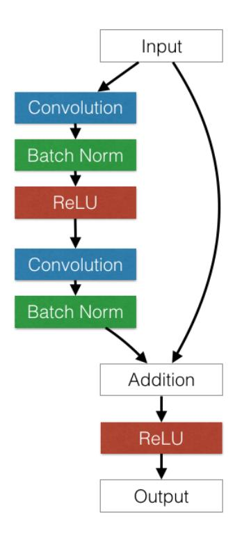

*Obrázek 16: Základní schéma skokového spoje (převzato z [8]).*

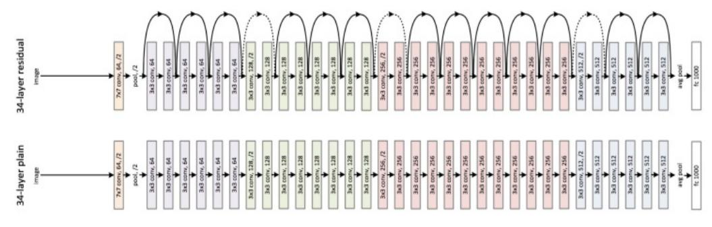

*Obrázek 17:* ResNet *(převzato z [13]).*

#### **Nejdůležitější probrané pojmy:**

- konvoluční neuronové sítě;
- konvoluční vrstva;
- stride (krok);
- padding (velikost rámce nul);

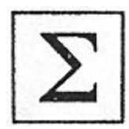

- flatten layer (zplošťovací vrstva);
- podvzorkovací vrstva;
- LeNet-5;
- AlexNet;
- GoogleNet;
- ResNet.

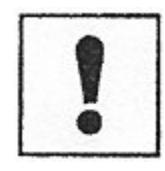

### **Úkoly a otázky k textu:**

Promyslete si definice hlubokého učení. Srovnejte hluboké neuronové sítě a vícevrstvé neuronové sítě adaptované metodou backpropagation.

#### **Korespondenční úkol:**

Vypracujte seminární práci na téma "*Použití konvolučních filtrů při zpracování obrazu"*. Informace hledejte především na www-stránkách. Seminární práci vypracujte v rozsahu 5 stran.

# **3 Specifika učení hlubokých neuronových sítí**

### **Cíl:**

Po prostudování této kapitoly se seznámíte:

- s principem učení hlubokých neuronových sítí;
- s adaptačním pravidlem pro hluboké neuronové sítě.

*Dříve než se pustíte do studia této kapitoly, důkladně si prostudujte problematiku adaptace vícevrstvých neuronových sítí, hlavně adaptační algoritmus zpětného šíření (backpropagation) [21]. Tento algoritmus se rovněž používá pro adaptaci hlubokých neuronových sítí, avšak pro učení konvolučních neuronových sítí je rozšířen o schopnost upravovat váhy konvolučních filtrů konvolučních vrstev, tzn. z filtrů se stanou automatické extraktory příznaků.*

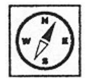

Hluboké neuronové sítě obsahují více než jednu skrytou vrstvu. Sítě s více skrytými vrstvami se dokáží učit komplexnějším problémům a lépe abstrahovat. Například první vrstva dokáže rozpoznávat hrany, další vrstva základní tvary, další vrstva složitější tvary a tak dále. V důsledku je neuronová síť schopna se naučit rozpoznávat v obraze například povrchy, klasifikovat plemena psů a jiné komplexní úkony. Při učení hlubokých neuronových sítí přichází problém s rozdílnou rychlostí učení vah v jednotlivých vrstvách. Zatímco váhy poslední vrstvy se učí rychle, tak váhy v předchozích vrstvách se učí velice pomalu. Trénování hlubokých neuronových sítí je velice náročné. Existuje mnoho faktorů, které ovlivňují proces učení, např.:

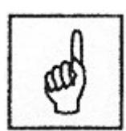

- volba aktivační funkce
- počáteční inicializace vah
- použitá metoda minimalizace cenové funkce
- koeficient učení
- architektura sítě a jiné parametry.

Pro učení konvolučních neuronových sítí je, stejně jako u klasických neuronových sítí, využíván algoritmus zpětného šíření chyby (backpropagation). Tento algoritmus je však rozšířen o schopnost upravovat váhy konvolučních filtrů konvolučních vrstev, tzn. z filtrů se stanou automatické extraktory příznaků.

Učení hlubokých neuronových sítí probíhá ve dvou fázích. První fáze spočívá v nastavení počáteční konfigurace sítě pomocí učících mechanismů bez učitele, což nahrazuje náhodnou inicializaci vah vstupů neuronů. Neurony se v této fázi naučí základní závislosti trénovacích dat bez ohledu na jejich popisek. Proběhne prvotní abstrakce problému na několika úrovních. Druhá fáze spočívá v konečném dotrénovaní sítě metodou s učitelem (ve většině se jedná o metodu backpropagation). Na obrázku 18je schematicky znázorněno předtrénování a finální dotrénování hluboké neuronové sítě. U zvýrazněných vrstev probíhá v daném kroku jejich učení.

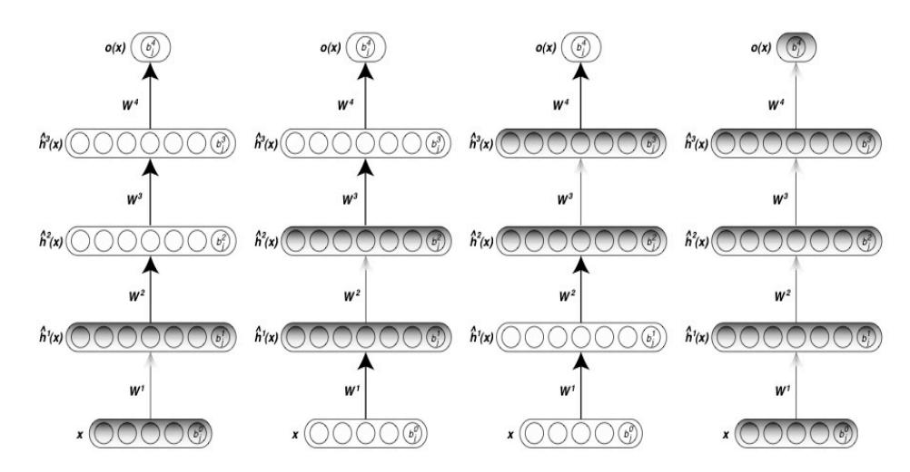

*Obrázek 18: Jednotlivé fáze chytrého předtrénování a závěrečné dotrénování hluboké neuronové sítě* 

*(převzato z [http://www.dmi.usherb.ca/~larocheh/images/deep\\_learning.jpg](http://www.dmi.usherb.ca/%7Elarocheh/images/deep_learning.jpg) )*

Následující algoritmus [6] popisuje obě fáze, tj. předtrénování a finální dotrénování hybridního přístupu k učení hlubokých neuronových sítí.

#### **Vstup:**

- *•* trénovací množina = {(, )}=1 ;
- *•* učící koeficient předtrénovací části −;
- *•* učící koeficient závěrečného dotrénování −.

#### **Inicializace:**

- *•* Inicializuj váhy náhodnými hodnotami z intervalu 〈−−0.5, 0.5〉, kde = ��h−1�,�h ��,
- *•* nastav předpětí (bias) neuronů b na hodnotu 0.

#### Předtrénování sítě:

for 
$$i \in \{1, \ldots, L\}$$
do

while dokud není splněna ukončovací podmínka do

vyber  $x_t$  z trénovací množiny

$$h^0(x_t) \leftarrow x_t$$

for 
$$j \in \{1, ..., i-1\}$$
 do

$$a^j(x_t) = b^j + W^j h^{j-1}(x_t)$$

$$h^j(x_t) = sigm\left(a^j(x_t)\right)$$

end for

Použij  $h^{j-1}(x_t)$ ,  $b^{i-1}$  a  $b^i$  jako vstupní parametry metody pro předtrénování vrstvy i (úprava vah  $W^i$ ). Například můžeme využít metodu založenou na autoenkodéru nebo metodu na omezeném Boltzmannově stroji.

end while

end for

#### Finální dotrénování sítě:

while dokud není splněna ukončovací podmínka do

vyber vzor  $(x_t, y_t)$  z z trénovací množiny

//Dopředná propagace

$$h^0(x_t) \leftarrow x_t$$

for 
$$l \in \{1, ..., L\}$$
 do

$$a^l(x_t) = b^l + W^l h^{l-1}(x_t)$$

$$h^l(x_t) = sigm\left(a^l(x_t)\right)$$

end for

$$o(x_t) = \mathbf{h}^L(x_t)$$

//Zpětná propagace chyby a úprava vah, kde můžeme využít algoritmus backpropagation [21].

end while

#### **Jak se učí hluboké neuronové sítě**

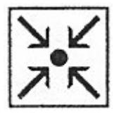

Představme si, jak se učí hluboká neuronová síť rozpoznávat, co je na fotografii (obrázek 19). Zaprvé potřebujeme velké množství obrázků, o kterých předem víme, co na nich je. Síť tedy v první fázi vyžaduje "učitele", který jí řekne, zde máš tisíc obrázků koček a tady je tisíc obrázků psů. Síť si opakovaně prochází obrázky a stále lépe se učí rozpoznávat kočky od psů. V nižších vrstvách sítě se učí identifikovat barvy a základní tvary, ze kterých se obrázek skládá. V další vrstvách se komponují základní tvary do ucelenějších částí, jako je oko, čumák nebo packa. V posledních vrstvách nalezneme nejvyšší míru abstrakce. Zde síť rozhoduje, zda je na obrázku kočka, nebo pes. Dobře naučená síť dokáže rozpoznat kočku od psa nejen u fotografií, na které jsme ji trénovali, ale také na těch, které nikdy předtím neviděla. Umělé neuronové sítě jsou inspirovány našimi poznatky o neurobiologii, přesto by však bylo zavádějící tvrdit, že jsou její přesnou kopií.

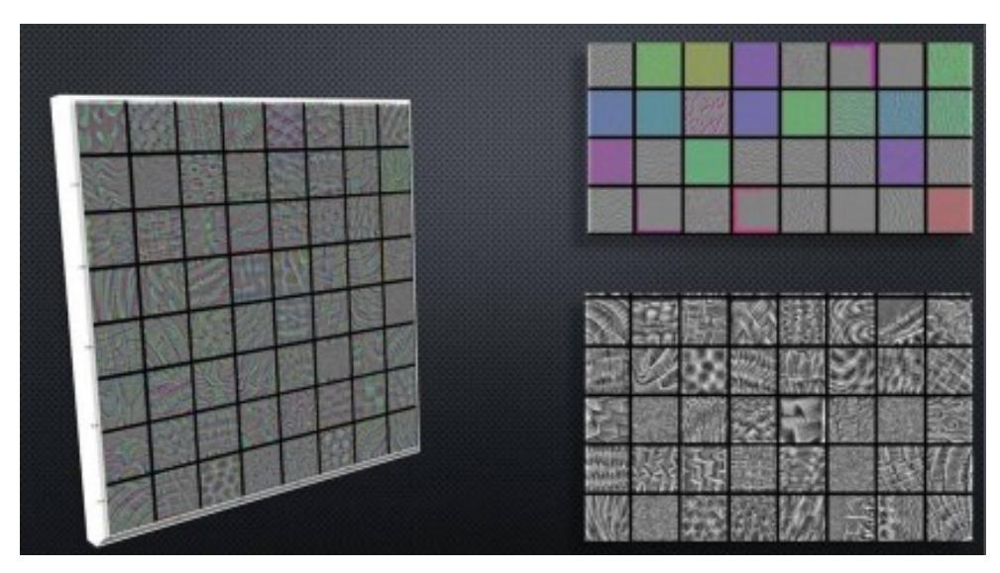

*Obrázek 19: Pohled na vrstvy neuronové sítě, která slouží k rozpoznávání zvířat. Vpravo nahoře nízká hloubka, sítě se učí rozpoznávat barvy, tvary a obrysy. Vlevo a vpravo dole jsou patrné komplexnější vzory, které mohou sloužit k identifikaci šupin a srsti (převzato z*

*[https://www.systemonline.cz/business-intelligence/vsudypritomna-umela](https://www.systemonline.cz/business-intelligence/vsudypritomna-umela-inteligence-bude-megatrendem-pristich-deseti-let.htm)[inteligence-bude-megatrendem-pristich-deseti-let.htm](https://www.systemonline.cz/business-intelligence/vsudypritomna-umela-inteligence-bude-megatrendem-pristich-deseti-let.htm) ).*

#### **Nejdůležitější probrané pojmy:**

- algoritmus zpětného šíření chyby (backpropagation) [21];
- adaptační algoritmus pro hluboké neuronové sítě;

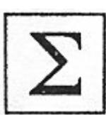

- předtrénování hluboké neuronové sítě;
- finální dotrénování hluboké neuronové sítě.

#### **Úkoly a otázky k textu:**

Srovnejte principy adaptačních algoritmů pro hluboké neuronové sítě a vícevrstvé neuronové sítě.

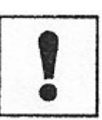

# **4 Předtrénování sítě pomocí autoenkodéru**

#### **Cíl:**

Získáte základní přehled o těchto tématech:

- předtrénování neuronové sítě;
- autoenkodér;
- kodér;
- dekodér.

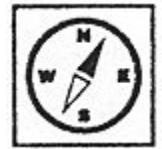

*V této kapitole se stručně seznámíte s autoenkodérem, což je speciální typ hlubokých neuronových sítí. Typicky má autoenkodér vstupní vrstvu, která reprezentuje původní data nebo vstupní vektor příznaků, jednu nebo více skrytých vrstev, které reprezentují transformované příznaky a výstupní vrstvu, která se shoduje se vstupní vrstvou kvůli rekonstrukci. Učení autoenkodéru typicky probíhá za pomocí algoritmu zpětného šíření (backpropagation) [21]. Autoenkodér lze použití pro předtrénování hluboké neuronové sítě.* 

Autoenkodér (*angl. Autoencoder*) je metoda vhodná k předtrénování hlubokých neuronových sítí. Tato metoda spadá do kategorie učení bez učitele.

Autoenkodér je speciální typ hlubokých neuronových sítí, jejichž výstupní vektory mají stejnou dimenzi jako vstupní vektory. Počet neuronů výstupní vrstvy je tedy totožný s počtem vstupů a cílem je produkovat na výstup stejná data jako na vstupu, tj. cílem této sítě je zakódovat (*encode*) vstupní data a poté je znova dekódovat (*decode*). Jelikož první vrstva obvykle obsahuje méně neuronů, než je velikost vstupu resp. počet neuronů výstupní vrstvy, provede se zobecnění těchto dat. V ideálním případě platí rovnice (2).

$$\widehat{\mathbf{x}} = decode(encode(\mathbf{x})) \tag{2}$$

Často jsou autoenkodéry používány pro učení reprezentace nebo efektivního zakódování původních dat ve formě vstupního vektoru ve skrytý vrstvách. Typicky má autoenkodér vstupní vrstvu, která reprezentuje původní data nebo vstupní vektor příznaků (např. pixely obrazu nebo spektra v hlasu), jednu nebo více skrytých vrstev, které reprezentují transformované příznaky a výstupní vrstvu, která se shoduje se vstupní vrstvou kvůli rekonstrukci. Pokud je počet skrytých vrstev vyšší než jedna, autoenkodér je považován za hluboký. Počet neuronů ve skryté vrstvě může být buď menší než dimenze vstupu, pokud je úkolem redukce příznaků anebo vyšší, pokud je úkolem mapování příznaků do prostoru vyšší dimenze.

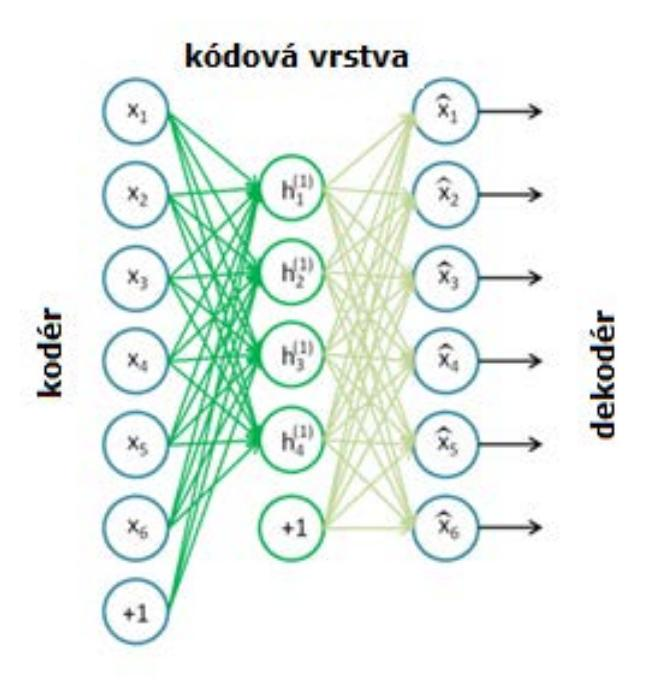

Obrázek 20: Schéma autoenkodéru (převzato z [12]).

Příklad autoenkodéru je znázorněn na obrázku 20. Síť v tomto případě kóduje šest vstupních hodnot do tří (generalizace) a poté z těchto tří hodnot zpětně rekonstruuje vstupní data. Autoenkodér se skládá ze dvou sítí, *kodéru* a *dekodéru*. Kodér mapuje vstupní vektor o dimenzi *d* na dimenzi *d'*. Druhá síť, *dekodér*, zase rekonstruuje zakódovanou reprezentaci na původní dimenzi. Výstupem je kódový vektor na kódové vrstvě.

#### Vybavovací režim sítě

Vybavovací režim sítě je obdobný jako u dopředných sítí. Pokud si autoenkodér rozdělíme na dvě části (kódování, dekódování), pak je vybavovací funkce pro kódování dána rovnici (3), kde  $f(\cdot)$  odpovídá sigmoidální aktivační funkci, W váhám mezi vstupem sítě a první skrytou vrstvou, j iteruje přes všechny neurony první skryté vrstvy, k iteruje přes všechny vstupy sítě a b odpovídá předpětí (biasu) neuronů první vrstvy. Vybavovací funkce pro dekódování je popsána rovnici (4), kde  $g(\cdot)$  odpovídá sigmoidální aktivační funkci, c odpovídá předpětí (biasu) neuronů výstupní vrstvy a  $W^*$  odpovídá vahám mezi první skrytou vrstvou a výstupní vrstvou sítě.

$$h_j(\mathbf{x}) = f(u_j), \text{kde } u_j(\mathbf{x}) = b_j + \sum_k W_{jk} x_k$$
 (3)

$$\hat{x}_k = g(\hat{u}_k)$$
, kde  $\hat{u}_k = c_k + \sum_i W_{ik}^* h_i(\mathbf{x})$  (4)

#### Adaptivní režim sítě

V adaptivním režimu se hledá se taková konfigurace sítě, pro kterou by v ideálním případě platila rovnice (2). V praxi se však snažíme minimalizovat chybovou funkci, která je dána předpisem (5). Proměnná k iteruje přes neurony výstupní vrstvy. Jinými slovy, pokoušíme se o minimalizaci rozdílu mezi daty získanými po vybavení sítě  $\hat{x}$  a daty očekávanými (u autoenkodéru očekáváme stejná data jako jsou přivedena na vstup sítě, tedy x)

$$C(\widehat{\mathbf{x}}, \mathbf{x}) = \frac{1}{2} \sum_{k} (\widehat{\mathbf{x}}_{k} - \mathbf{x}_{k})^{2}$$
 (5)

Učení autoenkodéru typicky probíhá za pomocí algoritmu backpropagation [21]. I když je tato metoda efektivní, tak pokud se snaží naučit síť s mnoha skrytými vrstvami, nastávají problémy. Řešením tohoto problému je učit autoenkodér postupně po vrstvách. Každá nová vrstva je pak samotný autoenkodér. Použití autoenkodérů pro předtrénování mnohavrstvé neuronové sítě je následující.

- V prvním kroku natrénujeme váhy mezi vstupem a první skrytou vrstvou (neurony h1, h2,..., h4 na obrázku 20). K dispozici tedy máme vstupní vektor x trénovacích dat, matici vah W¹ (váhy mezi vstupem sítě a první skrytou vrstvou) a příslušné předpětí (bias) neuronů. Nyní vytvoříme dočasnou vrstvu neuronů, kterou připojíme za první skrytou vrstvu. Počet dočasných neuronů odpovídá počtu vstupů. Tato dočasná síť odpovídá topologii autoenkodéru a můžeme ji natrénovat metodou backpropagation. Váhy dočasné vrstvy můžeme buďto použít totožné s vahami první skryté vrstvy W¹ = W¹\*¹ nebo můžeme použít váhy nezávislé na první vrstvě s náhodnou inicializací. Po natrénování sítě se dočasná vrstva odstraní.
- V druhém kroku se postupuje obdobně. Naším úkolem je natrénovat váhy mezi první a druhou skrytou vrstvou. K dispozici máme příslušné váhy W², vstupní vektor trénovacích dat, který je získán jako výstup z již předtrénované první skryté vrstvy a odpovídající předpětí (bias) neuronů. Vytvoříme dočasnou vrstvu a tuto síť natrénujeme. Tato dočasná síť odpovídá topologii

- autoenkodéru a můžeme ji natrénovat metodou backpropagation. Po natrénování sítě se dočasná vrstva odstraní.
- Takto lze postupovat až k výstupní vrstvě, která již řeší jednoduchý klasifikátor, a následně použít algoritmus zpětného šíření nad celou sítí pro její dotrénování. Na obrázku 21 je zobrazen autoenkodér s topologií 6-4-3-2. Výsledkem, po složení celého modelu, je hluboká síť.
- Po fázi předučení nastává fáze odlazení. Pro tuto fázi se použije jen jedna strana sítě (obrázek 21) a přistupuje se k ní jako k vícevrstvé síti. Síť se pak učí algoritmem backpropagation.

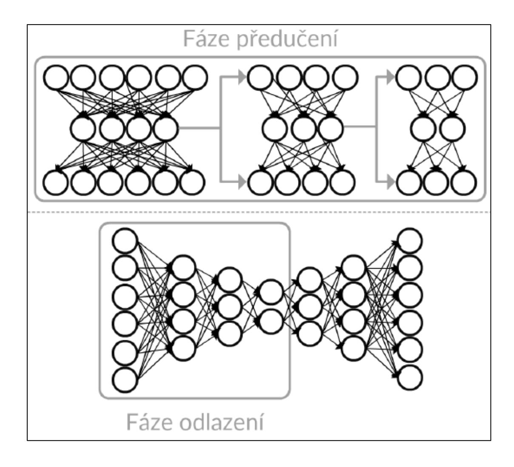

*Obrázek 21: Učení autoenkodéru (převzato z [4]).*

Algoritmus pro předtrénování vrstvy hluboké sítě pomocí autoenkodéru, kde platí  $W^i = W^{i*T}$  (proměnná i odpovídá vrstvě, která se právě trénuje) pracuje následovně:

#### Vstup:

- trénovací vektor x;
- váhy vrstvy *i W*i
- učící koeficient předtrénovací části  $\epsilon_{pre-train}$ ;
- předpětí (bias) neuronů  $b^{i-1}$ ,  $b^i$ .

#### Inicializace - nastavení parametrů autoenkodéru

- $W \leftarrow W^i$
- $b \leftarrow b^i$
- $c \leftarrow b^{i-1}$

#### Dopředná fáze:

- $u(x) \leftarrow b + Wx$
- h(x) = sigm(u(x))
- $\widehat{\boldsymbol{u}}(\boldsymbol{x}) \leftarrow \boldsymbol{c} + \boldsymbol{W}^T \boldsymbol{h}(\boldsymbol{x})$
- $\widehat{x}(x) = sigm(\widehat{u}(x))$

- **Zpětná fáze:**  $\bullet \ \frac{\partial C(\hat{x},x)}{\partial \hat{u}(x)} \leftarrow \hat{x}_k x_k$ 
  - $\frac{\partial C(\hat{x},x)}{\partial \hat{p}(x)} \leftarrow W \frac{\partial C(\hat{x},x)}{\partial \hat{p}(x)}$
  - for  $j \in \{1, ..., |\hat{h}(x)|\}$  do  $\frac{\partial C(\hat{x}, x)}{\partial u_j(x)} \leftarrow \frac{\partial C(\hat{x}, x)}{\partial h_j(x)} \hat{h}(x) \left(1 \hat{h}(x)\right)$

### Adaptace vah vrstvy i a příslušných předpětí (biasů) neuronů:

- $W \leftarrow W^{i} \epsilon_{pre-train} \left( \frac{\partial C(\hat{x}, x)}{\partial u(x)} x^{T} + \hat{h}(x) \frac{\partial C(\hat{x}, x)}{\partial \hat{u}(x)} \right)$
- $\boldsymbol{b^i} \leftarrow \boldsymbol{b^i} \epsilon_{pre-train} \left( \frac{\partial C(\hat{x}, x)}{\partial u(x)} \right)$
- $b^{i-1} \leftarrow b^{i-1} \epsilon_{pre-train} \left( \frac{\partial C(\hat{x}, x)}{\partial \hat{y}(x)} \right)$

#### **Nejdůležitější probrané pojmy:**

- předtrénování neuronové sítě;
- autoenkodér (*angl. autoencoder*);
- kodér;
- dekodér.

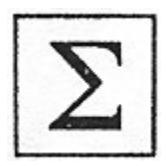

#### **Úkoly a otázky k textu:**

Dříve než začnete řešit korespondenční úkol, důkladně si prostudujte princip autoenkodéru.

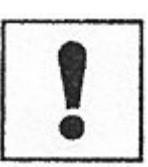

#### **Korespondenční úkol:**

Vytvořte počítačový program pro realizaci autoenkodéru a otestujte jej reálných datech.

# 5 Předtrénování sítě pomocí omezeného Boltzmannova stroje

#### Cíl:

Po prostudování této kapitoly budete seznámeni:

- s omezeným Boltzmannovým strojem (Restricted Boltzmann Machine RBM);
- s algoritmem pro předtrénování vrstvy hluboké neuronové sítě.

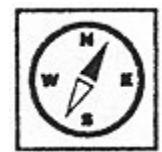

Omezený Boltzmannův stroj (Restricted Boltzmann Machine - RBM) je metoda vhodná k předtrénování hlubokých neuronových sítí. Tato metoda spadá do kategorie učení bez učitele. Jedná se o pravděpodobnostní grafický model, který může být prezentován jako stochastická neuronová síť. Tento model sítě obsahuje dva typy neuronů, a to viditelné neurony a skryté neurony. Neurony jsou uspořádány do dvou vrstev a tvoří bipartitní neorientovaný graf. Omezený Boltzmannův stroj lze použití pro předtrénování hluboké neuronové sítě.

Omezený Boltzmannův stroj (*Restricted Boltzmann Machine - RBM*) je metoda vhodná k předtrénování hlubokých neuronových sítí. Tato metoda spadá do kategorie učení bez učitele.

Jedná se o pravděpodobnostní grafický model, který může být prezentován jako stochastická neuronová síť. Omezený Boltzmannův stroj je speciálním případem Boltzmannova stroje. Učení klasického Boltzmannova stroje je výpočetně náročné. Proto byl zaveden jeho zjednodušený model, který získal velkou popularitu poté, co se začal využívat pro učení vícevrstvých sítí zvaných *Deep Belief Networks*. Omezení je na úrovni topologie sítě. Tento model sítě obsahuje dva typy neuronů, a to viditelné neurony a skryté neurony. Neurony jsou uspořádány do dvou vrstev a tvoří bipartitní neorientovaný graf. Příklad této neuronové sítě je znázorněn na obrázku 22.

Viditelné (*visible*) neurony tvoří první vrstvu sítě a představují její pozorovací část. Jejich vnitřní stavy (výstup neuronů) budeme značit  $\boldsymbol{v} = (v_1, \ldots, v_m)$ , kde  $v_k$  odpovídá stavu viditelného neuronu k. Jeden neuron může například odpovídat jednomu pixelu bitmapy přivedené na vstup sítě.

Skryté (*hidden*) neurony jsou uspořádány do druhé vrstvy a modelují závislosti mezi jednotlivými vstupními daty (např. závislosti mezi jednotlivými pixely bitmapy). Jejich vnitřní stavy (výstup neuronů) budeme značit  $\mathbf{h} = (h_1, \dots, h_n)$ , kde  $h_i$  odpovídá stavu neuronu j. Každý

neuron je propojený se všemi neurony druhé vrstvy, neexistuje propojení mezi neurony téže vrstvy (v klasickém Boltzmannovém stroji jsou neurony propojeny i v rámci jedné vrstvy). Propojení viditelného neuronu k a skrytého neuronu j je symetrické a obsahuje reálnou váhu  $w_{kj}$ , která určuje sílu spojení.

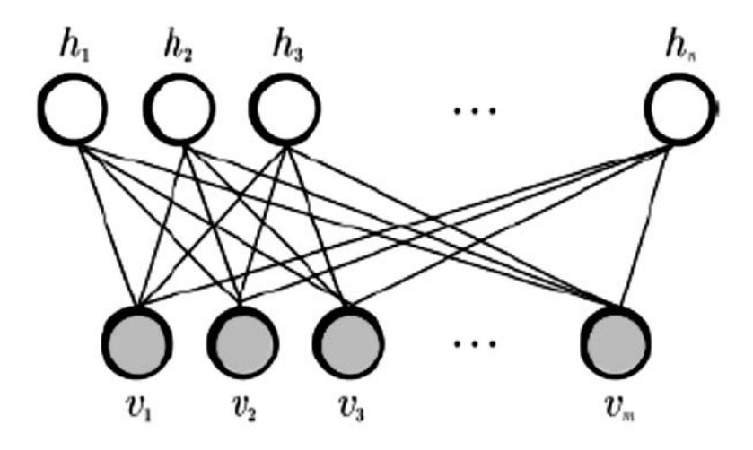

Obrázek 22: Příklad topologie omezeného Boltzmannova stroje (převzato z [6]).

Kongurace (v; h) viditelných a skrytých neuronů má energii E(v; h), která je dána vztahem (6)

$$E(\mathbf{v}, \mathbf{h}) = -\sum_{k=1}^{n} \sum_{j=1}^{m} v_k h_j w_{kj} - \sum_{j=1}^{m} b_j h_j - \sum_{k=1}^{n} c_k v_k,$$
 (6)

kde  $v_k$  resp.  $h_j$  je binární hodnota viditelného neuronu k, resp. skrytého neuronu j. Proměnná n značí počet neuronů viditelné vrstvy, proměnná m udává počet neuronů skryté vrstvy b a c jsou příslušná předpětí (bias) neuronů.

Síť přiřazuje pravděpodobnost každému možnému páru viditelného a skrytého vektoru pomocí funkce (7)

$$p(\mathbf{v}, \mathbf{h}) = \frac{1}{Z} e^{-E(\mathbf{v}, \mathbf{h})},\tag{7}$$

kde funkce rozdělení (partition function) Z je suma přes všechny možné páry viditelného a skrytého neuronu (8)

$$Z = \sum_{\boldsymbol{v},\boldsymbol{h}} e^{-E(\boldsymbol{v},\boldsymbol{h})} \tag{8}$$

Pravděpodobnost, kterou síť přiřadí viditelnému neuronu *v* je dána sumou přes všechny skryté neurony (9)

$$p(\mathbf{v}) = \frac{1}{Z} \sum_{\mathbf{h}} e^{-E(\mathbf{v}, \mathbf{h})}$$
 (9)

Podmíněnou pravděpodobnost, kde hodnota daného neuronu bude rovna jedné, lze vypočítat podle vzorců (10) a (11).

$$p(\boldsymbol{h}|\boldsymbol{v}) = \prod_{j} p(h_{j}|\boldsymbol{v}), kde \ p(h_{j} = 1|\boldsymbol{h}) = \sigma(b_{j}) + \sum_{k} w_{jk} v_{k} \quad (10)$$

$$p(\boldsymbol{v}|\boldsymbol{h}) = \prod_{k} p(v_k|\boldsymbol{h}), \text{kde } p(v_k = 1|\boldsymbol{v}) = \sigma(c_k) + \sum_{j} w_{jk} h_j \quad (11)$$

Funkce je sigmoidální, odpovídá předpětí (biasu) neuronu *j*, je váha spojení mezi neuronem ℎ a , *k* iteruje přes všechny neurony viditelné vrstvy a j iteruje přes všechny neurony skryté vrstvy.

#### **Algoritmus pro předtrénování vrstvy hluboké neuronové sítě**

Následující algoritmus popisuje jeden krok předtrénování vrstvy hluboké neuronové sítě pomocí omezeného Boltzmannova stroje. Vstupem této metody je trénovací vektor *x*, váhy vrstvy *i Wi* , učící koeficient ∈−, předpětí (bias) neuronů předchozí vrstvy *bi-1* a předpětí neuronů trénované vrstvy *bi* . U předtrénování první vrstvy nastává problém s předpětím neuronů předchozí vrstvy *bi* , tedy předpětí vstupních dat. Toto předpětí v rámci hluboké neuronové sítě neexistuje. U předtrénování jednotlivých vrstev musíme na danou vrstvu nahlížet tak, jako by ostatní vrstvy neexistovaly. Pro vstupní vektor tedy vytvoříme dočasné předpětí, které po předtrénování první vrstvy odstraníme a dále postupujeme podle uvedeného algoritmu. Předpětí neuronů obou vrstev jsou inicializována na hodnotu 0.

Algoritmus pro předtrénování vrstvy hluboké neuronové sítě pracuje následovně:

#### **Vstup:**

*•* trénovací vektor *x*;

- váhy vrstvy i Wi
- učící koeficient předtrénovací části  $\epsilon_{pre-train}$ ;
- předpětí (bias) neuronů  $b^{i-1}$ ,  $b^i$ .

#### **Notace:**

•  $a \sim p(\cdot)$  značí, že a se rovná náhodnému vzorku z  $p(\cdot)$ 

Inicializace - nastavení parametrů omezeného Boltzmannova stroje

- $W \leftarrow W^i$
- $b \leftarrow b^i$
- $c \leftarrow b^{i-1}$

Dopředná fáze:

- $v^0 \leftarrow x$
- $\widehat{h^0} = sigm(b + Wv^0)$

Zpětná fáze:

- $h^0 \sim p(h|v^0)$  podle vzorce (10)
- $v^1 \sim p(v|h^0)$  podle vzorce (11)
- $\widehat{h}^1 = sigm(b + Wv^1)$

Adaptace vah vrstvy i:

- $W \leftarrow W^i + \epsilon_{pre-train} (\widehat{h^0}(v^0)^T \widehat{h^1}(v^1)^T)$
- $b^i \leftarrow b^i + \epsilon_{pre-train} (\widehat{h^0} \widehat{h^1})$
- $\boldsymbol{b^{i-1}} \leftarrow \boldsymbol{b^{i-1}} + \epsilon_{pre-train}(\boldsymbol{v^0} \boldsymbol{v^1})$

# Nejdůležitější probrané pojmy:

- omezený Boltzmannův stroj (Restricted Boltzmann Machine RBM)
- předtrénování hlubokých neuronových sítí
- algoritmus pro předtrénování vrstvy hluboké neuronové sítě.

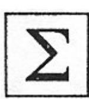

# Úkoly a otázky k textu:

Dříve než začnete řešit korespondenční úkol, důkladně si prostudujte princip adaptace omezeného Boltzmannova stroje.

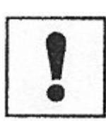

#### **Korespondenční úkol:**

Vytvořte počítačový program pro realizaci omezeného Boltzmannova stroje a otestujte jej reálných datech.

# **6 Nástroje pro práci s hlubokými neuronovými sítěmi**

#### **Cíl:**

Po prostudování této kapitoly se seznámíte:

- s frameworky pro práci s hlubokými neuronovými sítěmi;
- s datasety pro testování algoritmů z oblasti hlubokého učení.

*V této kapitole se specializovanými frameworky pro práci s hlubokými neuronovými sítěmi. V první části této kapitoly si postupně ukážeme tyto softwarové nástroje: Caffe [2], Tensorflow [15], Torch [19], Theano [5] a Microsoft Cognitive Toolkit (CNTK) [17]. Druhá část této kapitoly se bude věnovat datasetům pro testování algoritmů z oblasti hlubokého učení, např. MNIST dataset [18], CIFAR10 dataset [16] a UTKinect-Action3D dataset [20].*

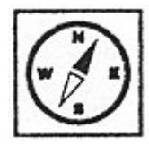

#### **6.1 Frameworky pro práci s hlubokými neuronovými sítěmi**

Práce s neuronovými sítěmi vyžaduje optimalizované matematické algoritmy z důvodů velké výpočetní složitosti algoritmů, které vytváří funkčnost neuronových sítí. Proto je vhodné využít specializovaných frameworků, například:

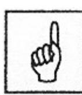

- Caffe [2]
- Tensorflow [15]
- Torch [19]
- Theano [5]
- Microsoft Cognitive Toolkit (CNTK) [17]

#### **Caffe**

Caffe je deep learningový framework vytvořen s důrazem na rychlost a modularitu. Je to open source nástroj pro deep learning dostupný na GitHub vyvíjený univerzitou v Berkeley. Umožňuje provádět výpočty na procesoru nebo na grafické kartě. Při využívání procesoru se uplatňují moduly psané v C++ a při práci na grafické kartě moduly psané pro CUDA. Tento Framework umožňuje volit počet jader procesoru, na která se rozdělí početní úlohy. U grafických karet lze také volit několik jader. Celý framework se snaží o rychlé vyhodnocování s využitím podpůrných knihoven jako BLAS, ATLAS, cuDNN a jiné. Pro návrh celé struktury neuronové sítě využívá Caffe formátu Protobuffer od Google, jedná se o serializační textový formát. Caffe disponuje velkým množstvím typů vrstev a také poskytuje možnost vytvořit si vlastní vrstvu s definovaným

chováním popsaným v Python nebo C++. Vnitřní reprezentace data v Caffe je jako tzv. Blob, což je čtyřrozměrná struktura obsahující čtveřici [počet vzorů, kanál, výška, šířka], kdy kanál představuje např. příslušný kanál z RGB modelu.

#### **Tensorflow**

Tensorflow je open-source framework určený pro numerické výpočty využívající grafy a pro vývoj aplikací využívajících metody strojového učení. Framework byl vyvinut týmem Google-Brain od společnosti Google a původně byl určen pouze pro interní práci a výzkum v rámci společnosti. V roce 2015 byl vypuštěn na veřejnost pod licencí Apache 2.0. Framework v současnosti podporuje práci v jazycích C++, Python a Javascript a pro práci dokáže využívat i GPU. Google rovněž vyvíjí speciální procesorové jednotky (TPU) určené pro strojové učení a optimalizované pro tento framework.

**Keras** [3] je knihovna napsaná v jazyce Python, která poskytuje vysokoúrovňové rozhraní pro práci s neuronovými sítěmi. Cílem Kerasu je usnadnění a urychlení vývoje a experimentace, čehož se snaží docílit zaměřením na uživatelskou přívětivost, modularitu a snadnou rozšiřitelnost. Knihovna sama o sobě pouze dodává jednotné rozhraní. Pro práci vyžaduje další framework, přes který pak dále funguje. V současnosti Keras podporuje 3 frameworky, nad kterými může pracovat - Tensorflow, Theano a Microsoft Cognitive Toolkit (CNTK).

#### **Torch**

Torch je vědecký počítačový framework s širokou podporou pro strojové učení s podporou GPU. Je snadno ovladatelný a efektivní díky rychlému skriptovacímu jazyku LuaJIT a implementaci C / CUDA. Cílem Torch je maximální flexibilita a rychlost při vytváření vědeckého algoritmu. Torch má velkou komunitu, která pro něj připravila nespočet balíčků v oblasti strojového učení, ať už k zpracování obrazu, zvuku nebo zpracování signálu. Jádrem frameworku jsou neuronové sítě a optimalizační knihovny, které mají maximální flexibilitu při implementaci topologie neuronové sítě. Výpočty lze efektivně paralelizovat na CPU či GPU. Samotný Torch podporuje vývoj v C/C++ nebo Lua. Některé modifikace však podporují i rozhraní Python.

### **Theano**

Theano je Python knihovnou, která umožňuje efektivně definovat, optimalizovat a vyhodnocovat matematické výrazy zahrnující multidimenzionální pole. Umožňuje provádět výsledky za pomocí GPU. Podporuje vývoj pouze v jazyce Python.

#### **6.2 Datasety pro testování algoritmů z oblasti hlubokého učení**

Dataset je kolekce (shluk) dat. Následující datasety se používají pro výzkum v oblasti strojového učení a jsou citovány v recenzovaných akademických časopisech. Kvalitní soubory pro testování algoritmů z oblasti hlubokého učení (*deep learning*) je obvykle obtížné a nákladné vytvořit. Z tohoto důvodu se používají standardizované kolekce dat (*Benchmark Datasets*), díky kterým můžeme testovat vytvořené algoritmy a experimentální výstupy pak porovnat s pracemi jiných autorů.

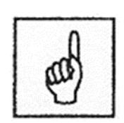

**MNIST dataset** [18]. Tento dataset zahrnuje obrázky ručně psaných čísel. Trénovací množina obsahuje 60000 vzorů a testovací množina obsahuje 10000 vzorů o velikosti 28x28 pixelů. MNIST je databáze tvořená reálnými vzory a běžně se používá pro adaptaci různých systémů zabývajících se zpracováním obrazu a na testování metod z oblasti strojového učení. Vzory obsažené v MNIST vyžadují pouze minimální předzpracování.

**CIFAR10 dataset** [16]. Tento dataset obsahuje 60000 barevných obrázků o velikosti 32x32pixelů roztříděných do deseti kategorií - letadlo, auto, pták, kočka, jelen, pes, žába, kůň, loď, nákladní automobil. K dispozici je 50000 tréninkových obrázků a 10000 testovacích obrázků, přičemž každá kategorie obsahuje 6000 obrázků.

**UTKinect-Action3D dataset** [20]. Tento dataset byl vytvořen Lu Xia et al. a k zachycení bylo využito zařízení Kinect. Dataset je tvořen 10 typy akcí: chůze, sednutí, postavení se, zvednutí předmětu, nesení předmětu, hod, strčení, potáhnutí, mávání rukama a zatleskání. Byly shromážděny akce od celkem deseti subjektů, přičemž každá z akcí byla zaznamenána dvakrát za každý subjekt. Celkem tedy dataset obsahuje 200 zaznamenaných akcí. Záznamy jsou rozděleny do sekvencí tak, jak byly pořizovány. Každá sekvence je tvořena 10 na sebe navazujícími akcemi od jednoho subjektu.

Další datasety vhodné pro testování algoritmů z oblasti hlubokého učení naleznete např. na <https://byteacademy.co/blog/datasets-deep-learning> .

#### **Nejdůležitější probrané pojmy:**

- frameworky pro práci s hlubokými neuronovými sítěmi,
- datasety pro testování algoritmů z oblasti hlubokého učení.

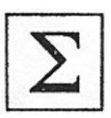

#### **Korespondenční úkol (vybraný úkol vykonejte):**

- 1. Vypracujte seminární práci na téma "*Porovnání frameworků pro práci s hlubokými neuronovými sítěmi"*. Informace hledejte především na www-stránkách. Seminární práci vypracujte v rozsahu 5 stran.
- 2. Vypracujte seminární práci na téma "*Porovnání datasetů pro práci s hlubokými neuronovými sítěmi"*. Informace hledejte především na www-stránkách. Seminární práci vypracujte v rozsahu 5 stran.

# **7 Použití hlubokých neuronových sítí**

#### **Cíl:**

Po prostudování této kapitoly budete seznámeni:

- s aplikacemi hlubokých neuronových sítí.

*V této závěrečné kapitole se postupně zamyslíme nad aplikacemi hlubokých neuronových sítí, tj. autonomní řízení vozidla, zpracování obrazových dat, predikce časových řad, DeepDream - počítačového vidění program, Deep Patient – diagnostika pacientů, AlphaGo – hra GO, WaveNet - generování lidské řeči.*

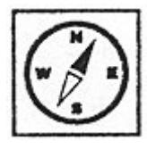

#### **Zpracování obrazových dat**

Konvoluční neuronové sítě se využívají zejména pro zpracování obrazových dat. Jonathan Long [11] využívá plně konvoluční neuronovou síť pro segmentaci 2D obrazů. Na místo plně propojené vrstvy je použita jako poslední vrstva konvoluční vrstva s velikostí jádra voleného tak, aby výstup z vrstvy dával rozměr 1x1 pixel a *N* kanálů. S využitím dekonvoluční vrstvy je znovu vytvořen obraz o původní velikosti vstupu. Architektura sítě je zobrazena na obrázku 23.

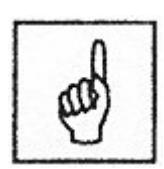

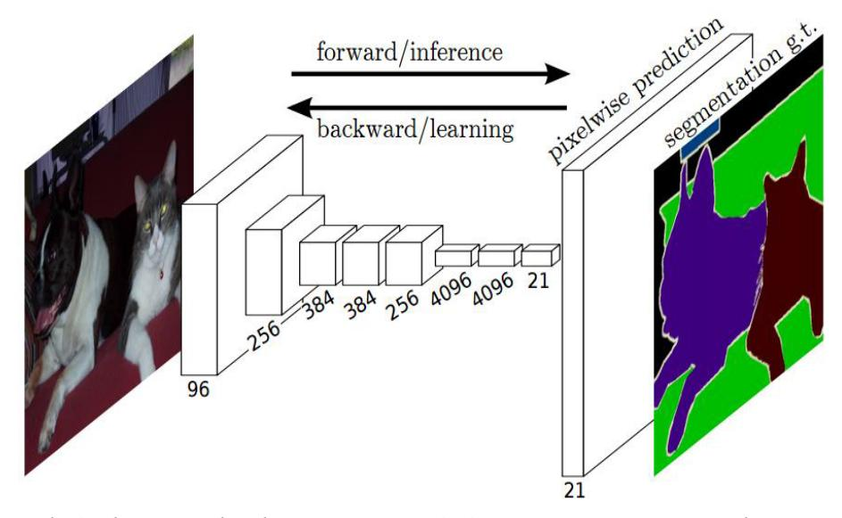

*Obrázek 23: Architektura neuronové sítě pro segmentaci 2D obrazu (převzato z [11]).*

#### **DeepDream**

Deep Dream naučí váš počítač "snít"!!

DeepDream je program počítačového vidění vytvořený v roce 2015 inženýrem Google Alexanderem Mordvintsevem, který používá konvoluční neuronovou síť k nalezení a vylepšení vzorů v obrazech. Google upravil svůj algoritmus na rozpoznávání obrázků tak, aby místo rozpoznávání obsahu naopak obrázky generoval, tak kromě groteskní galerie získal i představu o tom, jak rozdílné je vnímání lidské od toho naučeného pomocí deep learningu - DeepDream dokáže najít a zvýraznit vzory ukryté v hlubinách obrazu. Výsledkem jsou pak snímky s halucinogenním vzhledem. Ukázka je na obrázku 24.

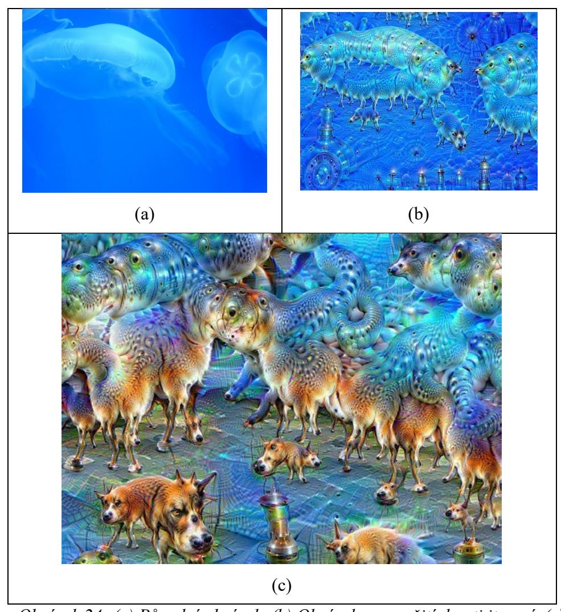

*Obrázek 24: (a) Původní obrázek. (b) Obrázek po použití deseti iterací. (c) Obrázek po padesáti iterací. Síť byla naučena na obrázcích psů (převzato z <https://en.wikipedia.org/wiki/DeepDream> ).*

Google uvolnil zdrojový kód projektu, který je napsaný v Pythonu a využívá framework s názvem Caffe. Ve zvoleném obrázku umí najít různé obrazce, uvolněná verze je naučena na zvířata. Uvolněna byla také zkompilovaná verze v .app souboru pro systém OS X s názvem DeepDreamer. Verze pro OS X umí pracovat také s gify nebo videi.

#### **Deep Patient**

Výzkumná skupina z newyorské nemocnice Mount Sinai v roce 2015 odhalila svůj nástroj Deep Patient. Této umělé inteligenci poskytla 12 let lékařských záznamů 700 tisíců pacientů. Nacházely se v nich stovky různých proměnných – návštěva lékaře, závažnost příznaků, výsledky testů, operace, léky atd. Pomocí strojového učení byl Deep Patient pak schopen určit u dalších případů předpoklady ke konkrétním typům onemocnění, včetně rakoviny.

Lékaři tím získávají drahocenný čas při vyšetření, ale i při nasazování samotné léčby. Shodují na tom, že jde o mimořádně dobrý způsob, jak postupovat při léčbě různých chorob. Systém ale opět naráží na problém, že není jasné, jak se neuronová síť rozhoduje. A to je při předepisovaní konkrétních léků naprosto nezbytná informace.

### **AlphaGo**

Hrubou silou se s dnešní technologií hra GO vyřešit nedá. Na začátku hry je k dispozici 361 možností, jak zahrát a po pěti kolech může být hrací plocha uspořádána do celkem zhruba pět bilionů (5×1012) možných konfigurací. Pro srovnání, šachovnice může po deseti tazích (po pěti každého hráče) uspořádána "jen" necelými pěti miliony způsobů. To je o mnoho řádů více možností, než kolik by dnešní počítače mohly v nějaké smysluplné době projít. Pro extrémně velké množství kombinací je proto GO považována za nesmírně obtížný problém. Snaha počítat všechny varianty (jako například u piškvorek nebo u dámy) zde totiž nepřipadá v úvahu.

Tým Googlu vytvořil software nazvaný AlphaGo (obrázek 25), který je složen z kombinace konvolučních neuronových sítí a prohledávání stromu možných tahů. Jsou zde dvě neuronové sítě, jež každá má jinou úlohu. První bychom mohli nazvat jako "strategickou", protože provádí předvýběr vhodných možností pro další tah. Druhá je síť "hodnotící" a hodnotí pozice jako dobré nebo špatné a tím snižuje hloubku prohledávaného stromu. Neuronové sítě zúží výběr natolik, aby druhá část AlphaGo - stromové prohledávání - mohla vybrat optimální možnost právě z těch předvybraných. Nemusí tak propočítávat a ověřovat stovky možných tahů, ale třeba jen ty neuronovou sítí nejdoporučovanější.

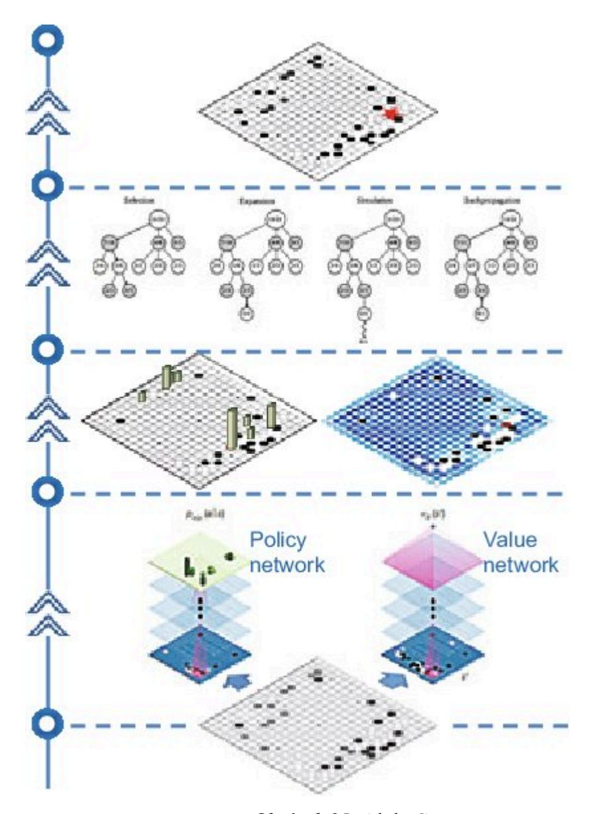

*Obrázek 25:* AlphaGo

*(převzato z* [https://www.researchgate.net/publication/316618941\\_Hybrid](https://www.researchgate.net/publication/316618941_Hybrid-augmented_intelligence_collaboration_and_cognition/figures?lo=1)[augmented\\_intelligence\\_collaboration\\_and\\_cognition/figures?lo=1](https://www.researchgate.net/publication/316618941_Hybrid-augmented_intelligence_collaboration_and_cognition/figures?lo=1)*).*

#### **WaveNet**

Googlem vlastněná společnost DeepMind vyvinula hlubokou neuronovou síť WaveNet (obrázek 26), která generuje lidskou řeč a díky průběžnému sběru informací se neustále zdokonaluje. Tato síť představuje významný pokrok, oproti současným hlasovým syntetizérům. Namísto jednoduché analýzy zvuku je nový způsob postaven na učení a porozumění daného fragmentu řeči. WaveNet může přímo modulovat syrový průběh audiosignálu, což je tak náročný proces, že k němu byla nutná právě samostatná neuronová síť. WaveNet se učí z nahrávek lidského hlasu a poté získané znalosti aplikuje sama na svůj vlastní výstup. A právě tato nezávislost pak programu umožňuje tvořit i jiné druhy zvuku, například hudbu.

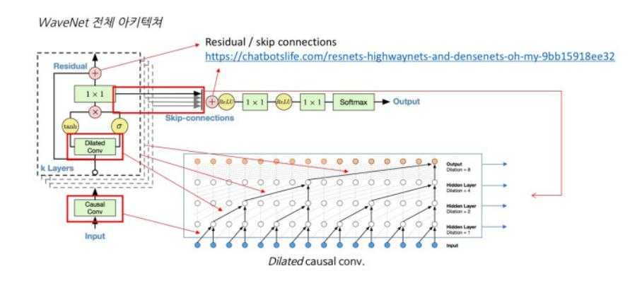

*Obrázek 26: WaveNet (převzato z* [https://kakalabblog.wordpress.com/2017/07/18/wavenetnsynth](https://kakalabblog.wordpress.com/2017/07/18/wavenetnsynth-deep-audio-generative-models/)[deep-audio-generative-models/](https://kakalabblog.wordpress.com/2017/07/18/wavenetnsynth-deep-audio-generative-models/)*).*

#### **Autonomní řízení vozidla**

Automatizované vozidlo musí být schopné dělat všechno co řidič, jenž vnímá okolí svými smysly, vlastní inteligencí zpracovává získané informace, rozhoduje se – a podle toho všeho řídí. Základním předpokladem pro pokročilé asistenční funkce a automatizované řízení je detailní porozumění a přesné vyhodnocení celé dopravní situace. Aby mohly automatizované systémy od řidičů převzít kontrolu nad vozem, musí vozidlo pochopit okamžité chování všech účastníků provozu. Jen tak se může systém v každé situaci rozhodnout správně. Tento úkol nejlépe zvládají algoritmy využívající metody hlubokého strojového učení.

Na obrázku 27 jsou základní stavební kameny systému automatické jízdy. Vozidlo je vybaveno soupravou senzorů (ultrazvukové, radarové, přední kamera, parkovací kamery aj.) umožňující získávat informace v okruhu celých 360° okolo vozidla. Dále jsou nutné mapové podklady ve vysokém rozlišení společně s co nejpřesnějším určením polohy vozidla. Takovéto mapy v ideálním případě poskytují 3D data infrastruktury zaměřené s přesností na centimetry. Posledním stavebním kamenem je komunikace vozidla s okolím. Všechna tato data musejí být zpracovávána v reálném čase. Počítač navíc z důvodu bezpečnosti musí zajišťovat dvě nezávislé výpočetní cesty. V současnosti nejvýkonnější řešení podporuje výpočtový model na bázi hlubokých neuronových sítí. Výsledkem fúze a vyhodnocení informací je neustále obnovovaná mapa statických objektů v okolí vozidla a mapa dynamických objektů, které jsou v reálném čase trekovány, tzn. je sledována jejich trajektorie a vzájemná rychlost vztažená k danému vozidlu. Na základě těchto informací je průběžně vypočítávána trajektorie tohoto vozidla.

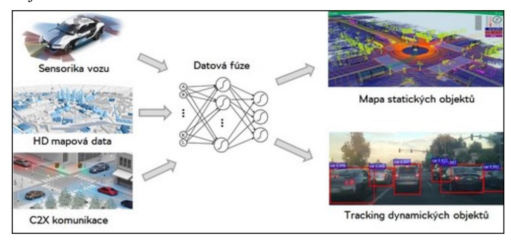

*Obrázek 27: Princip autonomní jízdy ve vozidle (převzato z* [http://www.odbornecasopisy.cz/elektro/clanek/autonomni](http://www.odbornecasopisy.cz/elektro/clanek/autonomni-jizda-silnicnich-vozidel--3746)[jizda-silnicnich-vozidel--3746](http://www.odbornecasopisy.cz/elektro/clanek/autonomni-jizda-silnicnich-vozidel--3746) *).*

#### **Predikce časových řad**

Jak využít potenciál a výkonnost konvolučních neuronových sítí pro jednorozměrné signály a časové řady? Jednou z možností je převést signály na "obrázky" pomocí časově-frekvenční transformace. Výsledkem transformace je obrázek změn rozložení frekvencí signálu v čase. Může se jednat o spektrogram, který využívá Fourierovu transformaci, nebo scalogram, který využívá vlnkovou (wavelet) transformaci. Konvoluční neuronová síť je aplikována na transformovaná data stejným způsobem, jako by pracovala s běžnými obrázky.

Příkladem nasazení metody deep learning na 1-D signály je klasifikace záznamů EKG. Použitá data jsou veřejně dostupná na webových stránkách PhysioNet [\(https://physionet.org/\)](https://physionet.org/). Na obrázku 28 jsou signály srdečního rytmu ze tří situací: srdeční arytmie, městnavé srdeční selhání a normální sinusový rytmus. Cílem bylo naučit hlubokou neuronovou síť rozpoznat tyto tři situace.

Aby bylo možné využít sílu konvolučních neuronových sítí, byly úseky naměřeného srdečního rytmu převedeny na scalogramy s využitím spojité vlnkové transformace (obrázek 29)

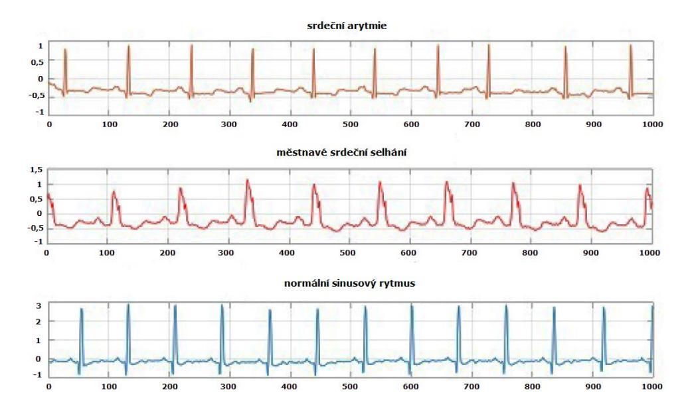

*Obrázek 28: Srdeční rytmus ze záznamu EKG (převzato z* [https://sciencemag.cz/wp](https://sciencemag.cz/wp-content/uploads/2017/06/obr2_srdecni_rytmus.jpg)[content/uploads/2017/06/obr2\\_srdecni\\_rytmus.jpg](https://sciencemag.cz/wp-content/uploads/2017/06/obr2_srdecni_rytmus.jpg) *).*

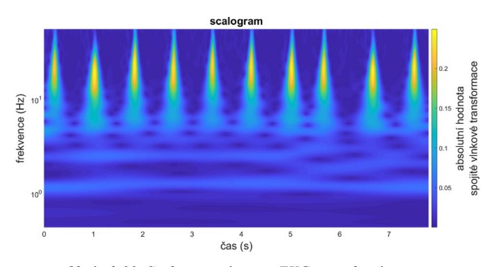

*Obrázek 29: Scalogram záznamu EKG při srdeční arytmii (převzato z* [https://sciencemag.cz/wp](https://sciencemag.cz/wp-content/uploads/2017/06/obr3_scalogram.jpg)[content/uploads/2017/06/obr3\\_scalogram.jpg](https://sciencemag.cz/wp-content/uploads/2017/06/obr3_scalogram.jpg) *).*

Pro klasifikaci byla využita před-učená síť AlexNet, složená z 25 vrstev. Síť AlexNet je natrénována na 1,2 milionu obrázků a rozpoznává 1000 druhů objektů (druhy zvířat, kancelářské předměty atd.). Pro rozpoznání srdečního rytmu byla téměř celá síť ponechána v originální podobě, pouze poslední klasifikační vrstvy byly nahrazeny novými "čistými" vrstvami. Síť byla poté doučena na datech 130 scalogramů EKG ze 3 sledovaných kategorií srdečního rytmu. Její fungování bylo testováno s validační sadou údajů, kde síť dosáhla úspěšnosti přes 93%.

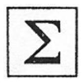

#### **Nejdůležitější probrané pojmy:**

- DeepDream;
- Deep Patient;
- AlphaGo;
- WaveNet.

#### **Korespondenční úkol:**

Vypracujte seminární práci na téma "*Použití neuronových sítí v …"* (*oblast použití si zvolte sami*). Informace hledejte především na www-stránkách. Zaměřte se pouze na jednu oblast, v níž použití neuronových sítí rozeberete podrobněji. Nedělejte přehled použití neuronových sítí v různých oblastech. Seminární práci vypracujte v rozsahu 5 stran.

# **Literatura**

- **[1]** Anderson, D. and McNeill, G. *Artificial Neural Networks Technology*. [online], [cit. 2019-10-10]. URL [http://andrei.clubcisco.ro/cursuri/f/f](http://andrei.clubcisco.ro/cursuri/f/f-sym/5master/aac-nnga/AI_neural_nets.pdf)[sym/5master/aac-nnga/AI\\_neural\\_nets.pdf.](http://andrei.clubcisco.ro/cursuri/f/f-sym/5master/aac-nnga/AI_neural_nets.pdf)
- **[2]** Caffe [online]. Bekeley university [cit. 2019-10-15]. Dostupné z: <http://caffe.berkeleyvision.org/>
- **[3]** Chollet, F. Keras. Keras [online]: 2015 [cit. 2019-03-30]. Dostupné z: <https://keras.io/>
- **[4]** Daubner, L. Deep Learning. Bakalářská práce. Masarykova univerzita, Brno 2015.
- **[5]** Deeplearning: Theano [online]. University of Montreal, 2008 [cit. 2019-04-29]. Dostupné z:<http://www.deeplearning.net/software/theano/>
- **[6]** Habrnál, M. Hluboké neuronové sítě. *Diplomová práce*. VUT v Brně, Brno 2014.
- **[7]** Hlavoň, D. Hluboké neuronové sítě pro analýzu 3D obrazových dat. *Bakalářská práce*. VUT v Brně, Brno 2016.
- **[8]** He, K., Zhang, X., Ren, S., Sun, J.: Deep Residual Learning for Image Recognition. *IEEE Conference on Computer Vision and Pattern Recognition*, (pp. 770-778), 2016.
- **[9]** Krizhevsky, A., Sutskever, I., Hinton, G. E.: ImageNet classification with deep convolutional neural networks. *Communications of the ACM*, 2017, 60(6), 84-90.
- **[10]** Lecun, Y., Bottou, L., Bengio Y., Haffner, P.: Gradient-based learning applied to document recognition*. Proceedings of the IEEE* 86(11), 2278-2324, 1998.
- **[11]** Long, J., Shelhamer, E., Darrell, T.: Fully Convolutional Networks for Semantic Segmentation [online]. 2014 [cit. 2018-04-23]. Dostupné z:<http://arxiv.org/abs/1411.4038>
- **[12]** Materna, J. Deep Learning: budoucnost strojového učení? [online], [cit. 2019-10-10]. URL [https://blog.seznam.cz/2013/01/deep-learning](https://blog.seznam.cz/2013/01/deep-learning-budoucnost-strojoveho-uceni/)[budoucnost-strojoveho-uceni/](https://blog.seznam.cz/2013/01/deep-learning-budoucnost-strojoveho-uceni/)
- **[13]** Student Notes: Convolutional Neural Networks (CNN) Introduction [online]. [cit. 2019-10-15]. Dostupné z: [https://indoml.com/2018/03/07/student-notes-convolutional-neural](https://indoml.com/2018/03/07/student-notes-convolutional-neural-networks-cnn-introduction/)[networks-cnn-introduction/](https://indoml.com/2018/03/07/student-notes-convolutional-neural-networks-cnn-introduction/)
- **[14]** Szegedy, C. et al. Going deeper with convolutions. *IEEE Conference on Computer Vision and Pattern Recognition,* (pp. 1-9) 2015.

- **[15]** Tensorflow. Tensorflow: Large-Scale Machine Learning on Heterogeneous Systems [online]. 2015 [cit. 2019-03-30]. Dostupné z: [https://tensorflow.org](https://tensorflow.org/)
- **[16]** The CIFAR-10 dataset [online]: [cit. 2019-03-30]. Dostupné z: [https://www.cs.toronto.edu/~kriz/cifar.html](https://www.cs.toronto.edu/%7Ekriz/cifar.html)
- **[17]** The Microsoft Cognitive Toolkit [online]: 2017 [cit. 2019-03-30]. Dostupné z:<https://docs.microsoft.com/en-us/cognitive-toolkit/>
- **[18]** The MNIST database of handwritten digits [online]: [cit. 2019-03-30]. Dostupné z:<http://yann.lecun.com/exdb/mnist/>
- **[19]** Torch [online]. Facebook, Twitter, Google [cit. 2019-04-29]. Dostupné z:<http://torch.ch/>
- **[20]** UTKinect-Action3D dataset [online]: [cit. 2019-03-30]. Dostupné z: <http://cvrc.ece.utexas.edu/KinectDatasets/HOJ3D.html>
- **[21]** Volná, E.: Neuronové sítě 1. *Ostrava: Ostravská univerzita v Ostravě. Vydání: druhé,* 2008.
- **[22]** Zeiler, M. D., & Fergus, R. (2014, September). Visualizing and understanding convolutional networks. In *European conference on computer vision* (pp. 818-833). Springer, Cham.