# OSTRAVSKÁ UNIVERZITA V OSTRAVĚ


# NEURONOVÉ SÍTĚ 1

EVA VOLNÁ

**OSTRAVA 2008** 

Recenzenti:

Název: Neuronové sítě 1

Autoři: RNDr. PaedDr. Eva Volná, PhD.

Vydání: druhé, 2008

Počet stran: 86

Náklad: Tisk:

Studijní materiály pro distanční kurz: Neuronové sítě 1

Jazyková korektura nebyla provedena, za jazykovou stránku odpovídá autor.

Vydavatel a tisk: Ostravská univerzita v Ostravě,

- © RNDr. PaedDr. Eva Volná, PhD.
- © Ostravská univerzita v Ostravě

ISBN

# NEURONOVÉ SÍTĚ 1

#### Eva Volná

## Cíl předmětu

Seznámit studenta se základy teorie neuronových sítí. Důraz je zde kladen nejen na základní teorii, ale i na schopnost ji aplikovat při řešení příkladů. Všechny v textu uvedené popisy algoritmů jsou převzaty z [2].

#### Po prostudování textu budete znát:

Tyto učební texty jsou určeny studentům informatiky pro předmět neuronové sítě 1. Jsou v nich vysvětleny základní pojmy z teorie umělých neuronových sítí. V jednotlivých kapitolách jsou postupně podle obtížnosti uvedeny základní modely neuronových sítí (tj. perceptron, adaline, madaline, dopředná vícevrstvá neuronová sít' s adaptační metodou backpropagation, asociativní neuronové sítě a neuronové sítě pracující na principu samoorganizace), a to jejich architektura, aktivní dynamika a adaptivní dynamika.

# Úvod pro práci s textem pro distanční studium.

#### Účel textu

#### Průvodce studiem:


Tento text má sloužit pro potřeby výuky výběrového předmětu NEURONOVÉ SÍTĚ 1 na katedře informatiky a počítačů. Nepředpokládá se žádná předchozí znalost problematiky, pouze základy matematické analýzy, především diferenciální počet a maticový počet. Předmět má rysy kurzu, ve kterém student získá ucelenější pohled na problematiku umělých neuronových sítí.

#### Struktura textu

V textu jsou dodržena následující pravidla:

- je specifikován cíl lekce (tedy co by měl student po jejím absolvování umět, znát, pochopit)
- výklad učiva
- důležité pojmy
- úkoly a otázky k textu
- korespondenční úkoly (mohou být sdruženy po více lekcích)

*Úkoly* Vyberte si a vypracujte JEDEN korespondenční úkol z kapitoly 4. – 9. této studijní opory. Dále vypracujte korespondenční úkol z kapitoly 10. Řešení obou korespondenčních úkolů zašlete do konce semestru (nejpozději před zkouškou) na adresu eva.volna@osu.cz.

Pokud máte jakékoliv věcné nebo formální připomínky k textu, kontaktujte autora (eva.volna@osu.cz).

# **Obsah:**

| BIOLOGICKÝ NEURON                             |                                                                                                                                                                                                                                                                                                                                                                                                                                                                                                                                                                                                                                                                                                                                                                                                                                             |
|-----------------------------------------------|---------------------------------------------------------------------------------------------------------------------------------------------------------------------------------------------------------------------------------------------------------------------------------------------------------------------------------------------------------------------------------------------------------------------------------------------------------------------------------------------------------------------------------------------------------------------------------------------------------------------------------------------------------------------------------------------------------------------------------------------------------------------------------------------------------------------------------------------|
|                                               |                                                                                                                                                                                                                                                                                                                                                                                                                                                                                                                                                                                                                                                                                                                                                                                                                                             |
|                                               |                                                                                                                                                                                                                                                                                                                                                                                                                                                                                                                                                                                                                                                                                                                                                                                                                                             |
| NEURONOVÁ SÍŤ                                 |                                                                                                                                                                                                                                                                                                                                                                                                                                                                                                                                                                                                                                                                                                                                                                                                                                             |
|                                               |                                                                                                                                                                                                                                                                                                                                                                                                                                                                                                                                                                                                                                                                                                                                                                                                                                             |
| AKTIVNÍ DYNAMIKA                              |                                                                                                                                                                                                                                                                                                                                                                                                                                                                                                                                                                                                                                                                                                                                                                                                                                             |
|                                               |                                                                                                                                                                                                                                                                                                                                                                                                                                                                                                                                                                                                                                                                                                                                                                                                                                             |
|                                               |                                                                                                                                                                                                                                                                                                                                                                                                                                                                                                                                                                                                                                                                                                                                                                                                                                             |
|                                               |                                                                                                                                                                                                                                                                                                                                                                                                                                                                                                                                                                                                                                                                                                                                                                                                                                             |
|                                               |                                                                                                                                                                                                                                                                                                                                                                                                                                                                                                                                                                                                                                                                                                                                                                                                                                             |
| KLASIFIKACE VZORŮ                             |                                                                                                                                                                                                                                                                                                                                                                                                                                                                                                                                                                                                                                                                                                                                                                                                                                             |
|                                               |                                                                                                                                                                                                                                                                                                                                                                                                                                                                                                                                                                                                                                                                                                                                                                                                                                             |
| STANDARDNÍ METODA BACKPROPAGATION             |                                                                                                                                                                                                                                                                                                                                                                                                                                                                                                                                                                                                                                                                                                                                                                                                                                             |
|                                               |                                                                                                                                                                                                                                                                                                                                                                                                                                                                                                                                                                                                                                                                                                                                                                                                                                             |
|                                               |                                                                                                                                                                                                                                                                                                                                                                                                                                                                                                                                                                                                                                                                                                                                                                                                                                             |
|                                               |                                                                                                                                                                                                                                                                                                                                                                                                                                                                                                                                                                                                                                                                                                                                                                                                                                             |
| KVANTOVÁNÍ VEKTORŮ UČENÍM                     |                                                                                                                                                                                                                                                                                                                                                                                                                                                                                                                                                                                                                                                                                                                                                                                                                                             |
|                                               |                                                                                                                                                                                                                                                                                                                                                                                                                                                                                                                                                                                                                                                                                                                                                                                                                                             |
|                                               |                                                                                                                                                                                                                                                                                                                                                                                                                                                                                                                                                                                                                                                                                                                                                                                                                                             |
|                                               |                                                                                                                                                                                                                                                                                                                                                                                                                                                                                                                                                                                                                                                                                                                                                                                                                                             |
| DISKRÉTNÍ HOPFIELDOVA SÍŤ                     |                                                                                                                                                                                                                                                                                                                                                                                                                                                                                                                                                                                                                                                                                                                                                                                                                                             |
|                                               |                                                                                                                                                                                                                                                                                                                                                                                                                                                                                                                                                                                                                                                                                                                                                                                                                                             |
|                                               |                                                                                                                                                                                                                                                                                                                                                                                                                                                                                                                                                                                                                                                                                                                                                                                                                                             |
| NEURONOVÉ SÍTĚ A VON NEUMANOVSKÁ ARCHITEKTURA |                                                                                                                                                                                                                                                                                                                                                                                                                                                                                                                                                                                                                                                                                                                                                                                                                                             |
|                                               |                                                                                                                                                                                                                                                                                                                                                                                                                                                                                                                                                                                                                                                                                                                                                                                                                                             |
| IMPLEMENTACE NEURONOVÝCH SÍTÍ A NEUROPOČÍTAČE | 84                                                                                                                                                                                                                                                                                                                                                                                                                                                                                                                                                                                                                                                                                                                                                                                                                                          |
|                                               |                                                                                                                                                                                                                                                                                                                                                                                                                                                                                                                                                                                                                                                                                                                                                                                                                                             |
|                                               | ÚVOD DO PROBLEMATIKY NEURONOVÝCH SÍTÍ6<br>1.1<br>HISTORIE NEURONOVÝCH SÍTÍ6<br>1.2<br>8<br>1.3<br>FORMÁLNÍ NEURON10<br>HEBBOVO UČENÍ14<br>18<br>3.1<br>ORGANIZAČNÍ DYNAMIKA18<br>3.2<br>20<br>3.3<br>ADAPTIVNÍ DYNAMIKA<br>23<br>JEDNODUCHÉ MODELY NEURONOVÝCH SÍTÍ24<br>4.1<br>PERCEPTRON24<br>4.2<br>ADALINE27<br>4.3<br>MADALINE29<br>4.4<br>35<br>BACKPROPAGATION39<br>5.1<br>41<br>5.2<br>MODIFIKOVANÉ ALGORITMY UČENÍ SE ZPĚTNÝM ŠÍŘENÍM CHYBY<br>49<br>SAMOORGANIZACE52<br>6.1<br>KOHONENOVY SAMOORGANIZAČNÍ MAPY52<br>6.2<br>57<br>DOPŘEDNÁ SÍŤ TYPU COUNTERPROPAGATION60<br>HOPFIELDOVA SÍŤ64<br>8.1<br>ASOCIATIVNÍ NEURONOVÉ SÍTĚ64<br>8.2<br>68<br>DVOUSMĚRNÁ ASOCIATIVNÍ PAMĚŤ<br>74<br>POSTAVENÍ NEURONOVÝCH SÍTÍ V INFORMATICE80<br>10.1<br>80<br>POČÍTAČE<br>10.2<br>APLIKACE NEURONOVÝCH SÍTÍ<br>82<br>10.3<br>LITERATURA87 |

# 1 ÚVOD DO PROBLEMATIKY NEURONOVÝCH SÍTÍ

#### Cíl:

Získáte základní přehled o těchto tématech:

- historie neuronových sítí;
- biologický neuron;
- formální neuron.

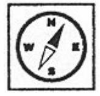

V této úvodní kapitole se stručně seznámíte s historií neuronových sítí [6] a se základním matematickým modelem biologického neuronu, tj. formálním neuronem. Z tohoto modelu budeme dále vycházet, a proto je nutné, abyste jeho pochopení věnovali zvýšenou pozornost.

#### 1.1 Historie neuronových sítí

počáteční období

Za počátek vzniku oboru neuronových sítí je považována práce Warrena McCullocha a Waltera Pittse z roku 1943, kteří vytvořili velmi jednoduchý matematický model neuronu, což je základní buňka nervové soustavy. Číselné hodnoty parametru v tomto modelu byly převážně bipolární, tj. z množiny {-1,0,1}. Ukázali, že nejjednodušší typy neuronových sítí mohou v principu počítat libovolnou aritmetickou nebo logickou funkci. Ačkoliv nepočítali s možností bezprostředního praktického využití svého modelu, jejich článek měl velký vliv na ostatní badatele. V roce 1949 napsal Donald Hebb knihu "The Organization of Behaviour", ve které navrhl učící pravidlo pro synapse neuronů (mezineuronové rozhraní). Toto pravidlo bylo inspirováno myšlenkou, že podmíněné reflexy, které jsou pozorovatelné u všech živočichů, jsou vlastnostmi jednotlivých neuronů. Hebb se snažil vysvětlit některé experimentální výsledky psychologie. Také jeho práce ovlivnila ostatní vědce, kteří se začali zabývat podobnými otázkami. Avšak 40. a 50. léta zatím ještě nepřinesla zásadní pokroky v oblasti neurovýpočtů. Typickým příkladem výzkumu v tomto období byla v roce 1951 konstrukce prvního neuropočítače Snark, u jehož zrodu stál Marvin Minsky. Snark byl sice úspěšný z technického hlediska, dokonce již automaticky adaptoval váhy, ale ve skutečnosti nebyl nikdy využit k řešení nějakého zajímavého praktického problému. Nicméně jeho architektura později inspirovala další konstruktéry neuropočítačů. V roce 1957 Frank Rosenblatt vynalezl tzv. perceptron, který je zobecněním McCullochova a Pittsova modelu neuronu pro reálný číselný obor parametrů. Pro tento model navrhl učící algoritmus, o kterém matematicky dokázal, že pro daná tréninková data nalezne po konečném počtu kroků odpovídající váhový vektor parametrů (pokud existuje) nezávisle na jeho počátečním nastavení. Rosenblatt také napsal jednu z prvních knih o neurovýpočtech "Principles of Neurodynamics". Na základě tohoto výzkumu Rosenblatt spolu s Charlesem Wightmanem a dalšími sestrojili během let 1957 a 1958 první úspěšný neuropočítač, který nesl jméno "Mark I Perceptron". Protože původním odborným zájmem Rosenblatta

bylo rozpoznávání obrazců, byl tento neuropočítač navržen pro rozpoznávání znaků. Znak byl promítán na světelnou tabuli, ze které byl snímán polem 20x20 fotovodičů. Intenzita 400 obrazových bodů byla vstupem do neuronové sítě perceptronů, jejímž úkolem bylo klasifikovat, o jaký znak se jedná (např. "A", "B" apod.). Díky úspěšné presentaci uvedeného neuropočítače se neurovýpočty, které byly alternativou ke klasickým výpočtům realizovaným na von neumannovské architektuře počítače, staly novým předmětem výzkumu. Frank Rossenblatt je proto dodnes některými odborníky považován za zakladatele tohoto nového oboru. Krátce po objevu perceptronu Bernard Widrow se svými studenty vyvinul další typ neuronového výpočetního prvku, který nazval "ADALINE" (ADAptive Linear NEuron). Tento model byl vybaven novým výkonným učícím pravidlem, které se dodnes nezměnilo. Widrow se svými studenty demonstroval funkčnost "ADALINE" na mnoha jednoduchých typových příkladech a založil také první firmu (Memistor Corporation) orientovanou na hardware neuropočítačů, která v první polovině 60. let vyráběla a prodávala neuropočítače a jejich komponenty. Na přelomu 50. a 60. let dochází k úspěšnému rozvoji neurovýpočtů v oblasti návrhu nových modelů neuronových sítí a jejich implementací. Výsledky z uvedeného období jsou shrnuty v knize Nilse Nilssona "Learning Machines" z roku 1965. Přes nesporné úspěchy dosažené v tomto období se obor neuronových sítí potýkal se dvěma problémy. Za přistupovala prvé, většina badatelů k neuronovým sítím z experimentálního zanedbávala hlediska a analytický neuronových modelů. Za druhé, nadšení některých výzkumných pracovníků vedlo k velké publicitě neopodstatněných prohlášení (např. za několik málo let bude vyvinut umělý mozek). Tyto skutečnosti diskreditovaly neuronové sítě v očích odborníků z jiných oblastí a odradily vědce a inženýry, kteří se o neurovýpočty zajímali. Navíc se samostatný obor neuronových sítí vyčerpal a další krok v této oblasti by býval požadoval radikálně nové myšlenky a postupy. Neilepší odborníci oblast neuronových sítí opouštěli a začali se zabývat příbuznými obory umělé inteligence.

Poslední epizodou tohoto období byla kampaň vedená Marvinem Minským a Seymourem Papertem, kteří využili svůj vliv na to, aby zdiskreditovali výzkum neuronových sítí nacházející se v krizi, ve snaze přenést finanční zdroje z této oblasti na jiný výzkum v oblasti umělé inteligence. V té době koloval rukopis jejich výzkumné zprávy, která napomáhala tomuto záměru. Uvedený rukopis byl v upravené formě publikován roce 1969 pod názvem "Perceptrons". V této knize Minsky a Papert využili pro svou argumentaci známého triviálního faktu, že jeden perceptron nemůže počítat jednoduchou logickou funkci, tzv. vylučovací disjunkci (XOR). Tento problém lze sice vyřešit vytvořením dvouvrstvé sítě se třemi neurony, ale pro vícevrstvý perceptron nebyl v této době znám učící algoritmus. Autoři z toho nesprávně vyvodili, že takový algoritmus vzhledem ke komplikovanosti funkce, kterou vícevrstvá síť počítá, snad ani není možný. Jejich tvrzení bylo všeobecně přijato a považováno za matematicky dokázané. Kampaň Minského a Paperta byla úspěšná, výzkum neuronových sítí nebyl již déle dotován a neurovýpočty

XOR problém

byly považovány za neperspektivní. V dalším období od roku 1967 do 1982 probíhal výzkum neuronových sítí ojediněle a izolovaně, převážně mimo území Spojených států, kde kniha "Perceptrons" měla velký vliv. Většina prací byla publikována např. pod hlavičkou adaptivní zpracování signálů, rozpoznávání obrazců a biologické modelování. Avšak již v počátcích tohoto tichého období se neurovýpočty začali zabývat talentovaní badatelé, mezi nimi byli např. Shun Ichi Amari, James Anderson, Kunihiko Fukushima, Stephen Grossberg, Harry Klopf, Teuvo Kohonen a David Willshaw. Tito vědci přispěli svými objevy k renesanci neuronových sítí.

80. léta 20. stol.

Počátkem 80. let se badatelé v oblasti neurovýpočtů osmělili a začali podávat vlastní grantové projekty zaměřené na vývoj neuropočítačů a jejich aplikace. Zásluhou programového manažera Ira Skurnicka začala v roce 1983 americká grantová agentura DARPA (Defense Advanced Research Projects Agency) finančně podporovat výzkum neuronových sítí a jejího příkladu v krátké době následovaly i jiné organizace podporující základní i aplikovaný výzkum. Další zásluhu na renesanci oboru neuronových sítí měl světově uznávaný fyzik John Hopfield, který se v této době zabýval neurovýpočty. Své výsledky publikoval v roce 1982 a 1984. Ukázal souvislost některých modelů neuronových sítí s fyzikálními modely magnetických materiálů. Svými zvanými přednáškami, které měl po celém světě, získal pro neuronové sítě stovky kvalifikovaných vědců, matematiků a technologů. V roce 1986 publikovali své výsledky badatelé z tzv. PDP skupiny (Parallel Distributed Processing Group). Ve svých pracích popsali učící algoritmus zpětného šíření chyby (backpropagation) pro vícevrstvou neuronovou síť a vyřešili tak problém, který se Minskému a Pappertovi v 60. letech jevil jako nepřekonatelná překážka pro využití a neuronových sítí. Tento algoritmus je doposud nejpoužívanější učící metodou neuronových sítí a jeho publikováním dosáhl zájem o neuronové sítě svého vrcholu. V roce 1987 se v San Diegu konala první větší konference specializovaná na neuronové sítě (IEEE International Conference on Neural Networks), na které byla založena mezinárodní společnost pro výzkum neuronových sítí INNS (International Neural Network Society). O rok později INNS začala vydávat svůj časopis Neural Networks. V následujících letech vznikly další specializované časopisy: Neural Computing (1989), IEEE Transactions on Neural Networks (1990) a mnoho jiných (např. v Praze vychází od roku 1991 mezinárodní časopis Neural Network World). Od roku 1987 mnoho renovovaných univerzit založilo nové výzkumné ústavy zabývající se neuronovými sítěmi a vyhlásilo výukové programy zaměřené na neurovýpočty. Tento trend pokračuje dodnes.

#### 1.2 Biologický neuron

Nervová soustava člověka je velmi složitý systém, který je stále předmětem zkoumání. Uvedené velmi zjednodušené neurofyziologické principy nám však v dostatečné míře stačí k formulaci matematického

modelu neuronové sítě. Základním stavebním funkčním prvkem nervové soustavy je nervová buňka, neuron. Neurony jsou samostatné specializované buňky, určené k přenosu, zpracování a uchování informací, které jsou nutné pro realizaci životních funkcí organismu. Struktura neuronu je schématicky znázorněna na obrázku 1.

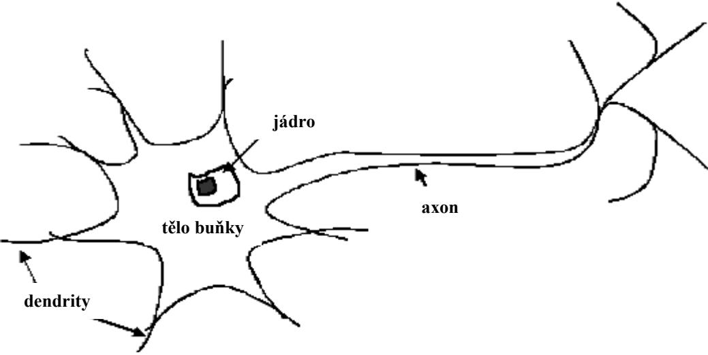

Obrázek 1: Biologický neuron.

Neuron je přizpůsoben pro přenos signálů tak, že kromě vlastního těla (somatu), má i vstupní a výstupní přenosové kanály: dendrity a axon. Z axonu odbočuje řada větví (terminálů), zakončených blánou, která se převážně stýká s výběžky (trny), dendritů jiných neuronů. K přenosu informace pak slouží unikátní mezineuronové rozhraní, synapse. Míra synaptické propustnosti je nositelem všech význačných informací během celého života organismu. Z funkčního hlediska lze synapse rozdělit na excitační, které umožňují rozšíření vzruchu v nervové soustavě a na inhibiční, které způsobují jeho útlum. Paměťová stopa v nervové soustavě vzniká pravděpodobně zakódováním synaptických vazeb na cestě mezi receptorem (čidlem orgánu) a efektorem (výkonným orgánem). Šíření informace je umožněno tím, že soma i axon jsou obaleny membránou, která má schopnost za jistých okolností generovat elektrické impulsy. Tyto impulsy jsou z axonu přenášeny na dendrity jiných neuronů synaptickými branami, které svou propustností určují intenzitu podráždění dalších neuronů. Takto podrážděné neurony při dosažení určité hraniční meze, tzv. prahu, samy generují impuls a zajišťují tak šíření příslušné informace. Po každém průchodu signálu se synaptická propustnost mění, což je předpokladem paměťové schopnosti neuronů. Také propojení neuronů prodělává během života organismu svůj vývoj: v průběhu učení se vytváří nové paměťové stopy nebo při zapomínání se synaptické spoje přerušují.

biologický neuron

#### 1.3 Formální neuron

#### V dalších kapitolách budeme používat následujícího značení:

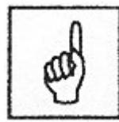

| $x_i, y_j$      | Stav neuronů $X_i$ , $Y_j$ , tj.pro vstupní neurony $X_i$ je $x_i$ vstupní signál; pro ostatní neurony $Y_j$ je $y_j = f(y_in_j)$ . |
|-----------------|-------------------------------------------------------------------------------------------------------------------------------------|
| $w_{ij}$        | Váha přiřazena spojení z neuronu $X_i$ do neuronu $Y_j$ .                                                                           |
| $b_j$           | Bias neuronu $Y_j$ .                                                                                                                |
| $y_in_j$        | Vnitřní potenciál neuronu <i>Y<sub>j</sub></i> :                                                                                    |
| W               | Váhová matice: $W = \{w_{ij}\}.$                                                                                                    |
| w <sub>.j</sub> | Vektor vah: $\mathbf{w}_{.j} = (w_{1j}, w_{2j},, w_{nj})^T$ .  Je to j. sloupec váhové matice.                                      |
| x               | Norma nebo velikost vektoru x.                                                                                                      |
| $\theta_{j}$    | Práh pro aktivační funkci neuronu $Y_i$ .                                                                                           |
| S               | Tréninkový vstupní vektor: $\mathbf{s} = (s_1, s_2,, s_n)$ .                                                                        |
| t               | Tréninkový výstupní vektor: $t = (t_1, t_2,, t_m)$ .                                                                                |
| x               | Vstupní vektor: $x = (x_1, x_2,, x_n)$ .                                                                                            |
| $\Delta w_{ij}$ | Změna váhy $w_{ij}$ : $\Delta w_{ij} = [w_{ij}(new) - w_{ij}(old)]$ .                                                               |
| α               | Koeficient učení.                                                                                                                   |

formální neuron

Základem matematického modelu neuronové sítě je *formální neuron*. Jeho struktura je schematicky zobrazena [1] na obrázku 2. Formální neuron Y (dále jen neuron) má obecně n reálných vstupů, které modelují dendrity a určují vstupní vektor  $\mathbf{x} = (x_1, \dots, x_n)$ . Tyto vstupy jsou ohodnoceny reálnými synaptickými váhami tvořícími vektor  $\mathbf{w} = (w_1, \dots, w_n)$ . Ve shodě s neurofyziologickou motivací mohou být synaptické váhy i záporné, čímž se vyjadřuje jejich inhibiční charakter.

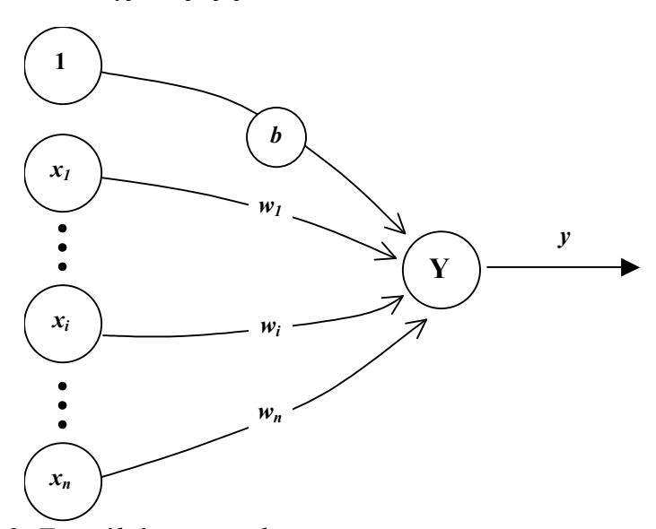

Obrázek 2: Formální neuron s biasem.

Vážená suma vstupních hodnot *y\_in* představuje *vnitřní potenciál* neuronu *Y*:

$$y_{in} = \sum_{i=1}^{n} w_i x_i.$$

*Bias* může být do vztahu včleněn přidáním komponent  $x_0 = 1$  k vektoru x, tj.  $x = (1, x_1, x_2, ..., x_n)$ . Bias je dále zpracováván jako jakákoliv jiná váha, tj.  $w_0 = b$ . Vstup do neuronu Y je pak dán následujícím vztahem:

$$y_{in} = \sum_{i=0}^{n} w_{i} x_{i} = w_{0} + \sum_{i=1}^{n} w_{i} x_{i} = b + \sum_{i=1}^{n} w_{i} x_{i}$$

Hodnota vnitřního potenciálu  $y_in$  po dosažení hodnoty b indukuje výstup (stav) y neuronu Y, který modeluje elektrický impuls axonu. Nelineární nárůst výstupní hodnoty  $y = f(y_in)$  při dosažení hodnoty potenciálu b je dán aktivační (přenosovou) funkci f. Nejjednodušším typem přenosové funkce je ostrá nelinearita, která má pro neuron Y tvar:

$$f(y_i in) = \begin{cases} 1 & \text{pokud } y_i in \ge 0 \\ 0 & \text{pokud } y_i in < 0 \end{cases}$$

Pokud místo váhového biasu, pracujeme s fixním prahem  $\theta$  pro aktivační funkci, pak má přenosové funkce *ostrá nelinearita* pro neuron Y tvar:

$$f(y_in) = \begin{cases} 1 & \text{pokud } y_in \ge \theta \\ 0 & \text{pokud } y_in < \theta \end{cases}, \text{ kde } y_in = \sum_{i=1}^n w_i x_i.$$

K lepšímu pochopení funkce jednoho neuronu nám pomůže geometrická představa načrtnutá na obrázku 3. Vstupy neuronu chápeme jako souřadnice bodu v n - rozměrném Euklidovském vstupním prostoru  $E_n$ . V tomto prostoru má rovnice nadroviny (v  $E_2$  přímka, v  $E_3$  rovina) tvar:

$$w_0 + \sum_{i=1}^n w_i x_i = 0$$
. Tato nadrovina dělí vstupní prostor na dva poloprostory.

Souřadnice bodů  $[x_1^+,...,x_n^+]$ , které leží v jednom poloprostoru, splňují následující nerovnost:  $w_0 + \sum_{i=1}^n w_i x_i^+ > 0$ . Body  $[x_1^-,...,x_n^-]$  z druhého

poloprostoru pak vyhovují relaci s opačným relačním znaménkem:

$$w_0 + \sum_{i=1}^n w_i x_i^- < 0$$
. Synaptické váhy  $\mathbf{w} = (w_0, ..., w_n)$  chápeme jako

koeficienty této nadroviny. Neuron Y tedy klasifikuje, ve kterém z obou poloprostorů určených nadrovinou leží bod, jehož souřadnice jsou na vstupu, tj. realizuje *dichotomii* vstupního prostoru. Neuron Y je *aktivní*, je-li jeho stav y = 1 a *pasivní*, pokud je jeho stav y = 0.

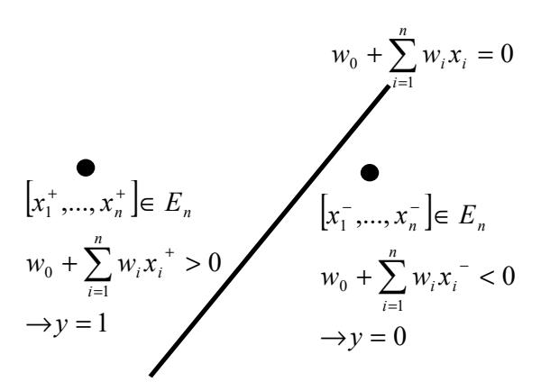

Obrázek 3: Geometrická interpretace funkce neuronu.

logické neurony McCullocha a Pittse V publikaci Warrena McCullocha a Waltera Pittsa [8] "A logical calculus of the ideas immanent to nervous activity" z r. 1943 bylo poprvé uvedeno, že neuronové sítě jsou mocným modelovým prostředkem, např., že sítě složené z logických neuronů mohou simulovat Boolovské funkce.

Logické neurony jsou výpočtové jednotky s binárními stavy 1 a 0. Vstupy do logického neuronu jsou dvojího typu: *excitační vstupy* (popsané binárními proměnnými  $x_1, x_2, ..., x_p$ ) a *inhibiční vstupy* (popsané binárními proměnnými  $x_{p+1}, x_{p+2}, ..., x_n$ ). Excitační aktivity vstupují do neuronu spoji, které jsou ohodnocené jednotkovým váhovým koeficientem (w = 1), zatímco inhibiční aktivity vstupují do neuronu spoji se záporným jednotkovým váhovým koeficientem (w = -1). Potom aktivitu logického neuronu můžeme vyjádřit takto:

$$y = f(y_in) = \begin{cases} 1 & \text{pokud } y_in \ge 0 \\ 0 & \text{pokud } y_in < 0 \end{cases}, \text{ kde } y_in = \sum_{i=1}^p x_i - \sum_{i=p+1}^n x_i + b,$$

kde b je váhový bias. Jednoduchá implementace elementárních Boolovských funkcí disjunkce, konjunkce a implikace v  $E_2$  je následující:.

$$y_{OR} = f(x_1 + x_2 - 1)$$
$$y_{AND} = f(x_1 + x_2 - 2)$$
$$y_{IMPL} = f(-x_1 + x_2 - 0)$$

Funkční hodnoty jsou uvedeny v následující tabulce:

|   | $x_1$ | $x_2$ | $y_{OR}(x_1,x_2)$ | $x_1 \lor x_2$ | $y_{AND}(x_1,x_2)$ | $x_1 \wedge x_2$ | $y_{IMPL}(x_1,x_2)$ | $x_1 \Longrightarrow x_2$ |
|---|-------|-------|-------------------|----------------|--------------------|------------------|---------------------|---------------------------|
| 1 | 0     | 0     | <i>f</i> (-1)     | 0              | f(-2)              | 0                | f(0)                | 1                         |
| 2 | 0     | 1     | f(0)              | 1              | f(-1)              | 0                | f(1)                | 1                         |
| 3 | 1     | 0     | f(0)              | 1              | f(-1)              | 0                | f(-1)               | 0                         |
| 4 | 1     | 1     | f(1)              | 1              | f(2)               | 1                | f(0)                | 1                         |

neuron vyššího řádu

Logické neurony jsou schopné korektně klasifikovat pouze lineárně separovatelné Boolovske funkce. Toto podstatné omezení logických neuronů může být odstraněné pomocí *logických neuronů vyšších řádů*, které jsou schopny simulovat i množiny objektů, jež nejsou lineárně separovatelné. Jejich aktivita je určena následovně:

$$y = f \left( \sum_{i=1}^{n} w_{i} x_{i} + \sum_{\substack{i,j=1 \ (i < j)}} w_{ij} x_{i} x_{j} + \dots + b \right)$$

Pokud je vnitřní potenciál neuronu určený pouze jako lineární kombinace vstupních aktivit (tj. pouze první sumou), potom se logický neuron nazývá "logický neuron prvního řádu". Pokud však tento potenciál neuronu obsahuje i kvadratické popř. i další členy, potom se nazývá "logický neuron vyššího řádu". Jako ilustrační příklad uvedeme funkci XOR, která není lineárně separovatelná, jejíž implementace v  $E_2$  je následující:

$$y_{XOR} = f(x_1 + x_2 - 2x_1x_2 - 1)$$

|   | $x_I$ | $x_2$ | $y_{XOR}(x_1,x_2)$ | $x_{1}\oplus x_{2}$ |
|---|-------|-------|--------------------|---------------------|
| 1 | 0     | 0     | f(-1)              | 0                   |
| 2 | 0     | 1     | f(0)               | 1                   |
| 3 | 1     | 0     | f(0)               | 1                   |
| 4 | 1     | 1     | f(-1)              | 0                   |

#### Nejdůležitější probrané pojmy:

- stav neuronu,
- bias neuronu,
- vnitřní potenciál neuronu, s
- synaptické váhy,
- aktivační(přenosová) funkce,
- logické neurony McCullocha a Pittse
- neurony vyššího řádu.

# Σ

#### Úkoly a otázky k textu:

Vytvořte geometrickou interpretaci funkce jednoho neuronu ve 2 - rozměrném Euklidovském prostoru. Vstupy neuronu jsou souřadnice bodu v  $E_2$ .

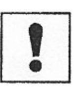

# 2 HEBBOVO UČENÍ

#### Cíl:

Po prostudování této kapitoly se seznámíte:

- s principy Hebbova učení;
- s Hebbovým adaptačním pravidlem.

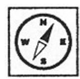

Dříve než se pustíte do studia této kapitoly, důkladně se seznamte s problematikou formálního neuronu a s používaným značením (viz kapitola "Úvod do problematiky neuronových sítí").


Hebbovo učení je založeno na myšlence, že váhové hodnoty na spojení mezi dvěma neurony, které jsou současně ve stavu "on", budou narůstat a naopak, tj. váhové hodnoty na spojení mezi dvěma neurony, které jsou současně ve stavu "off", se budou zmenšovat. Změna synaptické váhy spoje mezi dvěma neurony je úměrná jejich souhlasné aktivitě, tj. součinu jejich stavů. Donald Hebb tímto způsobem vysvětloval vznik podmíněných reflexů. Uvažujme jednovrstvou neuronovou síť, ve které jsou všechny vstupní neurony propojeny s jediným výstupní neuronem Y (viz. obr. 2), ale ne již navzájem mezi sebou. Pokud jsou složku vstupního vektoru  $\mathbf{x} = (x_1, \dots, x_n)$  reprezentovány v bipolární formě, lze složky příslušného váhového vektoru  $\mathbf{w} = (w_1, \dots, w_n)$  aktualizovat následovně:

$$w_i(new) = w_i(old) + x_i y$$
,

kde y je výstup z neuronu Y.

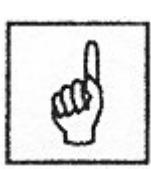

#### Hebbovo adaptační pravidlo [2]

Krok 0. Inicializace všech vah:

$$w_i = 0$$
  $(i = 1 \text{ až } n)$ 

*Krok 1.* Pro každý vzor - tréninkový pár, tj. vstupní vektor (s) a příslušný výstup (t), opakovat následující kroky (2 až 4).

Krok 2. Aktivovat vstupní neurony:

$$x_i = s_i$$
  $(i = 1 \text{ až } n).$ 

Krok 3. Aktivovat výstupní neuron:

$$y = t$$
.

Krok 4. Aktualizovat váhy podle

 $w_i(new) = w_i(old) + x_i y \quad (i = 1 \text{ až } n).$ 

Aktualizovat biasy podle

b(new) = b(old) + v.

*Bias* lze zapsat také jako váhovou hodnotu přiřazenou výstupu z neuronu, jehož aktivace má vždy hodnotu 1. Aktualizace váhových hodnot může být také vyjádřena ve vektorové formě jako

$$w(new) = w(old) + xy$$
.

Váhový přírůstek lze zapsat ve tvaru

$$\Delta w = xy$$

a potom

$$w(new) = w(old) + \Delta w$$
.

Výše uvedený algoritmus je pouze jedním z mnoha způsobu implementace Hebbova pravidla učení. Tento algoritmus vyžaduje jen jeden průchod tréninkovou množinou. Existují však i jiné ekvivalentní metody nalezení vhodných váhových hodnot, které jsou popsány dále.

#### Příklad:

Hebbovovo pravidlo učení pro logickou funkci "AND" v bipolární reprezentaci můžeme zapsat následovně:

| čas | s VSTUP |       | YSTUP POŽADOVANÝ<br>VÝSTUP |              | RUST<br>VAH     | KY         | VÁHOVÉ<br>HODNOTY |       |    |
|-----|---------|-------|----------------------------|--------------|-----------------|------------|-------------------|-------|----|
|     | $x_1$   | $x_2$ | t                          | $\Delta w_I$ | $\Delta w_2 \\$ | $\Delta b$ | $w_I$             | $w_2$ | b  |
| 0   |         |       |                            |              |                 |            | 0                 | 0     | 0  |
| 1   | 1       | 1     | 1                          | 1            | 1               | 1          | 1                 | 1     | 1  |
| 2   | 1       | -1    | -1                         | -1           | 1               | -1         | 0                 | 2     | 0  |
| 3   | -1      | 1     | -1                         | 1            | -1              | -1         | 1                 | 1     | -1 |
| 4   | -1      | -1    | -1                         | 1            | 1               | -1         | 2                 | 2     | -2 |

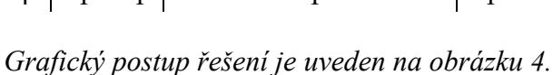


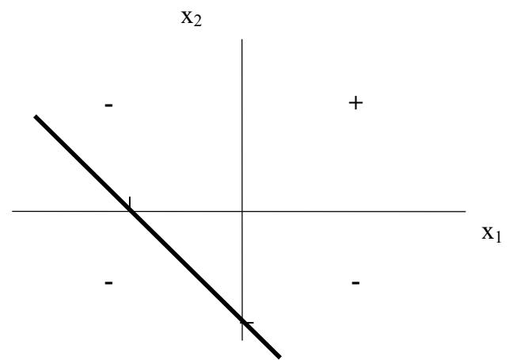

rovnice přímky: *x2 = -x1 - 1* 

*1. tréninkový vzor* 

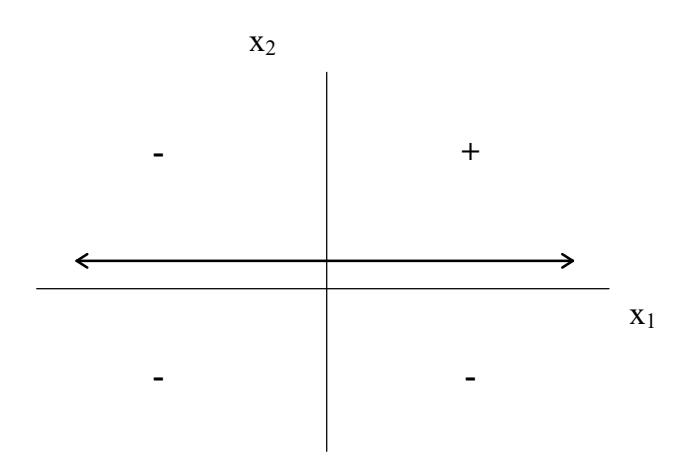

rovnice přímky: *x2 = 0.* 

#### *2. tréninkový vzor*

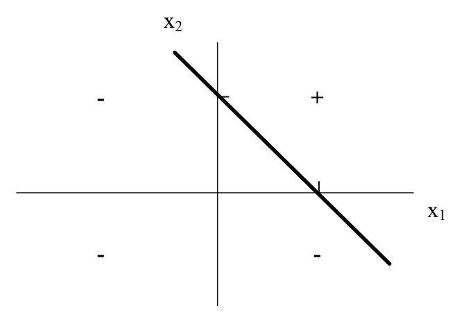

rovnice přímky: *x2 = -x1 + 1* 

*3. a 4. tréninkový vzor* 

*Obrázek 4: Hebbovovo pravidlo u*č*ení pro logickou funkci "AND" v bipolární reprezentaci.* 

# **Nejd**ů**ležit**ě**jší probrané pojmy:**

- Hebbovo učení,
- tréninkový vzor,
- váhový přírustek.

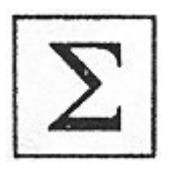

## **Úkoly a otázky k textu:**

Realizujte Hebbovo pravidlo učení pro logickou funkci "OR" v bipolární reprezentaci.

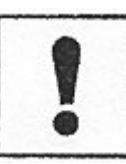

# 3 NEURONOVÁ SÍŤ

#### Cíl:

Po prostudování této kapitoly budete seznámeni:

- jakým způsobem jsou neurony v umělé neuronové síti propojeny;
- jak probíhá šíření a zpracování informace v umělé neuronové síti;
- s organizační, aktivní a adaptivní dynamikou umělé neuronové sítě.

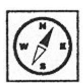

Tato kapitola je úvodní kapitolou zabývající se problematikou vzájemného propojení neuronů, tj. architekturou neuronové sítě. Dále si zde ozřejmíme i způsob, jakým probíhá šíření a zpracování informace v neuronové síti.

Všechny zde uvedené pojmy doporučuji pečlivě nastudovat, protože je budeme dále velmi často používat.

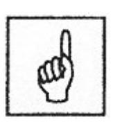

Každá neuronová síť je složena z formálních neuronů, které jsou vzájemně propojeny tak, že výstup jednoho neuronu je vstupem do (obecně i více) neuronů. Obdobně jsou terminály axonu biologického neuronu přes synaptické vazby spojeny s dendrity jiných neuronů. Počet neuronů a jejich vzájemné propojení v síti určuje architekturu (topologii) neuronové sítě. Z hlediska využití rozlišujeme v síti vstupní, pracovní (skryté, mezilehlé, vnitřní) a výstupní neurony. Šíření a zpracování informace v síti je umožněno změnou stavů neuronů ležících na cestě mezi vstupními a výstupními neurony. Stavy všech neuronů v síti určují stav neuronové sítě a synaptické váhy všech spojů představují konfiguraci neuronové sítě.

Neuronová síť se v čase vyvíjí, mění se stav neuronů, adaptují se váhy. V souvislosti se změnou těchto charakteristik v čase je účelné rozdělit celkovou dynamiku neuronové sítě do tří dynamik a uvažovat pak tři režimy práce sítě: organizační (změna topologie), aktivní (změna stavu) a adaptivní (změna konfigurace). Uvedené dynamiky neuronové sítě jsou obvykle zadány počátečním stavem a matematickou rovnicí, resp. pravidlem, které určuje vývoj příslušné charakteristiky sítě (topologie, stav, konfigurace) v čase. Změny, které se řídí těmito zákonitostmi probíhají v odpovídajících režimech práce neuronové sítě.

Konkretizací jednotlivých dynamik pak obdržíme různé modely neuronových sítí vhodné pro řešení různých tříd úloh.

#### 3.1 Organizační dynamika

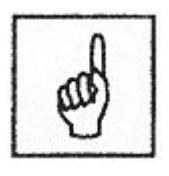

Organizační dynamika specifikuje architekturu neuronové sítě a její případnou změnu. Změna topologie se většinou uplatňuje v rámci adaptivního režimu tak, že síť je v případě potřeby rozšířena o další

neurony a příslušné spoje. Avšak organizační dynamika převážně předpokládá pevnou architekturu neuronové sítě (tj. takovou architekturu, která se již v čase nemění). Rozlišujeme dva typy architektury: *cyklická* (*rekurentní*) a *acyklická* (*dopředná*) síť.

V případě *cyklické* topologie existuje v síti skupina neuronů, která je spojena v kruhu (tzv. *cyklus*). To znamená, že v této skupině neuronů je výstup prvního neuronu vstupem druhého neuronu, jehož výstup je opět vstupem třetího neuronu atd., až výstup posledního neuronu v této skupině je vstupem prvního neuronu. Nejjednodušším příkladem cyklu je *zpětná vazba* neuronu, jehož výstup je zároveň jeho vstupem. Nejvíce cyklů je v *úplné topologii* cyklické neuronové sítě, kde výstup libovolného neuronu je vstupem každého neuronu. Příklad obecné cyklické neuronové sítě je uveden na obrázku 5, kde jsou vyznačeny všechny možné cykly.

cyklická architektura neuronové sítě

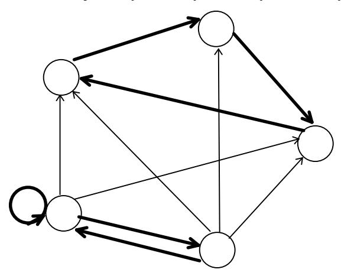

Obrázek 5: Příklad cyklické architektury.

V *acyklických* sítích naopak cyklus neexistuje a všechny cesty vedou jedním směrem. Příklad acyklické sítě je na obrázku 6, kde je vyznačena nejdelší cesta.

acyklická architektura neuronové sítě

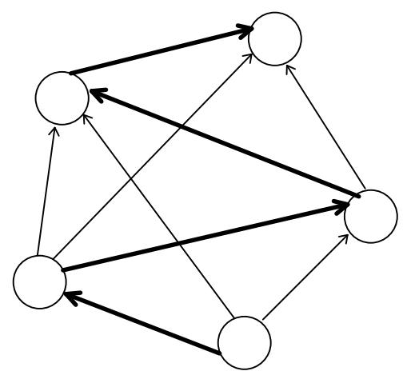

Obrázek 6: Příklad acyklické architektury.

vícevrstvá neuronová síť

U acyklické neuronové sítě lze neurony vždy (disjunktně) rozdělit do vrstev, které jsou uspořádány (např. nad sebou) tak, že spoje mezi neurony vedou jen z nižších vrstev do vrstev vyšších (obecně však mohou přeskočit jednu nebo i více vrstev). Speciálním případem takové architektury je vícevrstvá neuronová síť. V této síti je první (dolní), tzv. vstupní vrstva tvořena vstupními neurony a poslední (horní), tzv. výstupní vrstva je složena z výstupních neuronů. Ostatní, tzv. skryté (mezilehlé, vnitřní) vrstvy isou složeny ze skrytých (vnitřních) neuronů. V topologii vícevrstvé sítě jsou neurony jedné vrstvy spojeny se všemi neurony bezprostředně následující vrstvy. Proto architekturu takové sítě lze zadat jen počty neuronů v jednotlivých vrstvách (oddělených pomlčkou), v pořadí od vstupní k výstupní vrstvě. Také cesta v takové síti vede směrem od vstupní vrstvy k výstupní, přičemž obsahuje po jednom neuronu z každé vrstvy. Příklad architektury třívrstvé neuronové sítě 3-4-3-2 s jednou vyznačenou cestou je na obrázku 7, kde kromě vstupní a výstupní vrstvy jsou i dvě skrvté vrstvv.

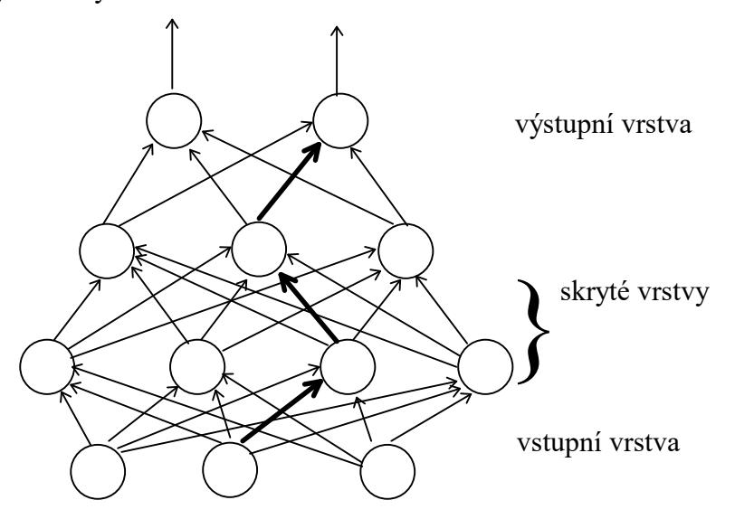

Obrázek 7: Příklad architektury vícevrstvé neuronové sítě 3-4-3-2.

#### 3.2 Aktivní dynamika

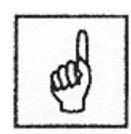

Aktivní dynamika specifikuje *počáteční stav sítě* a způsob jeho změny v čase při pevné topologii a konfiguraci. V aktivním režimu se na začátku nastaví stavy vstupních neuronů na tzv. *vstup sítě* a zbylé neurony jsou v uvedeném počátečním stavu. Všechny možné vstupy, resp. stavy sítě, tvoří *vstupní prostor*, resp. *stavový prostor*, neuronové sítě. Po inicializaci stavu sítě probíhá vlastní výpočet. Obecně se předpokládá spojitý vývoj stavu neuronové sítě v čase a hovoří se o *spojitém modelu*, kdy stav sítě je spojitou funkcí času, která je obvykle v aktivní dynamice zadána diferenciální rovnicí. Většinou se však předpokládá diskrétní čas, tj. na počátku se síť nachází v čase 0 a stav sítě se mění jen v čase 1, 2, 3, . . . .

V každém takové časové kroku je podle daného pravidla aktivní dynamiky vybrán jeden neuron (tzv. sekvenční výpočet) nebo více neuronů (tzv. paralelní výpočet), které aktualizují (mění) svůj stav na základě svých vstupů, tj. stavů sousedních neuronů, jejichž výstupy jsou vstupy aktualizovaných neuronů. Podle toho, zda neurony mění svůj stav nezávisle na sobě nebo je jejich aktualizace řízena centrálně, rozlišujeme synchronní a asynchronní modely neuronových sítí. Stav výstupních neuronů, který se obecně mění v čase, je *výstupem* neuronové sítě (tj. výsledkem výpočtu). Obvykle se však uvažuje taková aktivní dynamika, že výstup sítě je po nějakém čase konstantní a neuronová síť tak v aktivním režimu realizuje nějakou funkci na vstupním prostoru, tj. ke každému vstupu sítě vypočítá právě jeden výstup. Tato tzv. funkce neuronové sítě je dána aktivní dynamikou, jejíž rovnice parametricky závisí na topologii a konfiguraci, které se v aktivním režimu, jak již bylo uvedeno, nemění. Je zřejmé, že v aktivním režimu se neuronová síť využívá k vlastním výpočtům.

Aktivní dynamika neuronové sítě také určuje funkci jednoho neuronu, jejíž předpis (matematický vzorec) je většinou pro všechny (nevstupní) neurony v síti stejný (tzv. homogenní neuronová síť). Můžeme se setkat s následujícími sigmoidními aktivačními funkcemi:

$$f(x) = \begin{cases} 1 & \text{pokud } x \ge 1 \\ 0 & \text{pokud } x < 0 \end{cases}$$
 ostrá nelinearita

$$f(x) = \begin{cases} 1 & x \ge 1 \\ x & 0 \le x \le 1 \end{cases}$$
 saturovaná lineární funkce 
$$0 & x < 0$$

$$f(x) = \frac{1}{1 + e^{-x}}$$
 standardní (logistická) sigmoida

$$f(x) = \frac{1 - e^{-x}}{1 + e^{-x}}$$
 hyperbolický tangens

Grafy těchto funkcí jsou znázorněny na obrázku 8. Podle toho, zda je funkce neuronu diskrétní nebo spojitá rozlišujeme diskrétní a analogové modely neuronových sítí.

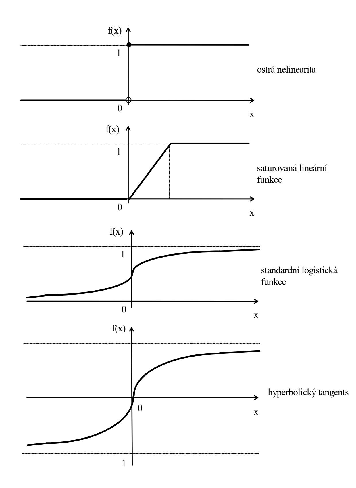

*Obrázek 8: Grafy sigmoidních aktiva*č*ních funkcí.* 

#### 3.3 Adaptivní dynamika

Adaptivní dynamika neuronové sítě specifikuje *počáteční konfiguraci* sítě a způsob, jakým se mění váhové hodnoty na spojeních mezi jednotlivými neurony v čase. Všechny možné konfigurace sítě tvoří *váhový prostor* neuronové sítě. V adaptivním režimu se tedy na začátku nastaví váhy všech spojů v síti na počáteční konfiguraci (např. náhodně). Po inicializaci konfigurace sítě probíhá vlastní adaptace. Podobně jako v aktivní dynamice se obecně uvažuje spojitý model se spojitým vývojem konfigurace neuronové sítě v čase, kdy váhy sítě jsou (spojitou) funkcí času, která je obvykle v adaptivní dynamice zadána diferenciální rovnicí. Většinou se však předpokládá diskrétní čas adaptace. Víme, že funkce sítě v aktivním režimu závisí na konfiguraci. Cílem adaptace je nalézt takovou konfiguraci sítě ve váhovém prostoru, která by v aktivním režimu realizovala předepsanou funkci. Jestliže aktivní režim sítě se využívá k vlastnímu výpočtu funkce sítě pro daný vstup, pak adaptivní režim slouží k *učení* ("programování") této funkce.

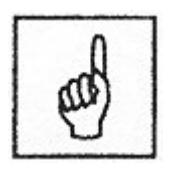

Požadovaná funkce sítě je obvykle zadána tzv. tréninkovou množinou (posloupností) dvojic vstup/výstup sítě (tzv. tréninkový vzor). Způsobu adaptace, kdy požadované chování sítě modeluje učitel, který pro vzorové vstupy sítě informuje adaptivní mechanismus o správném výstupu sítě, se nazývá učení s učitelem (supervised learning). Někdy učitel hodnotí kvalitu momentální skutečné odpovědi (výstupu) sítě pro daný vzorový vstup pomocí známky, která je zadána místo požadované hodnoty výstupu sítě (tzv. klasifikované učení). Jiným typem adaptace je tzv. samoorganizace. V tomto případě tréninková množina obsahuje jen vstupy sítě. To modeluje situaci, kdy není k dispozici učitel, proto se tomuto způsobu adaptace také říká učení bez učitele. Neuronová síť v adaptivním režimu sama organizuje tréninkové vzory (např. do shluků) a odhaluje jejich souborné vlastnosti.

#### Nejdůležitější probrané pojmy:

- architektura (topologie) neuronové sítě,
- organizační dynamika neuronové sítě,
- aktivní dynamika neuronové sítě,
- adaptivní dynamika neuronové sítě,
- homogenní neuronová síť,
- učení s učitelem,
- samoorganizace.

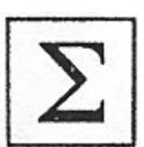

#### Úkoly a otázky k textu:

Zopakujte si všechny základní pojmy této kapitoly.

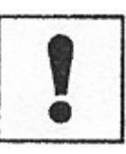

# 4 JEDNODUCHÉ MODELY NEURONOVÝCH SÍTÍ

#### Cíl:

Po prostudování této kapitoly se seznámíte:

- s jednoduchými modely umělých neuronových sítí (percepton, Adaline a Madaline);
- s problematikou Pattern Recognition.

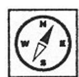

Při popisu algoritmů adaptace budeme používat značení, které je uvedeno v kapitole "Úvod do problematiky neuronových sítí".

Perceptron je nejjednodušší neuronová síť s jedním pracovním neuronem a na jeho adaptačním algoritmu si vysvětlíme proces učení s učitelem. Adaptační algoritmus neuronu Adaline bude srovnán s adaptačním algoritmem percetronu. V závěru pak budou uvedeny možnosti klasifikace různých typů neuronových sítí (tj. 1-vrstvé, 2-vrstvé a 3-vrstvé neuronové sítě).

#### 4.1 Perceptron

Autorem této nejjednodušší neuronové sítě je Frank Rosenblatt (r. 1957). Za typický perceptron je považována jednoduchá neuronová sít s n vstupy  $(x_1, x_2, ..., x_n)$  a jedním pracovním neuronem spojeným se všemi svými vstupy. Každému takovému spojení je přiřazena váhová hodnota  $(w_1, w_2, ..., w_n)$ . Signál přenášený vstupními neurony je buď binární (tj. má hodnotu 0 nebo 1), nebo bipolární (tj. má hodnotu -1, 0 nebo 1). Výstupem z perceptronu je pak  $y = f(y_i)$ . Aktivační funkce f má tvar:

$$f(y_in) = \begin{cases} 1 & pokud \ y_in > \theta \\ 0 & pokud - \theta \le y_in \le \theta \\ -1 & pokud \ y_in < -\theta \end{cases},$$

kde  $\theta$  je libovolný, ale pevný práh aktivační funkce f.

Váhové hodnoty jsou adaptovány podle adaptačního pravidla perceptronu tak, aby diference mezi skutečným a požadovaným výstupem byla co nejmenší. Adaptační pravidlo perceptronu je mnohem silnější než Hebbovo adaptační pravidlo.

#### Adaptační algoritmus perceptronu [2]

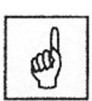

Krok 0. Inicializace vah  $w_i$  (i = 1 až n) a biasu b malými náhodnými čísly.

Přiřazení inicializační hodnoty koeficientu učení  $\alpha$  ( $0 < \alpha \le 1$ ).

Krok 1. Dokud není splněna podmínka ukončení výpočtu, opakovat kroky (2 až 6).

Krok 2. Pro každý tréninkový pár s:t (tj. vstupní vektor s a příslušný výstup t), provádět kroky (3 až 5).

*Krok 3.* Aktivuj vstupní neurony:  $x_i = s_i$ .

Krok 4 Vypočítej skutečnou hodnotu na výstupu:

$$y_{in} = b + \sum_{i} x_{i} w_{i};$$

$$y = \begin{cases} 1 & pokud \ y_{in} > \theta \\ 0 & pokud - \theta \le y_{in} \le \theta \\ -1 & pokud \ y_{in} < -\theta \end{cases}$$

Krok 5 Aktualizuj váhové hodnoty a bias pro daný vzor jestliže  $y \neq t$ ,  $w_i(new) = w_i(old) + \alpha t x_i$  (i = 1 až n).  $b(new) = b(old) + \alpha t$ . jinak  $w_i(new) = w_i(old)$  b(new) = b(old)

Krok 6. Podmínka ukončení: jestliže ve 2. kroku již nenastává žádná změna váhových hodnot, stop; jinak, pokračovat.

Aktualizaci podléhají pouze ty váhové hodnoty, které neprodukují požadovaný výstup y. To znamená, že čím více tréninkových vzorů má korektní výstupy, tím méně je potřeba času k jejich tréninku. Práh aktivační funkce je pevná nezáporná hodnota  $\theta$ . Tvar aktivační funkce pracovního neuronu je takový, že umožňuje vznik pásu pevné šířky (určené hodnotou  $\theta$ ) oddělujícího oblast pozitivní odezvy od oblasti negativní odezvy na vstupní signál. Předcházející analýza o zaměnitelnosti prahu a biasu zde nemá uplatnění, protože změna  $\theta$  mění šířku oblasti, ne však její umístění. Místo jedné separující přímky tedy máme pás určený dvěma rovnoběžnými přímkami:

1. Přímka separující oblast pozitivní odezvy od oblasti nulové odezvy na vstupní signál; tato hraniční přímka má tvar:

$$w_1 x_1 + w_2 x_2 + b > \theta$$
.

2. Přímka separující oblast nulové odezvy od oblasti negativní odezvy na vstupní signál;. tato hraniční přímka má tvar:

$$w_1 x_1 + w_2 x_2 + b < -\theta$$
.

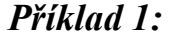

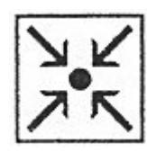

Adaptační algoritmus perceptronu pro logickou funkci "AND": binární vstupní hodnoty, bipolární výstupní hodnoty. Pro jednoduchost předpokládejme, že  $\theta = 0.2$  a  $\alpha = 1$ .

| čas | VS    | ГUР   | V    | ÝSTU | JP | PŘÍ          | RUST<br>VAH     | KY         |       | ÁHOV<br>DNO |    |
|-----|-------|-------|------|------|----|--------------|-----------------|------------|-------|-------------|----|
|     | $x_I$ | $x_2$ | y_in | У    | t  | $\Delta w_I$ | $\Delta w_2 \\$ | $\Delta b$ | $w_I$ | $w_2$       | b  |
| 0   |       |       |      |      |    |              |                 |            | 0     | 0           | 0  |
| 1   | 1     | 1     | 0    | 0    | 1  | 1            | 1               | 1          | 1     | 1           | 1  |
| 2   | 1     | 0     | 2    | 1    | -1 | -1           | 0               | -1         | 0     | 1           | 0  |
| 3   | 0     | 1     | 1    | 1    | -1 | 0            | -1              | -1         | 0     | 0           | -1 |
| 4   | 0     | 0     | -1   | -1   | -1 | 1            | 0               | 0          | 0     | 0           | -1 |
|     |       |       |      |      | •  | • •          |                 |            |       |             |    |
| 37  | 1     | 1     | 1    | 1    | 1  | 0            | 0               | 0          | 2     | 3           | -4 |
| 38  | 1     | 0     | -2   | -1   | -1 | 0            | 0               | 0          | 2     | 3           | -4 |
| 39  | 0     | 1     | -1   | -1   | -1 | 0            | 0               | 0          | 2     | 3           | -4 |
| 40  | 0     | 0     | -4   | -1   | -1 | 0            | 0               | 0          | 2     | 3           | -4 |

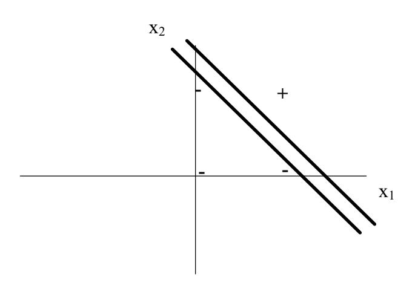

Obrázek 9: Hraniční pás pro logickou funkci "AND" po adaptaci algoritmem perceptronu.

Oblast kladné odezvy je dána body, pro které platí:  $2x_1 + 3x_2 - 4 > 0,2$  a hraniční přímka této oblasti má tvar:

*Oblast záporné odezvy* je dána body, pro které platí:  $2x_1 + 3x_2 - 4 < -0.2$ . a hraniční přímka této oblasti má tvar:  $x_2 = -\frac{2}{3}x_1 + \frac{19}{15}$ .

#### Příklad 2:

Adaptační algoritmus perceptronu pro logickou funkci "AND": bipoární vstupní i výstupní hodnoty. Pro jednoduchost předpokládejme, že  $\theta = 0$  a  $\alpha = 1$ .

| 1 | V | V | 1 |
|---|---|---|---|
|   | 7 | ٥ |   |
| 1 | ~ | r | \ |

| čas | VSTUP |       | VÝSTUP |    | PŘÍRUSTKY<br>VAH |              |                 | VÁHOVÉ<br>HODNOTY |       |       |    |
|-----|-------|-------|--------|----|------------------|--------------|-----------------|-------------------|-------|-------|----|
|     | $x_I$ | $x_2$ | y_in   | У  | t                | $\Delta w_I$ | $\Delta w_2 \\$ | Δb                | $w_I$ | $w_2$ | b  |
| 0   |       |       |        |    |                  |              |                 |                   | 0     | 0     | 0  |
| 1   | 1     | 1     | 0      | 0  | 1                | 1            | 1               | 1                 | 1     | 1     | 1  |
| 2   | 1     | -1    | 1      | 1  | -1               | -1           | 1               | -1                | 0     | 2     | 0  |
| 3   | -1    | 1     | 2      | 1  | -1               | 1            | -1              | -1                | 1     | 1     | -1 |
| 4   | -1    | -1    | -3     | -1 | -1               | 0            | 0               | 0                 | 1     | 1     | -1 |
| 5   | 1     | 1     | 1      | 1  | 1                | 0            | 0               | 0                 | 1     | 1     | -1 |
| 6   | 1     | -1    | -1     | -1 | -1               | 0            | 0               | 0                 | 1     | 1     | -1 |
| 7   | -1    | 1     | -1     | -1 | -1               | 0            | 0               | 0                 | 1     | 1     | -1 |
| 8   | -1    | -1    | -3     | -1 | -1               | 0            | 0               | 0                 | 1     | 1     | -1 |

Tento příklad demonstruje, že přechod od binární k bipolární reprezentaci může nápadně zrychlit výpočet řešené úlohy.

#### 4.2 Adaline

Adaline, tj. *Adaptive Linear Neuron*. Pro své vstupy obvykle používá bipolární aktivaci (1 nebo -1), výstupní hodnota je nejčastěji také bipolární. Adaline má rovněž bias chovající se jako regulovatelná váha  $(w_0)$  přiřazená spojení, které vychází z neuronu, jehož aktivace je vždy 1

#### Adaptační algoritmus pro Adaline [2]:

- Krok 0. Inicializace vah malými náhodnými hodnotami.
   Přiřazení inicializační hodnoty koeficientu učení α (viz poznámky za algoritmem).
- Krok 1. Dokud není splněna podmínka ukončení výpočtu, opakovat kroky (2 až 6).
  - Krok 2. Pro každý bipolární tréninkový pár s:t (tj. vstupní vektor s a příslušný výstup t), provádět kroky (3 až 5).
    - *Krok 3.* Aktivovat vstupní neurony:  $x_i = s_i$ .

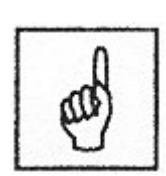

$$y_i = b + \sum_i x_i w_i;$$
  
 $y = y$  in.

Krok 5 Aktualizovat váhové hodnoty a 
$$i = 1, ..., n$$
:
$$w_i(new) = w_i(old) + \alpha (t - y_in) x_i.$$

$$b(new) = b(old) + \alpha (t - y_in).$$

Krok 6. Podmínka ukončení:

jestliže největší změna váhových hodnot, která se vyskytuje v kroku 2 je menší než maximální povolená chyba, stop; jinak, pokračovat.

Podle Hecht-Nielsena lze za jeho horní hraniční hodnotu nastavení vhodné hodnoty považovat největší vlastní číslo korelační matice R vstupu koeficientu učení (řádku) vektoru  $\mathbf{x}(p)$ ,

$$R = \frac{1}{P} \sum_{p=1}^{P} \mathbf{x}(p)^{T} \mathbf{x}(p),$$

tedy  $\alpha$  < jedna polovina největší hodnoty vlastního čísla R.

Jelikož hodnota R není během výpočtu měněna, obvykle se volí i  $\alpha$  jako  $0.1 < n\alpha < 1.0$ , kde n je počet vstupů. Pokud dosadíme za  $\alpha$  příliš velkou hodnotu, adaptační algoritmus nebude konvergovat. Pokud dosadíme za  $\alpha$  příliš malou hodnotu, proces učení bude extrémně pomalý.

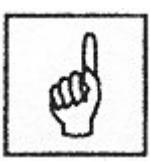

Geometrický význam funkce Adaline se nepatrně liší od perceptronu. Uvažujme vstup  $\mathbf{x} = (x_1, ..., x_n)$ , tj. bod  $[x_1, ..., x_n]$  v n-rozměrném vstupním prostoru. Nadrovina s koeficienty  $\mathbf{w}$  pro daný neuron Adaline určená rovnicí

$$w_0 + \sum_{i=1}^{n} w_i x_i = 0$$

rozděluje tento prostor na dva poloprostory, ve kterých má hodnota výstupu y zapsaného rovnicí

$$y = \sum_{i=1}^{n} w_i x_i$$

odlišné znaménko (tj. je buď kladná, nebo záporná). Pro body ležící na této nadrovině je hodnota výstupu nulová. Vzdálenost  $\rho$  bodu [ $x_1$ , ...,  $x_n$ ] od této nadroviny je dána rovnicí:

$$\rho = \frac{\left| w_0 + \sum_{i=1}^n w_i x_i \right|}{\sqrt{\sum_{i=1}^n w_i^2}} = \frac{\left| y_j \right|}{\sqrt{\sum_{i=1}^n w_i^2}}.$$

Tedy absolutní hodnota |y| výstupu z neuronu Adaline závisí lineárně na vzdálenosti bodu od nadroviny ve vstupním prostoru:

$$\left|y_{j}\right| = \sqrt{\sum_{i=1}^{n} w_{i}^{2}} \cdot \rho.$$

Body ze vstupního prostoru, které mají stejný výstup, leží na jedné nadrovině rovnoběžné s nadrovinou  $w_0 + \sum_{i=1}^n w_i x_i = 0$ , která je od ní ve vzdálenosti  $\rho$  ve směru daném znaménkem y. Uvedená situace je načrtnuta na obrázku 10, kde nadrovina určená stejným výstupem je znázorněna přerušovanou čarou.

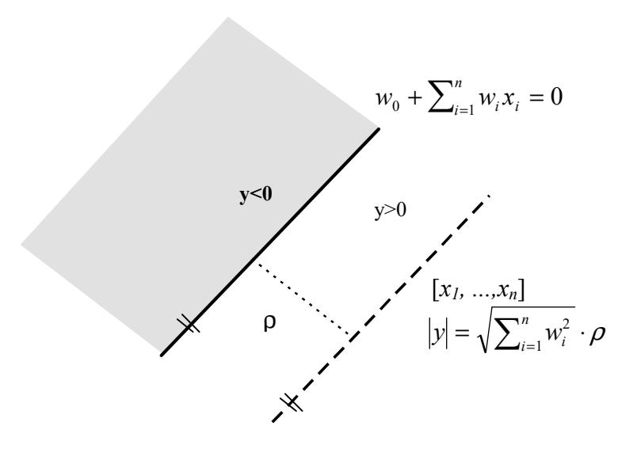

Obrázek 10: Geometrická interpretace funkce neuronu Adaline.

#### 4.3 Madaline

Madaline, tj. *Many Adaptive Linear Neurons*. Základním prvkem v tomto modelu je neuron Adaline, který je velmi podobný perceptronu. Jednoduchá architektura neuronové sítě Madaline je zobrazena na

obrázku 11. Výstupy ( $z_1$  a  $z_2$ ) z obou skrytých neuronů typu Adaline ( $Z_1$  a  $Z_2$ ), jsou určeny stejnými signály ( $x_1$  a  $x_2$ ) vycházejícími z neuronů  $X_1$  a  $X_2$ , které samozřejmě závisí na příslušné prahové funkci. Pak i skutečný výstup y je nelineární funkcí vstupního vektoru ( $x_1$ ,  $x_2$ ) a příslušné prahové funkce. Použití skrytých neuronů  $Z_1$  a  $Z_2$  sice dává síti větší výpočtové možnosti, ale naproti tomu komplikuje adaptační proces.

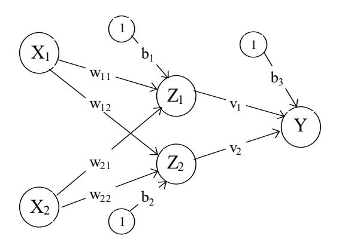

Obrázek 11: Madaline se dvěma skrytými neurony Adaline a jedním výstupním neuronem Adaline.

Původní adaptační algoritmus MRI (z roku 1960) adaptuje pouze váhové hodnoty příslušející oběma skrytým neuronům, zatímco váhové hodnoty příslušející výstupnímu neuronu jsou fixní. Adaptační algoritmus MRII (z roku 1987) upravuje všechny váhové hodnoty. Dále budeme pracovat pouze s adaptačním algoritmem MRI: Váhové hodnoty  $v_I$  a  $v_2$  a bias  $b_3$ , příslušející výstupnímu neuronu Y, jsou určeny tak, že výstupní signál z Y je roven I, pokud je alespoň jedna hodnota signálu vycházejícího ze skrytých neuronů (tj.  $Z_I$  a  $Z_2$  nebo obou z nich) rovna jedné. Pokud jsou oba signály vysílané ze  $Z_I$  i  $Z_2$  rovny -1, má výstupní signál z Y hodnotu -I. Jinými slovy, výstupní neuron Y provádí logickou funkci "OR" na signálech vysílaných z neuronů  $Z_I$  a  $Z_2$ . Můžeme tedy přiřadit

$$v_1 = \frac{1}{2},$$
 $v_2 = \frac{1}{2},$ 
 $b_3 = \frac{1}{2}.$ 

Váhové hodnoty příslušející prvnímu skrytému neuronu Adaline ( $w_{II}$  a  $w_{2I}$ ) a váhové hodnoty příslušející druhému skrytému neuronu Adaline ( $w_{12}$  a  $w_{22}$ ) jsou adaptovány podle algoritmu MRI takto:

Aktivační funkce pro  $Z_1$ ,  $Z_2$  a Y je dána následovně:

$$f(x) = \begin{cases} 1 & \text{pokud } x \ge 0; \\ -1 & \text{pokud } x < 0. \end{cases}$$

# Adaptační algoritmus MRI [2]:

Krok 0. Váhové hodnoty  $v_1$  a  $v_2$  a bias  $b_3$  jsou inicializovány výše uvedeným způsobem.

Inicializace zbývajících vah malými náhodnými hodnotami. Přiřazení inicializační hodnoty koeficientu učení  $\alpha$  stejným způsobem jako v adaptačním algoritmu pro neuron Adaline.

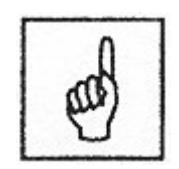

- Krok 1. Dokud není splněna podmínka ukončení výpočtu, opakovat kroky (2 až 8).
  - Krok 2. Pro každý bipolární tréninkový pár **s:t** provádět kroky (3 až 7).

*Krok 3.* Aktivovat vstupní neurony:  $x_i = s_i$ .

Krok 4 Vypočítat vstupní hodnoty skrytých neuronů:

$$\begin{split} z_{-}in_1 &= b_1 + x_1w_{11} + x_2w_{21}, \\ z_{-}in_2 &= b_2 + x_1w_{12} + x_2w_{22}. \end{split}$$

Krok 5 Stanovení výstupních hodnot skrytých neuronů:

$$z_1 = f(z_in_1),$$
  

$$z_2 = f(z_in_2).$$

Krok 6 Stanovení skutečné výstupní hodnoty signálu neuronové sítě Madaline:

$$y_i = b_3 + z_1 v_1 + z_2 v_2;$$
  
 $y = f(y_i).$ 

Krok 7 Aktualizovat váhové hodnoty: Pokud je y = t, nenastávají žádné změny.

Jinak (pro  $y \neq t$ ):

Je-li t = 1, potom pro váhové hodnoty na spojeních vedoucích k  $Z_J$  (J=1,2) platí:

$$w_{iJ}(new) = w_{iJ}(old) + \alpha(1 - z_in_J) x_i.$$

$$b_J(new) = b_J(old) + \alpha(1 - z_in_J).$$

Je-li t = -1, potom pro váhové hodnoty na spojeních vedoucích k  $Z_K$  (K=1,2) platí:

$$w_{iK}(new) = w_{iK}(old) + \alpha (-1 - z_{inK}) x_i.$$
  
$$b_K(new) = b_K(old) + \alpha (-1 - z_{inK}).$$

#### Krok 8. Podmínka ukončení:

pokud již nenastávají žádné změny váhových hodnot nebo pokud již bylo vykonáno maximálně definované množství váhových změn, *stop*; jinak, *pokračovat*.

#### Příklad:

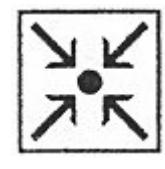

Adaptační algoritmus MRI pro logickou funkci "XOR" (bipolární vstupní i výstupní hodnoty) je zapsán následovně:

| VST   | POŽADOVANÝ |        |
|-------|------------|--------|
| $x_I$ | $x_2$      | VÝSTUP |
| 1     | 1          | -1     |
| 1     | -1         | 1      |
| -1    | 1          | 1      |
| -1    | -1         | -1     |

Krok 0. 
$$\alpha = 0.5$$
;

Inicializace váhových hodnot:

| váhy vedoucí do $Z_1$ |          |       | váhy vedoucí do Z <sub>2</sub> |          |       | váhy vedoucí do Y |       |       |
|-----------------------|----------|-------|--------------------------------|----------|-------|-------------------|-------|-------|
| $w_{II}$              | $w_{21}$ | $b_I$ | $w_{12}$                       | $w_{22}$ | $b_2$ | $v_I$             | $v_2$ | $b_3$ |
| 0.05                  | 0.2      | 0.3   | 0.1                            | 0.2      | 0.15  | 0.5               | 0.5   | 0.5   |

#### Krok 1. Adaptace:

Krok 2. Pro první tréninkový pár; (1,1):-1 Krok 3.  $x_1 = 1$ ,  $x_2 = 1$ . Krok 4  $z in_1 = 0.3 + 0.05 + 0.2 = 0.55,$  $z in_2 = 0.15 + 0.1 + 0.2 = 0.45$ Krok 5  $z_1 = 1$ ,  $z_2 = 1$ . Krok 6 y in = 0.5 + 0.5 + 0.5; y = 1. Krok 7  $t - y = -1 - 1 = -2 \neq 0$ , Pokud je t = -1, potom aktualizovat váhové hodnoty na spojeních vedoucích k  $Z_1$ :

$$b_{1}(new) = b_{1}(old) + \alpha(-1 - z_{in_{1}})$$

$$= 0.3 + (0.5)(-1.55)$$

$$= -0.475$$

$$w_{11}(new) = w_{11}(old) + \alpha(-1 - z_{in_{1}})x_{1}$$

$$= 0.05 + (0.5)(-1.55)$$

$$= -0.725$$

$$w_{21}(new) = w_{21}(old) + \alpha(-1 - z_{in_{1}})x_{2}$$

$$= 0.2 + (0.5)(-1.55)$$

$$= -0.575$$

a aktualizovat váhové hodnoty na spojeních vedoucích k  $Z_2$ :

$$b_{2}(new) = b_{2}(old) + \alpha(-1 - z_{in_{2}})$$

$$= 0.15 + (0.5)(-1.45)$$

$$= -0.575$$

$$w_{12}(new) = w_{12}(old) + \alpha(-1 - z_{in_{2}})x_{1}$$

$$= 0.1 + (0.5)(-1.45)$$

$$= -0.625$$

$$w_{22}(new) = w_{22}(old) + \alpha(-1 - z_{in_2})x_2$$
  
= 0,2 + (0,5)(-1,45)  
= -0,525

Po čtyřech tréninkových cyklech, byly nalezeny tyto váhové hodnoty:

$$w_{11} = -0.73$$
  $w_{12} = 1.27$   $w_{21} = 1.53$   $w_{22} = -1.33$   $b_1 = -0.99$   $b_2 = -1.09$ 

## Geometrická interpretace nalezených váhových hodnot:

Oblast kladné odezvy vznikne sjednocením obou oblastí pozitivní odezvy skrytých neuronů  $Z_l \ a \ Z_2$ .

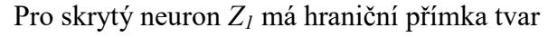

$$x_2 = -\frac{w_{11}}{w_{21}} x_1 - \frac{b_1}{w_{21}}$$
$$= \frac{0.73}{1.53} x_1 + \frac{0.99}{1.53}$$
$$= 0.48 x_1 + 0.65.$$

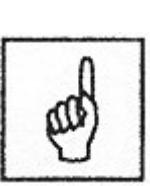

Pro skrytý neuron  $\mathbb{Z}_2$  má hraniční přímka tvar

$$x_2 = -\frac{w_{12}}{w_{221}} x_1 - \frac{b_2}{w_{22}}$$
$$= \frac{1,27}{1,33} x_1 + \frac{1,09}{1,33}$$
$$= 0,96x_1 - 0,82.$$

Vypočítané oblasti kladné a záporné odezvy na vstupní signál jsou znázorněny na následujících obrázcích:

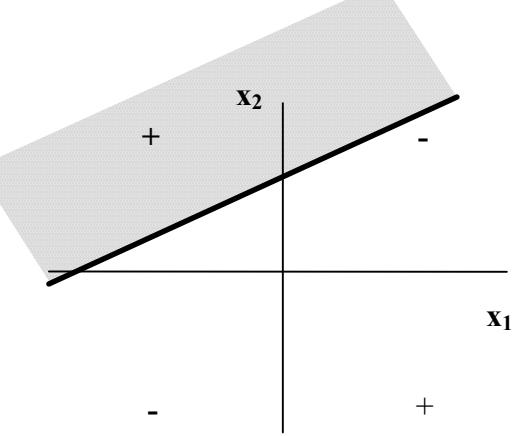

Obrázek 12: Oblast kladné odezvy pro Z<sub>1</sub>.

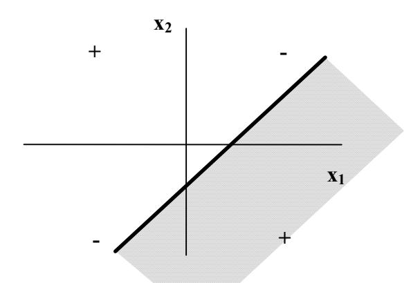

Obrázek 13: Oblast kladné odezvy pro Z<sub>2</sub>.

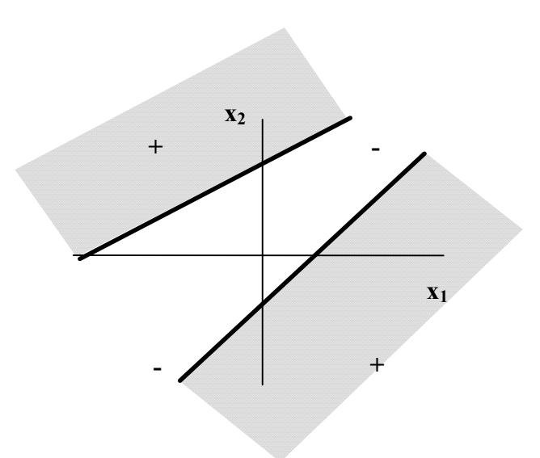

Obrázek 14: Oblast kladné odezvy pro Madaline pro "XOR" funkci.

#### 4.4 Klasifikace vzorů

Rozpoznáváni vzorů (Pattern Recognition) je jednou z nejdůležitějších aplikací teorie neuronových sítí. Obecně tento proces probíhá ve dvou krocích: nejprve je nutné určit charakteristický rys objektů a potom podle něj objekty klasifikovat. Máme-li n navzájem různých vstupů, můžeme použít jim odpovídajících n různých symbolů a vytvořit.z nich množinu, kterou nazýváme charakteristický vektor (feature vector). Tento n - rozměrný vektor charakterizuje n - rozměrný charakteristický prostor (feature space). Podstatou správného rozpoznávání je určení vhodného tvaru tzv. rozlišovací funkce (discriminant function). Rozlišovací funkce je matematicky popsána rovnicí nadroviny. Určení takovéto hranice nebývá většinou v praxi tak jednoduché. Existuje mnoho způsobů, jak stanovit její tvar rozlišovací funkce, např. metodou klasifikace s užitím nejbližších sousedů (nearest neighbour classification), lineární klasifikací (linear classifiers), statistickými technikami (Bayesian classification) apod. Lineární metody klasifikace jsou nejbližší aplikacím teorie umělých neuronových sítí. Jedním ze způsobů, jež umožňuje nalézt rovnici oddělující hadroviny je algoritmus adaptace perceptronu.

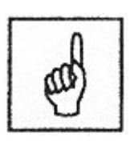

Na následujících dvou obrázcích [1] jsou souhrnně zobrazeny různé tyty neuronových sítí (tj. neuronové sítě s různým počtem vnitřních vrstev) a jejich možnosti klasifikace.

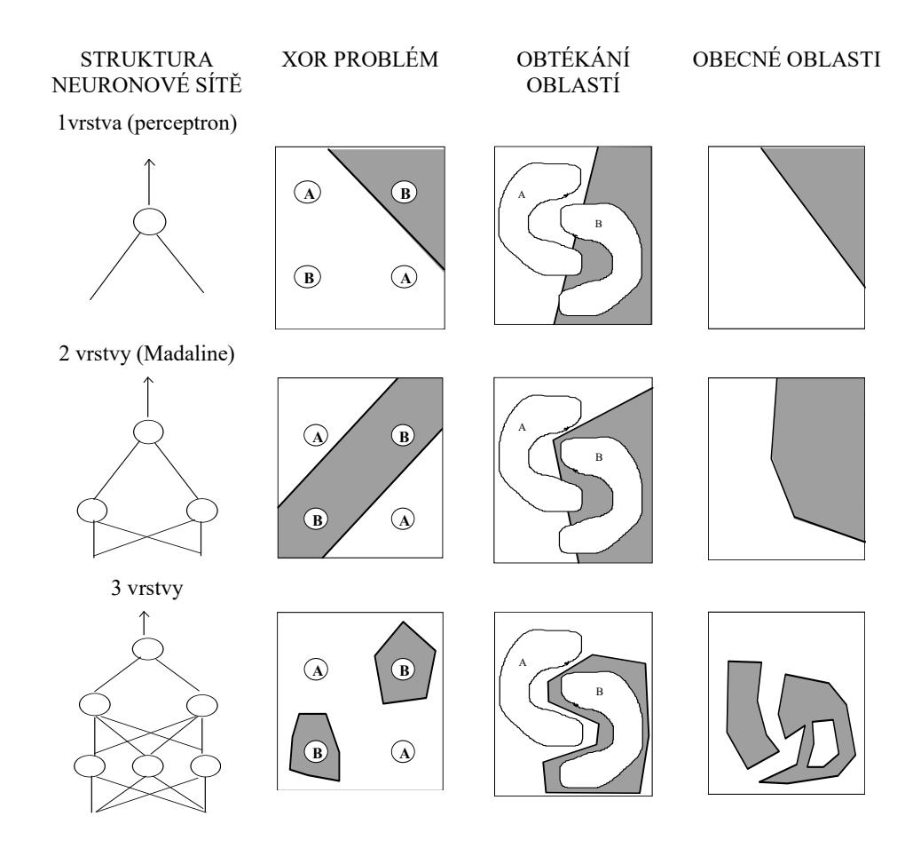

*Obrázek 15: Neuronové sít*ě *s r*ů*zným po*č*tem vnit*ř*ních vrstev a jejich možnosti klasifikace.* 

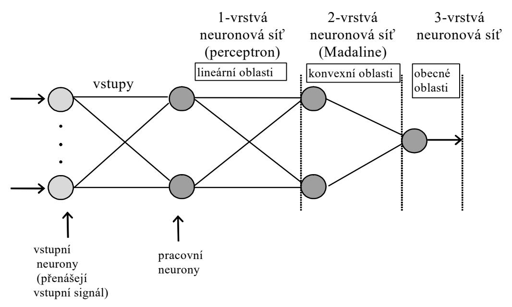

Obrázek 16: Mezní oblasti rozpoznávané neuronovou sítí s různým počtem vnitřních vrstev.

# Nejdůležitější probrané pojmy:

- perceptron,
- adaptační pravidlo perceptronu,
- koeficient učení,
- práh,
- Adaline,
- Madaline,
- delta pravidlo,
- pattern recognition.

# Úkoly a otázky k textu:

- 1. Srovnejte Hebbovo adaptační pravidlo a adaptační pravidlo perceptronu.
- 2. Srovnejte adaptační algoritmus neuronu Adaline a perceptronu.
- 3. Srovnejte geometrickou interpretaci funkce neuronu Adaline a perceptronu.

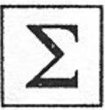

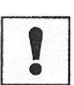


# **Koresponden**č**ní úkol (vybraný úkol vykonejte):**

- 1. Vytvořte počítačový program pro realizaci adaptačního algoritmu perceptronu.
- 2. Vytvořte počítačový program pro realizaci adaptačního algoritmu Adaline.
- 3. Vytvořte počítačový program pro realizaci adaptačního algoritmu MRI.

#### **5 BACKPROPAGATION**

#### Cíl:

Po prostudování této kapitoly se seznámíte:

- adaptací vícevrstvé neuronové sítě;
- s možnými modifikacemi adaptačního algoritmu backpropagation.

V této kapitole rozebereme problematiku vhodné volby topologie vícevrstvé neuronové sítě, která by měla odpovídat složitosti řešeného problému. Dále se podrobně seznámíte s adaptačním algoritmem zpětného šíření chyby (backpropagation), jež je používán v přibližně 80% všech aplikací neuronových (tj. je nejrozšířenějším adaptačním algoritmem vícevrstvých neuronových sítí). Seznámíte se zde i s možnými variantami adaptačního pravidla backpropagation, tj. do standardního algoritmu zavedeme parametr momentu a modifikovatelný parametr strmosti. Zavedeme si zde i další značení, které budeme používat i v následných kapitolách.


## V této kapitole budeme používat následující značení:

| X                | Vstupní vektor: $\mathbf{x} = (x_1,, x_i,, x_n)$ .                                                                                                       |
|------------------|----------------------------------------------------------------------------------------------------------------------------------------------------------|
| t                | Výstupní tréninkový vektor: $\mathbf{t} = (t_1,, t_k,, t_m)$ .                                                                                           |
|                  |                                                                                                                                                          |
| $\delta_{ m k}$  | Částečné váhové korekce pro $w_{jk}$ příslušející chybě na spojeních vedoucích k neuronu $Y_k$ ve výstupní vrstvě.                                       |
| $\delta_{\rm j}$ | Částečné váhové korekce pro $v_{ij}$ příslušející chybě na spojeních vedoucích k neuronu $Z_j$ ve skryté vrstvě.                                         |
| α                | Koeficient učení.                                                                                                                                        |
| $X_i$            | <ul> <li>i. neuron ve vstupní vrstvě:</li> <li>Pro neurony ve vstupní vrstvě je hodnota vstupního i výstupního signálu stejná, x<sub>i</sub>.</li> </ul> |
| $v_{0j}$         | Bias j. neuronu ve skryté vrstvě.                                                                                                                        |
| $Z_j$            | <i>j.</i> neuron ve skryté vrstvě:<br>Hodnota vstupního signálu pro $Z_j$ je $z_in_j$ :<br>$z_in_j = v_{0j} + \sum_i x_i v_{ij}$ .                       |
|                  | Hodnota vstupního signálu pro $Z_j$ je $z_j$ : $z_j = f(z_i n_j).$                                                                                       |
| $ w_{0k} $       | Bias k. neuronu ve výstupní vrstvě.                                                                                                                      |
| $Y_k$            | k. neuron ve výstupní vrstvě:                                                                                                                            |
| 1 K              | Hodnota vstupního signálu pro $Y_k$ je $y_in_k$ :<br>$y_in_k = w_{0k} + \sum_j z_j w_{jk}$ .                                                             |
|                  | Hodnota vstupního signálu pro $Z_j$ je $z_j$ : $y_k = f(y_in_k).$                                                                                        |

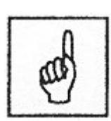

topologie vícevrstvé sítě

Pravděpodobně nejrozšířenější způsob propojení neuronů se sigmoidní aktivační funkcí jsou vícevrstvé sítě. Vícevrstvá neuronová síť s jednou vnitřní vrstvou neuronů (neurony jsou označeny  $Z_i$ , j=I,...,p) je zobrazena na obrázku 17. Výstupní neurony (neurony jsou označeny  $Y_k$ , k=1,...,m). Neurony ve výstupní a vnitřní vrstvě musí mít definovaný bias. Typické označení pro bias k. neuronu  $(Y_k)$  ve výstupní vrstvě je  $w_{0k}$ , a typické označení pro bias j. neuronu  $(Z_j)$  ve vnitřní vrstvě je  $v_{0j}$ . Bias (např. j. neuronu) odpovídá, jak již bylo dříve uvedeno, váhové hodnotě přiřazené spojení mezi daným neuronem a fiktivním neuronem, jehož aktivace je vždy I. Z uvedeného obrázku tedy vyplývá, že vícevrstvá neuronová síť je tvořena minimálně třemi vrstvami neuronů: vstupní, výstupní a alespoň jednou vnitřní vrstvou. Vždy mezi dvěmi sousedními vrstvami se pak nachází tzv. uplné propojení neuronů, tedy každý neuron nižší vrstvy je spojen se všemi neurony vrstvy vyšší.

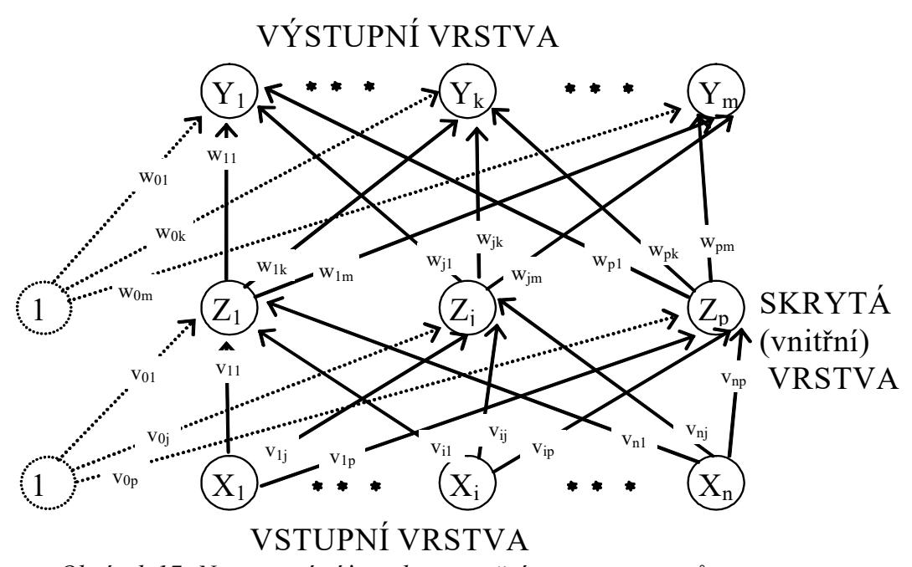

Obrázek 17: Neuronová síť s jednou vnitřní vrstvou neuronů.

Velkým problémem modelu vícevrstvé neuronové sítě s adaptačním algoritmem backpropagation je (kromě minimalizace chybové funkce) volba vhodné topologie pro řešení konkrétního praktického problému. Zřídkakdy jsou podrobněji známy vztahy mezi vstupy a výstupy, které by se daly využít při návrhu speciální architektury. Většinou se používá vícevrstvá topologie s jednou nebo dvěmi vnitřními vrstvami a očekává se, že učící algoritmus backpropagation zobecní příslušné vztahy z tréninkové množiny ve vahách jednotlivých spojů mezi neurony. I v tomto případě je však potřeba vhodně volit počty neuronů ve vnitřních vrstvách. Je zřejmé, že tento problém organizační dynamiky úzce souvisí s adaptací a generalizací neuronové sítě. Architektura vícevrstvé neuronové sítě (tj. určení vhodného počtu vnitřních neuronů a jejich spojení), by měla

odpovídat složitosti řešeného problému, tj. počtu tréninkových vzorů, jejich vstupů a výstupů a struktuře vztahů, které popisují. Je zřejmé, že malá síť nemůže řešit komplikovaný problém. Při učení pomocí algoritmu backpropagation se příliš malá síť obvykle zastaví v nějakém mělkém lokálním minimu a je potřeba topologii doplnit o další vnitřní neurony, aby adaptace měla větší stupeň volnosti. Na druhou stranu bohatá architektura sice při učení mnohdy umožní nalézt globální minimum chybové funkce, i když s větším počtem vah roste výpočetní náročnost adaptace. Avšak nalezená konfigurace sítě obvykle příliš zobecňuje tréninkové vzory včetně jejich nepřesností a chyb a pro nenaučené vzory dává chybné výsledky, tj. špatně generalizuje. Tomuto přesnému zapamatování tréninkové množiny bez zobecnění zákonitostí v ní obsažených se říká přeučení (overfitting) [6]. Zdá se tedy, že existuje optimální topologie, která je na jednu stranu dostatečně bohatá, aby byla schopna řešit daný problém, a na druhou stranu ne moc velká, aby správně zobecnila potřebné vztahy mezi vstupy a výstupy. Existují sice teoretické výsledky ohledně horního odhadu počtu vnitřních neuronů postačujících pro realizaci libovolné funkce z určité třídy, avšak pro praktické potřeby jsou příliš nadhodnocené, a tedy nepoužitelné. V praxi se obvykle topologie volí heuristicky, např. v první vnitřní vrstvě o něco více neuronů, než je vstupů a v druhé vrstvě aritmetický průmět mezi počtem výstupů a neuronů v první vnitřní vrstvě. Po adaptaci se v případě velké chyby sítě případně přidá, respektive při chudé generalizaci odebere několik neuronů a adaptivní režim se celý opakuje pro novou architekturu. Pro test kvality generalizace neuronové sítě se počítá chyba sítě vzhledem k tzv. testovací množině, což je část tréninkové množiny, která se záměrně nevyužila k adaptaci.

#### 5.1 Standardní metoda backpropagation

Adaptační algoritmus zpětného šíření chyby (backpropagation) je používán v přibližně 80% všech aplikací neuronových sítí. Samotný algoritmus obsahuje tři etapy: dopředné (feedforward) šíření vstupního signálu tréninkového vzoru, zpětné šíření chyby a aktualizace váhových hodnot na spojeních. Během dopředného šíření signálu obdrží každý neuron ve vstupní vrstvě  $(X_i, i = 1,..., n)$  vstupní signál  $(x_i)$ zprostředkuje jeho přenos ke všem neuronům vnitřní vrstvy  $(Z_1, ..., Z_n)$ . Každý neuron ve vnitřní vrstvě vypočítá svou aktivaci  $(z_i)$  a pošle tento signál všem neuronům ve výstupní vrstvě. Každý neuron ve výstupní vrstvě vypočítá svou aktivaci  $(y_k)$ , která odpovídá jeho skutečnému výstupu (k. neuronu) po předložení vstupního vzoru. V podstatě tímto způsobem získáme odezvu neuronové sítě na vstupní podnět daný excitací neuronů vstupní vrstvy. Takovým způsobem probíhá šíření signálů i v biologickém systému, kde vstupní vrstva může být tvořena např. zrakovými buňkami a ve výstupní vrstvě mozku jsou pak identifikovány jednotlivé objekty sledování. Otázkou pak zůstává to nejdůležitější, jakým způsobem jsou stanoveny synaptické váhy vedoucí

popis algoritmu zpětného šíření ke korektní odezvě na vstupní signál. Proces stanovení synaptických vah je opět spjat s pojmem učení - adaptace - neuronové sítě.

generalizace

Další otázkou je schopnost *generalizace* (zobecnění) nad naučeným materiálem, jinými slovy jak je neuronová síť schopna na základě naučeného usuzovat na jevy, které nebyly součástí učení, které však lze nějakým způsobem z naučeného odvodit.

trénovací množina

Co je nutné k naučení neuronové sítě? Je to jednak tzv. *trénovací množina* obsahující prvky popisující řešenou problematiku a dále pak metoda, která dokáže tyto vzorky zafixovat v neuronové síti formou hodnot synaptických vah pokud možno včetně již uvedené schopnosti generalizovat. Zastavme se nejdříve u trénovací množiny. Každý vzor trénovací množiny popisuje jakým způsobem jsou excitovány neurony vstupní a výstupní vrstvy. Formálně můžeme za trénovací množinu *T* považovat množinu prvků (vzorů), které jsou definovány uspořádanými dvojicemi následujícím způsobem [6]:

$$T = \left\{ \left( \mathbf{x}_{k} \mathbf{t}_{k} \right) | \mathbf{x}_{k} \in \left\{ 0, 1 \right\}^{n}, \mathbf{t}_{k} \in \left\{ 0, 1 \right\}^{m}, k = 1, \dots, q \right\}$$

kde q počet vzorů trénovací množiny

 $\mathbf{x}_k$  vektor excitací vstupní vrstvy tvořené n neurony

 $t_k$  vektor excitací výstupní vrstvy tvořené m neurony

princip adaptační metody backpropagation

Metoda, která umožňuje adaptaci neuronové sítě nad danou trénovací množinou se nazývá backpropagation, což v překladu znamená metodu zpětného šíření. Na rozdíl od už popsaného dopředného chodu při šíření signálu neuronové sítě spočívá tato metoda adaptace v opačném šíření informace směrem od vrstev vyšších k vrstvám nižším. Během adaptace neuronové sítě metodou backpropagation jsou srovnávány vypočítané aktivace  $y_k$  s definovanými výstupními hodnotami  $t_k$  pro každý neuron ve výstupní vrstvě a pro každý tréninkový vzor. Na základě tohoto srovnání je definována chyba neuronové sítě, pro kterou je vypočítán faktor  $\delta_k$  (k = 1, ..., m).  $\delta_k$ , jež odpovídá části chyby, která se šíří zpětně z neuronu  $Y_k$  ke všem neuronům předcházející vrstvy majícím s tímto neuronem definované spojení. Podobně lze definovat i faktor  $\delta_i$ (j = 1, ..., p), který je části chyby šířené zpětně z neuronu  $Z_i$  ke všem neuronům vstupní vrstvy, jež mají s tímto neuronem definované spojení. Úprava váhových hodnot  $w_{ik}$  na spojeních mezi neurony vnitřní a výstupní vrstvy závisí na faktoru  $\delta_k$  a aktivacích  $z_i$  neuronů  $Z_i$  ve vnitřní vrstvě. Úprava váhových hodnot  $v_{ij}$  na spojeních mezi neurony vstupní a vnitřní vrstvy závisí na faktoru  $\delta_i$  a aktivacích  $x_i$  neuronů  $X_i$  ve vstupní vrstvě. Aktivační funkce pro neuronové sítě s adaptační metodou backpropagation musí mít následující vlastnosti: musí být spojitá, diferencovatelná a monotónně neklesající. Nejčastěji používanou aktivační funkcí je proto standardní (logická) sigmoida a hyperbolický tangens.

Chyba sítě E(w) je vzhledem k tréninkové množině definována jako součet parciálních chyb sítě  $E_l(w)$  vzhledem k jednotlivým tréninkovým vzorům a závisí na konfiguraci sítě w:

$$E(\mathbf{w}) = \sum_{l=1}^{q} E_l(\mathbf{w}).$$

Parciální chyba  $E_l(\mathbf{w})$  sítě pro l. tréninkový vzor (l=1,...,q) je úměrná součtu mocnin odchylek skutečných hodnot výstupu sítě pro vstup l-tréninkového vzoru od požadovaných hodnot výstupů u tohoto vzoru:

$$E_l(\mathbf{w}) = \frac{1}{2} \sum_{k \in Y} (y_k - t_k)^2.$$

Cílem adaptace je minimalizace chyby sítě ve váhovém prostoru. Vzhledem k tomu, že chyba sítě přímo závisí na komplikované nelineární složené funkci vícevrstvé sítě, představuje tento cíl netriviální optimalizační problém. Pro jeho řešení se v základním modelu používá varianta gradientní metody, diferencovatelnost chybové funkce. K lepšímu pochopení nám pomůže geometrická představa. Na obrázku 18 je schematicky znázorněna chybová funkce E(w) tak, že konfigurace, která představuje mnohorozměrný vektor vah w, se promítá na osu x. Chybová funkce určuje chybu sítě vzhledem k pevné tréninkové množině v závislosti na konfiguraci sítě. Při adaptaci sítě hledáme takovou konfiguraci, pro kterou je chybová funkce minimální. Začneme s náhodně zvolenou konfigurací  $\mathbf{w}^{(0)}$ , kdy odpovídající chyba sítě od požadované funkce bude pravděpodobně velká. V analogii s lidským učením to odpovídá počátečnímu nastavení synaptických vah u novorozence, který místo požadovaného chování jako chůze, řeč apod. provádí náhodné pohyby a vydává neurčité zvuky. Při adaptaci sestrojíme v tomto bodě  $\mathbf{w}^{(0)}$  ke grafu chybové funkce tečný

vektor (gradient)  $\frac{\partial E}{\partial \mathbf{w}}(\mathbf{w}^{(0)})$  a posuneme se ve směru tohoto vektoru dolů o  $\mathcal{E}$ . Pro dostatečně malé  $\mathcal{E}$  tak získáme novou konfiguraci

o  $\mathcal{E}$ . Pro dostatečně malé  $\mathcal{E}$  tak získáme novou konfiguraci  $\mathbf{w}^{(1)} = \mathbf{w}^{(0)} + \Delta \mathbf{w}^{(1)}$ , pro kterou je chybová funkce menší než pro původní konfiguraci  $\mathbf{w}^{(0)}$ , tj.  $E(\mathbf{w}^{(0)}) \ge E(\mathbf{w}^{(1)})$ . Celý proces konstrukce tečného vektoru opakujeme pro  $\mathbf{w}^{(1)}$  a získáme tak  $\mathbf{w}^{(2)}$  takové, že  $E(\mathbf{w}^{(1)}) \ge E(\mathbf{w}^{(2)})$  atd., až se limitně dostaneme do lokálního minima chybové funkce. Ve vícerozměrném váhovém prostoru tento postup přesahuje naši představivost. I když při vhodné volbě koeficientu učení ( $\alpha$ ) tato metoda vždy konverguje k nějakému lokálnímu minimu z libovolné počáteční konfigurace, není vůbec zaručeno, že se tak stane v reálném čase. Obvykle je tento proces časově velmi náročný i pro malé topologie vícevrstvé sítě (desítky neuronů).

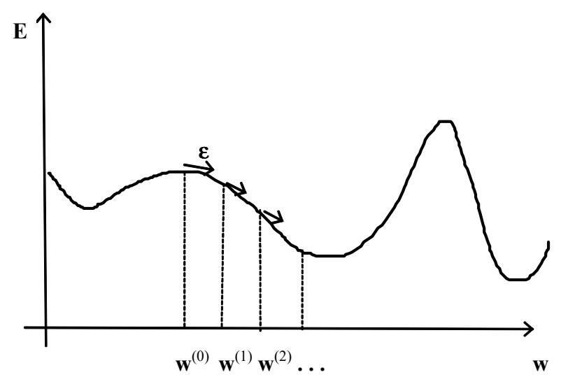

Obrázek 18: Gradientní metoda.

Hlavním problémem gradientní metody je, že pokud již nalezne lokální minimum, pak toto minimum nemusí být globální (viz obr. 18). Uvedený postup adaptace se v takovém minimu zastaví (nulový gradient) a chyba sítě se již dále nesnižuje. To lze v analogii s učením člověka interpretovat tak, že počáteční nastavení konfigurace v okolí nějakého minima chybové funkce určuje možnosti jedince učit se. Inteligentnější lidé začínají svou adaptaci v blízkosti hlubších minim. I zde je však chybová funkce definovaná relativně vzhledem k požadovanému "inteligentnímu" chování (tréninková množina), které však nemusí být univerzálně platné. Hodnotu člověka nelze měřit žádnou chybovou funkcí. Elektrické šoky aplikované v psychiatrických léčebnách připomínají některé metody adaptace neuronových sítí, které v případě, že se učení zastavilo v mělkém lokálním minimu chybové funkce, náhodně vnáší šum do konfigurace sítě, aby se síť dostala z oblastí abstrakce tohoto lokálního minima a mohla popř. konvergovat k hlubšímu minimu.

# Adaptační algoritmus backpropagation [2]:

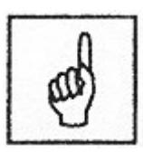

Krok 0. Váhové hodnoty a bias jsou inicializovány malými náhodnými čísly.

Přiřazení inicializační hodnoty koeficientu učení α.

Krok 1. Dokud není splněna podmínka ukončení výpočtu, opakovat kroky (2 až 9).

*Krok 2.* Pro každý (bipolární) tréninkový pár **s:t** provádět kroky (3 až 8).

#### Feedforward:

Krok 3. Aktivovat vstupní neurony  $(X_i, i=1, ...n)$ 

 $x_i = s_i$ ..

Krok 4 Vypočítat vstupní hodnoty vnitřních neuronů:

 $(Z_i, j=1,..., p)$ :

$$z_i i n_j = v_{0j} + \sum_{i=1}^n x_i v_{ij}.$$

Stanovení výstupních hodnot vnitřních neuronů  $z_i = f(z_i n_i)$ .

Krok 5 Stanovení skutečných výstupních hodnoty signálu neuronové sítě  $(Y_k, k=1, ..., m)$ :

$$y_{i}n_{k} = w_{0k} + \sum_{j=1}^{p} z_{j} w_{jk},$$
  
 $y_{k} = f(y_{i}n_{k}).$ 

#### **Backpropagation:**

Krok 6 Ke každému neuronu ve výstupní vrstvě  $(Y_k, k=1, ..., m)$  je přiřazena hodnota očekávaného výstupu pro vstupní tréninkový vzor. Dále je vypočteno  $\delta_k = (t_k - y_k) f'(y_i n_k)$ , které je součástí váhové korekce  $\Delta w_{jk} = \alpha \delta_k z_j$  i korekce biasu  $\Delta w_{0k} = \alpha \delta_k$ .

Krok 7 Ke každému neuronu ve vnitřní vrstvě (Zj, j=1, ..., p) je přiřazena sumace jeho delta vstupů (tj. z neuronů, které se nacházejí v

následující vrstvě), 
$$\delta_{-}in_{j} = \sum_{k=1}^{m} \delta_{k} w_{jk}$$
.

Vynásobením získaných hodnot derivací jejich aktivační funkce obdržíme  $\delta_j = \delta_{-} i n_j f'(z_{-} i n_j)$ , které je součástí váhové korekce  $\Delta v_{ij} = \alpha \delta_j x_i$  i korekce biasu  $\Delta v_{0j} = \alpha \delta_j$ .

#### Aktualizace vah a prahů:

Krok 8 Každý neuron ve výstupní vrstvě ( $Y_k$ , k=1, ..., m) aktualizuje na svých spojeních váhové hodnoty včetně svého biasu (j=0, ..., p):

$$w_{ik}(new) = w_{ik}(old) + \Delta w_{ik}$$
.

Každý neuron ve vnitřní vrstvě ( $Z_j$ , j=1, ..., p) aktualizuje na svých spojeních váhové hodnoty včetně svého biasu (i=0, ..., n):

$$v_{ij}(new) = v_{ij}(old) + \Delta v_{ij}.$$

Krok 9. Podmínka ukončení:
pokud již nenastávají žádné změny váhových
hodnot nebo pokud již bylo vykonáno maximálně
definované množství váhových změn, stop; jinak,
pokračovat.

Ačkoliv vlastní popis učícího algoritmu backpropagation je formulován pro klasický von neumannovský model počítače, přesto je zřejmé, že jej lze implementovat distribuovaně. Pro každý tréninkový vzor probíhá nejprve aktivní režim pro jeho vstup tak, že informace se v neuronové síti šíří od vstupu k jejímu výstupu. Potom na základě externí informace učitele o požadovaném výstupu, tj. o chybě u jednotlivých vstupů, se počítají parciální derivace chybové funkce tak, že signál se šíří zpět od výstupu ke vstupu. Výpočet sítě při zpětném chodu probíhá sekvenčně po vrstvách, přitom v rámci jedné vrstvy může probíhat paralelně.

#### Odvození adaptačního pravidla standardní backpropagation

Symbolem  $w_{JK}$  označíme váhovou hodnotu na spojení mezi vnitřním neuronem  $Z_J$  a neuronem ve výstupní vrstvě  $Y_K$ ; indexy IJ jsou použity analogicky pro váhové spojení mezi neuronem ve vstupní vrstvě  $X_I$  a vnitřním neuronem  $Z_J$ . Indexy uvedené malými písmeny se vyskytují pouze v sumacích. Symbolem f(x)označujeme aktivační funkci libovolného typu. Derivace této aktivační funkce je pak označena symbolem f'. Závislost aktivační funkce na váhových hodnotách je vyjádřena vztahem:

$$y_{-}in_{K} = \sum_{j} z_{j} w_{jK} ,$$

který musíme vyčíslit, abychom nalezli  $f(y_in_K)$ , tj. aktivační hodnotu  $Y_K$  (K. neuronu ve výstupní vrstvě).

Chybovou funkci (tj. funkci váhových hodnot), která má být minimalizována, lze zapsat takto:

$$E = 0.5 \sum_{k} \left[ t_k - y_k \right]^2.$$

Dále následuje odvození váhového přírůstku nejprve pro spojení mezi neurony vnitřní a výstupní vrstvy, tj.  $\Delta w_{JK}$  a potom mezi neurony ve vstupní a vnitřními vrstvě, tj.  $\Delta v_{IJ}$ .

vnitřní vrstvy

váhové hodnoty na spojeních Pro váhové hodnoty na spojeních vedoucích od neuronů vnitřní vrstvy *mezi neurony vstupni a* k neuronům ve *vstupni* vrstvě platí:

$$\frac{\partial E}{\partial w_{JK}} = \frac{\partial}{\partial w_{JK}} 0.5 \sum_{k} [t_{k} - y_{k}]^{2}$$

$$= \frac{\partial}{\partial w_{JK}} 0.5 \sum_{k} [t_{k} - f(y_{in_{K}})]^{2}$$

$$= -[t_{K} - y_{K}] \frac{\partial}{\partial w_{JK}} f(y_{in_{K}})$$

$$= -[t_{K} - y_{K}] f'(y_{in_{K}}) \frac{\partial}{\partial w_{JK}} f(y_{in_{K}})$$

$$= -[t_{K} - y_{K}] f'(y_{in_{K}}) z_{J}.$$

Pro přehlednější zápis výsledných hodnot je výhodné definovat  $\delta_{\!\scriptscriptstyle K}$  :

$$\delta_K = [t_K - y_K] f'(y_in_K).$$


Obrázek 19: Adaptace vah neuronu výstupní vrstvy.

Pro váhové hodnoty na spojeních vedoucích od neuronů *vstupní* vrstvy k neuronům ve *vnitřní* vrstvě platí:

váhové hodnoty na spojeních mezi neurony vnitřní a výstupní vrstvy

$$\frac{\partial E}{\partial v_{IJ}} = -\sum_{k} \left[ t_{k} - y_{k} \right] \frac{\partial}{\partial v_{IJ}} y_{k}$$

$$= -\sum_{k} \left[ t_{k} - y_{k} \right] f'(y_{-}in_{k}) \frac{\partial}{\partial v_{IJ}} y_{-}in_{k}$$

$$= -\sum_{k} \delta_{k} \frac{\partial}{\partial v_{IJ}} y_{-}in_{k}$$

$$= -\sum_{k} \delta_{k} w_{Jk} \frac{\partial}{\partial v_{IJ}} z_{J}$$

$$= -\sum_{k} \delta_{k} w_{Jk} f'(z_{-}in_{J}) [x_{I}].$$

I zde pro přehlednost následujícího zápisu definujme

$$\delta_{J} = -\sum_{k} \delta_{k} w_{Jk} f'(z_{in_{J}}).$$


Obrázek 20: Adaptace vah neuronu vnitřní vrstvy.

váhové přírůstky Vrátíme se opět k indexaci malými písmeny. Váhové přírůstky pak lze zapsat následujícími způsoby: pro váhové hodnoty na spojeních mezi neurony ve *vnitřní* a *výstupní* vrstvě platí

$$\Delta w_{jk} = -\alpha \frac{\partial E}{\partial w_{jk}}$$

$$= \alpha [t_k - y_k] f'(y_i n_k) z_j$$

$$= \alpha \delta_k z_j;$$

a pro váhové hodnoty na spojeních mezi neurony ve *vstupní* a *vnitřní* vrstvě platí

$$\Delta v_{ij} = -\alpha \frac{\partial E}{\partial v_{ij}}$$

$$= \alpha f'(z_i n_j) x_i \sum_k \delta_k w_{jk},$$

$$= \alpha \delta_i x_i.$$

#### 5.2 Modifikované algoritmy učení se zpětným šířením chyby

Popsaná standardní metoda backpropagation se vzhledem ke své jednoduchosti často používá, i když není příliš efektní. Její jednoduchá a celkem frekventovaná modifikace, která se snaží tento nedostatek částečně odstranit, zohledňuje při výpočtu nejen změny vah ve směru gradientu chybové funkce, ale navíc i předešlou změnu vah, tzv. moment ( $\mu$ ). Přírůstky váhových hodnot odvozené standardní metodou backpropagation pak můžeme přepsat do následujících tvarů:

gradientní učení s momentem

$$w_{jk}(t+1) = w_{jk}(t) + \alpha \delta_k z_j + \mu \left[ w_{jk}(t) - w_{jk}(t-1) \right],$$

nebo-li

$$\Delta w_{jk}(t+1) = \alpha \delta_k z_j + \mu \, \Delta w_{jk}(t)$$

a

$$v_{ij}(t+1) = v_{ij}(t) + \alpha \delta_j x_i + \mu \left[ v_{ij}(t) - v_{ij}(t-1) \right],$$

nebo-li

$$\Delta v_{i,i}(t+1) = \alpha \delta_i x_i + \mu \, \Delta v_{i,i}(t) \, ,$$

kde  $0 < \mu < 1$  je parametr momentu, který určuje míru vlivu předchozí změny (obvykle se volí  $\mu = 0.9$ ). Pomocí momentu gradientní metoda lépe opisuje tvar chybové funkce E(w), protože bere do úvahy předchozí gradient.

Doposud jsme se v našem výkladu zabývali pouze adaptací synaptických vah na spojeních mezi neurony, protože jsme pracovali pouze s neurony, které mají stejnou aktivační funkcí, přesněji: aktivační funkci se stejnou strmostí sigmoidu  $\sigma$ . Nicméně nic nebrání tomu, abychom adaptaci podrobili nejen synaptické váhy, ale i výše zmíněné strmosti sigmoidů jednotlivých neuronů. Konfigurace sítě je pak dána vektorem všech vah w a vektorem všech strmostí  $\sigma$ . Při učení adaptujeme tuto konfiguraci tak, že

backpropagation s adaptivní strmostí sigmoidů chybu sítě minimalizujeme gradientní metodou v prostoru vah a strmostí. Tím zvyšujeme stupeň volnosti adaptace, kdy tvar aktivační funkce (tj. míra rozhodnosti jednotlivých neuronů) se může přizpůsobit tréninkové množině a snáze nalezne globální minimum chybové funkce sítě. Na druhou stranu při zvýšení počtu adaptovaných parametrů roste počet numerických operací a učení se zpomaluje.

Sigmoidální aktivační funkce *standardní (logická) sigmoida*, je potom přepsána do následujícího tvaru:

$$f(x) = \frac{1}{1 + e^{-\sigma x}}.$$

Derivace této funkce je pak zapsána takto:  $f'(x) = \sigma f(x)[1 - f(x)]$  a její graf je uveden na obrázku 21.


*Obrázek 21: Binární sigmoida s modifikovanou strmostí:*  $\sigma = 1$  a  $\sigma = 3$ .

Tímto způsobem lze získat tzv. heterogenni síť, kde obecně každý neuron může mít svou aktivační dynamiku. Tato vlastnost ve většině případů zvyšuje schopnost sítě konvergovat k naučenému stavu. Odvození adaptačního pravidla backpropagation s adaptivní strmostí sigmoidu je velmi podobné odvození adaptačního pravidla standardní backpropagation. Aktivační funkce potom závisí nejen na váhových hodnotách, ale i na hodnotě parametru  $\sigma_K$ , který je přiřazen každému neuronu. I když má každý neuron přiřazen svůj parametr  $\sigma_K$ , tvar aktivační funkce je pro všechny tyto neurony identický.

vícevrstvý perceptron s intervalovým stavem excitace Stav  $\langle y_L, y_P \rangle$ . neuronu je zde uveden ve formě interval, jemuž odpovídá vnitřní potenciál, který je rovněž ve formě intervalu  $\langle y\_in_L, y\_in_P \rangle$ , kde  $y_L = f(y\_in_L)$  a  $y_P = f(y\_in_P)$ . To umožňuje definovat také vzory trénovací množiny ve formě intervalu a chybová funkce bude pak součtem obou chybových funkcí, tj. pro dolní i horní hranici intervalu. Adaptace probíhá podle algoritmu popsaného v [5].

#### Nejdůležitější probrané pojmy:

- backpropagation (adaptační algoritmus zpětného šíření chyby),
- generalizace,
- trénovací množina,
- dopředné (feedforward) šíření signálu,
- parametr momentu,
- parametr strmosti,
- heterogenní síť,
- overfitting (přeučení).


## Korespondenční úkol (vybraný úkol vykonejte):

- 1. Vytvořte počítačový program pro realizaci adaptačního algoritmu backpropagation a použijte jej pro logickou funkci "XOR".
- 2. Řešte vybranou logickou funkci standardním adaptačním algoritmem zpětného šíření chyby při stanovení různého počtu neuronů ve vnitřní vrstvě. Získané výsledky řešení srovnejte


# 6 Samoorganizace

#### Cíl:

Po prostudování této kapitoly budete seznámeni:

- modely neuronových sítí, které využívají soutěžní strategie učení;
- s principy soutěžní strategie učení;
- s principem procesu shlukování.


V této kapitole se budeme věnovat modelům neuronových sítí, které využívají soutěžní strategie učení (competitive learning). Společným principem těchto modelů je, že výstupní neurony sítě spolu soutěží o to, který z nich bude aktivní. Na rozdíl od jiných učících principů (např. Hebbovo učení) je tedy v určitém čase aktivní vždy jen jeden neuron.

#### 6.1 Kohonenovy samoorganizační mapy

Tato neuronová síť (angl. Self -Organizing Map) byla poprvé popsána v roce 1982. Je nejdůležitější architekturou vycházející ze strategie soutěžního učení (tj. učení bez učitele). Základním principem učícího je vytvoření množiny reprezentantů pravděpodobnosti výběru. Přesněji, hledáme takové reprezentanty, pro vybereme-li náhodný vstupní vektor z rozdělení pravděpodobnosti odpovídající rozdělení tréninkové množiny, bude mít každý takový reprezentant přiřazenu pravděpodobnost, která je mu nejblíže. Algoritmus tedy nemá informace o požadovaných aktivitách výstupních neuronů v průběhu adaptace, ale adaptace vah odráží statistické vlastnosti trénovací množiny. Jsou-li si tedy dva libovolné vzory blízké ve vstupním prostoru způsobují v síti odezvu na neuronech, které jsou si fyzicky blízké ve výstupním prostoru. Hlavní ideou těchto neuronových sítí je nalézt prostorovou reprezentaci složitých datových struktur. Mnohodimenzionální data se tímto způsobem zobrazují v daleko jednodušším prostoru. Uvedená vlastnost je typická i pro skutečný mozek, kde například jeden konec sluchové části mozkové kůry reaguje na nízké frekvence, zatímco opačný konec reaguje na frekvence vysoké.

organizační dynamika

Jedná se o dvouvrstvou síť s úplným propojením neuronů mezi vrstvami. Výstupní neurony jsou navíc uspořádány do nějaké topologické struktury, nejčastěji to bývá dvojrozměrná mřížka nebo jednorozměrná řada jednotek. Tato topologická struktura určuje, které neurony spolu v síti sousedí (pro adaptační proces je to nezbytné). Pro adaptační proces je rovněž důležité zavést pojem okoli~J výstupního neuronu  $(j^*)$  o poloměru (velikosti) R, což je množina všech neuronů  $(j \in J)$ , jejichž vzdálenost v síti je od daného neuronu  $(j^*)$  menší nebo rovna  $R: J = \{j; d(j,j^*) \le R\}$ .

To, jak měříme vzdálenost  $d(j,j^*)$ , je závislé na topologické struktuře výstupních neuronů. Např. pro lineární oblast obsahující m neuronů ve výstupní vrstvě platí pro všechny  $j \in J$ :  $\max(1, J - R) \le j \le \min(J + R, m)$ .

Obecná architektura Kohonenovy samoorganizační mapy obsahující m neuronů ve výstupní vrstvě (tj.  $Y_1,...,Y_m$ ) a n neuronů ve vstupní vrstvě (tj.  $X_1,...,X_n$ ) je zobrazena na obrázku 22.


Obrázek 22: Kohonenova samoorganizační mapa.

Sousedství neuronu označeného # je pro R=2 { }, R=1 ( ), R=0 [ ] v jednorozměrné výstupní oblasti zobrazeno na obrázku 23 (m=10 je počet neuronů ve výstupní vrstvě)

Obrázek 23: Sousedství definovaná v lineární výstupní oblasti pro různé hodnoty parametru R.

Sousedství neuronu označeného # je pro R=2, l,  $\theta$  ve dvourozměrné pravoúhlé výstupní oblasti zobrazeno na obrázku 24.


Obrázek 24: Sousedství v pravoúhlé dvojrozměrné oblasti.

adaptivní dynamika

Princip *adaptivní dynamiky* je jednoduchý: Procházíme celou tréninkovou množinu a po předložení jednoho tréninkového vzoru proběhne mezi neurony sítě kompetice. Její vítěz pak spolu s neurony, které jsou v jeho okolí, změní své váhové hodnoty. Reálný parametr učení  $0 < \alpha \le 1$  určuje míru změny vah. Na počátku učení je obvykle blízký jedné a postupně se zmenšuje až na nulovou hodnotu, což zabezpečuje ukončení procesu adaptace. Rovněž i velikost okolí R není konstantní: na začátku adaptace je okolí obvykle velké (např. polovina velikosti sítě) a na konci učení potom zahrnuje jen jeden samotný vítězný neuron (tj. R = 0).


#### Kohonenův algoritmus [2]:

Krok 0. Inicializace všech váhových hodnot  $w_{ij}$ : Inicializace poloměru sousedství; tj okolí (R). Inicializace parametru učení  $(\alpha)$ .

Krok 1. Pokud není splněna podmínka ukončení, provádět kroky (2-8). Krok 2. Pro každý vstupní vektor  $\mathbf{x} = (x_1,...,x_n)$  opakovat kroky 3 až 5.

*Krok 3.* Pro každé j (j = 1,..., m) vypočítat:  $D(j) = \sum_{i} (w_{ij} - x_i)^2.$ 

Krok 4. Najít index *J* takový, že *D(J)* je minimum.

Krok 5. Aktualizace váhových hodnot všech neuronů  $(j \in J)$  tvořících topologické sousedství charakterizované indexem J, tj. pro všechna i (i = 1,..., n) platí:  $w_{ij}(new) = w_{ij}(old) + \alpha [x_i - w_{ij}(old)]$ .

Krok 6. Aktualizace parametru učení.

Krok 7. Zmenšení poloměru R topologického sousedství.

Krok 8. Test podmínky ukončení.

Geometrický význam popsaného algoritmu je takový, že vítězný neuron *i* a všichni jeho sousedé v síti, kteří by od něj neměli být příliš vzdáleni ani ve vstupním prostoru, posunou svůj váhový vektor o určitou poměrnou vzdálenost směrem k aktuálnímu vstupu. Motivací tohoto přístupu je snaha, aby vítězný neuron, který nejlépe reprezentuje předložený vstup (je mu nejblíže), ještě více zlepšil svou relativní pozici vůči němu. Problémem vzniklým při adaptaci může být nevhodná náhodná inicializace vah, která vede k blízkým počátečním neuronům ve výstupní vrstvě a tudíž pouze jeden z nich vyhrává kompetici zatímco ostatní zůstávají nevyužity.

V *aktivním režimu* se pak sousedství neuronů neprojevuje: předložíme-li síti vstupní vektor, soutěží výstupní neurony o to, kdo je mu nejblíže a tento neuron se pak excituje na hodnotu rovnu jedné, zatímco výstupy ostatních neuronů jsou rovny nule. Každý neuron tak reprezentuje nějaký objekt, či třídu objektů ze vstupního prostoru: tj. pouze jeden neuron horní

vrstvy, jehož potenciál ( $\Sigma w.x$ ) je maximální odpovídá vstupnímu vektoru x. Tento neuron je navíc schopen rozpoznat celou třídu takových, podobných si vektorů. Princip "vítěz bere vše" se realizuje tzv. *laterální inhibici*; všechny výstupní neurony jsou navzájem propojeny laterálními vazbami, které mezi nimi přenášejí inhibiční signály. Každý výstupní neuron se pak snaží v kompetici zeslabit ostatní neurony silou úměrnou jeho potenciálu, který je tím větší, čím je neuron blíže vstupu. Výsledkem tedy je, že výstupní neuron s největším potenciálem utlumí ostatní výstupní neurony a sám zůstane aktivním.

#### Příklad:

Mějme 4 vektory: (1, 1, 0, 0); (0, 0, 0, 1); (1, 0, 0, ,0); (0, 0, 1, 1).

Maximální počet shluků je: m = 2.

Předpokládejme, že parametr učení je definován vztahy:  $\alpha(0) = 0.6$ ;

 $\alpha(t+1) = 0.5 \ \alpha(t)$ .

Protože jsou k dispozici pouze dva shluky, okolí bodu J (krok 4) je nastaveno tak, že v každém kroku aktualizuje své váhové hodnoty pouze jeden neuron výstupní vrstvy, tj. R = 0.


Krok 0. Inicializace váhové matice:

$$\begin{bmatrix} 0.2 & 0.8 \\ 0.6 & 0.4 \\ 0.5 & 0.7 \\ 0.9 & 0.3 \end{bmatrix}$$

Inicializace poloměru sousedství:

R=0

Inicializace parametru učení:

$$\alpha(0) = 0.6$$
.

Krok 1. Adaptace:

Krok 2. Pro první vektor (1, 1, 0, 0) opakovat kroky 3-5.

Krok 3. 
$$D(1) = (0.2 - 1)^2 + (0.6 - 1)^2 + (0.5 - 0)^2 + (0.9 - 0)^2 = 1.86;$$
  
 $D(2) = (0.8 - 1)^2 + (0.4 - 1)^2 + (0.7 - 0)^2 + (0.3 - 0)^2 = 0.98.$ 

Krok 4. Vstupní vektor je blíže uzlu 2, tak J = 2.

Krok 5. Aktualizace váhových hodnot vítězného neuronu:

$$w_{i2}(new) = w_{i2}(old) + 0.6[x_i - w_{i2}(old)]$$
  
= 0.4w<sub>i2</sub>(old) + 0.6x<sub>i</sub>.

Aktualizace druhého sloupce váhové matice

$$\begin{bmatrix} 0.2 & 0.92 \\ 0.6 & 0.76 \\ 0.5 & 0.28 \\ 0.9 & 0.12 \end{bmatrix}$$

Krok 2. Pro druhý vektor (0, 0, 0, 1) opakovat kroky 3-5.

Krok 3.

$$D(1) = (0.2 - 0)^{2} + (0.6 - 0)^{2} + (0.5 - 0)^{2} + (0.9 - 1)^{2} = 0.66;$$
  

$$D(2) = (0.92 - 0)^{2} + (0.76 - 0)^{2} + (0.28 - 0)^{2} + (0.12 - 1)^{2} = 2.27.$$

Krok 4. Vstupní vektor je blíže uzlu 1, tak J = I.

Krok 5. Aktualizace prvního sloupce váhové matice

$$\begin{bmatrix} 0.08 & 0.92 \\ 0.24 & 0.76 \\ 0.20 & 0.28 \\ 0.96 & 0.12 \end{bmatrix}$$

Krok 2. Pro třetí vektor (1, 0, 0, 0) opakovat kroky 3-5.

Krok 3.

$$D(1) = (0.08 - 1)^{2} + (0.24 - 0)^{2} + (0.2 - 0)^{2} + (0.96 - 0)^{2} = 1.86;$$
  

$$D(2) = (0.92 - 1)^{2} + (0.76 - 0)^{2} + (0.28 - 0)^{2} + (0.12 - 0)^{2} = 0.67$$

Krok 4. Vstupní vektor je blíže uzlu 2, tak J = 2.

Krok 5. Aktualizace druhého sloupce váhové matice

*Krok 2.* Pro čtvrtý vektor (0, 0, 1, 1) opakovat kroky 3-5. *Krok3*.

$$D(1) = (0.08 - 0)^{2} + (0.24 - 0)^{2} + (0.2 - 1)^{2} + (0.96 - 1)^{2} = 0.705;$$
  

$$D(2) = (0.968 - 0)^{2} + (0.304 - 0)^{2} + (0.112 - 1)^{2} + (0.048 - 1)^{2} = 2.72$$

Krok 4. Vstupní vektor je blíže uzlu 1, tak J = 1.

*Krok 5.* Aktualizace prvního sloupce váhové matice

Krok 6. Zmenšení parametru učení:

$$\alpha = 0.5 (0.6) = 0.3.$$

Aktualizace váhových hodnot vítězného neuronu j (j = 1, 2) ve druhém cyklu bude prováděna podle vztahu:

$$w_{ij}(new) = w_{ij}(old) + 0.3[x_i - w_{ij}(old)]$$
  
= 0,7 $w_{ij}(old) + 0.3x_i$ .

Parametr učení zmenšil svou hodnotu během 0.6 na 0.01 a výsledná váhová matice nabývala konverguje k matici:

$$\begin{bmatrix} 0.0 & 1.0 \\ 0.0 & 0.5 \\ 0.5 & 0.0 \\ 1.0 & 0.0 \end{bmatrix}.$$

Její první sloupec nabývá hodnot, které odpovídají průměrným hodnotám složek obou vektorů přiřazeným prvnímu neuronu výstupní vrstvy, tj. vektoru 2: (0,0,0,1) a vektoru 4: (0,0,1,1)). Její druhý sloupec nabývá hodnot, které odpovídají průměrným hodnotám složek obou vektorů přiřazeným druhému neuronu výstupní vrstvy, tj. vektoru 1: (1,1,0,0) a vektoru 3: (1,0,0,0).

Proces shlukování ještě jednou vysvětlíme prostřednictvím funkce hustoty pravděpodobnosti. Tato funkce reprezentuje statistický nástroj popisující rozložení dat v prostoru. Pro daný bod prostoru lze tedy stanovit pravděpodobnost, že vektor bude v daném bodu nalezen. Je-li dán vstupní prostor a funkce hustoty pravděpodobnosti, pak je možné dosáhnout takové organizace mapy, která se této funkci přibližuje (za předpokladu, že je k dispozici reprezentativní vzorek dat). Jinými slovy řečeno, pokud jsou vzory ve vstupním prostoru rozloženy podle nějaké distribuční funkce, budou váhové vektory rozloženy analogicky.

proces shlukování

#### 6.2 Kvantování vektorů učením

(LVG angl. Learning Vector Quantization); Prozatím jsme využívali neuronovou síť Kohonenovy mapy pro učení bez učitele. Nyní se budeme zabývat tím, jak lze tuto síť použít pro řešení problému klasifikace dat do několika kategorií. Ukážeme si způsob, kterým označíme výstupní neurony sítě kategoriemi a uvedeme algoritmy, které se používají pro doučení sítě, jež chceme použít k těmto účelům. Kvantování vektorů učením vychází z uvedených principů Kohonenova učení s jediným rozdílem, že místo již výše zmíněné samoorganizace chceme zajistit abv pro každou kategorii si podobných vektorů existoval jí odpovídající a námi definovaný neuron ve výstupní vrstvě sítě. Nejprve tedy musíme určit kolik takových kategorií či tříd budeme požadovat. Každé této třídě pak přiřadíme jeden neuron výstupní vrstvy. Následuje proces postupného předkládání vektorů vstupního prostoru a adaptace sítě, tentokráte s učitelem, který rozhoduje o správnosti odezvy. Vlastní odezva je realizována stejným způsobem jako v případě Kohonenových map, tj. postavená na základě kompetice. Klíčový rozdíl spočívá ve způsobu úpravy vah neuronové sítě.

Obecná architektura LVQ sítě je totožná s architekturou Kohonenovy mapy zobrazené na obrázku 22 (bez topologické struktury neuronů ve

adaptační algoritmus LVQ výstupní vrstvě). Navíc však má, jak už bylo uvedeno, každý výstupní neuron přiřazenou známou třídu vstupů, které reprezentuje. Cílem adaptačního algoritmu LVQ sítě je nalezení takového neuronu ve výstupní vrstvě (charakterizovaného váhovými hodnotami  $w_c$ ), který je nejbližší pro zadaný vstupní vektor (x). Algoritmus končí, pokud x i  $w_c$  patří do téže třídy klasifikace. Pokud x i  $w_c$  náleží do různých třídy klasifikace, hodnoty váhového vektoru  $w_c$  adaptujeme tak dlouho, aby byl tento nedostatek odstraněn.


#### Dále budeme používat následující označení:

| X                                          | Vstupní tréninkový vektor: $\mathbf{x} = (x_1,, x_i,, x_n)$ .                                  |
|--------------------------------------------|------------------------------------------------------------------------------------------------|
| T                                          | Korektní třída přiřazená tréninkovému vektoru.                                                 |
| w <sub>.j</sub>                            | Vektor vah pro j. neuron ve výstupní vrstvě: $\mathbf{w}_{.j} = (w_{lj}, w_{2j},, w_{nj})^T$ . |
| $C_j$                                      | Třída reprezentující j. neuron ve výstupní vrstvě.                                             |
| $\ \mathbf{x} - \mathbf{w}_{\mathbf{j}}\ $ | Euklidovská vzdálenost mezi vstupním vektorem x a                                              |
|                                            | váhovým vektorem. $j$ . neuronu ve výstupní vrstvě $w_{j}$ .                                   |


#### Adaptační algoritmus LVQ [2]:

Krok 0. Přiřazení tříd vstupním tréninkovým vektorům.
 Inicializace referenčních vektorů (viz příklady).
 Inicializace parametru učení (α).

Krok 1. Pokud není splněna podmínka ukončení, provádět kroky (2 až 6).

Krok 2. Pro každý vstupní vektor  $\mathbf{x} = (x_1,...,x_n)$  opakovat kroky 3 až 4.

*Krok 3.* Nalezení takového *J*, že  $\|\mathbf{x} - \mathbf{w}_J\|$  je minimum.

Krok 4. Aktualizace váhových hodnot  $w_J$ : pokud  $T = C_J$ , pak  $w_J(new) = w_J(old) + \alpha[x - w_{iJ}(old)]$ 

pokud 
$$T \neq C_J$$
, pak  
 $w_J(new) = w_J(old) - \alpha[x - w_{iJ}(old)]$ 

*Krok 6.* Aktualizace parametru učení (zmenšení jeho hodnoty).

Krok 7. Test podmínky ukončení.

V případě, že se jedná o *správnou* odezvu, adaptace probíhá podle známého vztahu:  $w_J(new) = w_J(old) + \alpha [x - w_{iJ}(old)]$ .

Tímto dochází k přiblížení vah neuronu směrem ke vstupnímu vektoru.

V případě *chybné* odezvy bude našim cílem váhy chybného vítěze spíše oddálit od vstupu, což vede k následujícímu předpisu pro adaptaci jeho vah

$$w_J(new) = w_J(old) - \alpha[x - w_{iJ}(old)].$$

*Učení odměnou a trestem* neboli *učení posilováním* (reinforcement learning) je učení, při kterém sice neznáme požadovanou hodnotu výstupu, ale opožděně získáváme z prostředí informace o výsledcích vygenerovaných výstupů. To nám zproztředkovává alespoň nějakou zpětnou vazbu. Toto učení je typické v oblasti robotiky a v multiagentních systémech.

reinforcement learning

#### Nejdůležitější probrané pojmy:

- adaptace bez učitele,
- samoorganizace,
- soutěžní strategie učení (competitive learning),
- laterální inhibice,
- sousedství.
- proces shlukování,
- kvantování vektorů učením (LVO)
- kategorie (tj. třída reprezentující neuron).


#### Úkoly a otázky k textu:

Mějme pět vektorů: (1,1,0,0), (0,0,0,1), (0,0,1,1), (1,0,0,0), (0,1,1,0). Maximální počet shluků je: m=2. Řešte příklad a) algoritmem adaptace Kohonenovy samoorganizační mapy (vhodně si definujte vztah proparametr učení); b) adaptačním algoritmem LVQ (vhodně si rozdělte vstupní vektory do dvou kategorií). Obě řešení porovnejte.


#### Korespondenční úkol:

Vytvořte počítačový program pro realizaci adaptačního algoritmu pracujícího na principu soutěžní strategie učení.


# 7 DOPŘEDNÁ SÍŤ TYPU COUNTERPROPAGATION

#### Cíl:

Po prostudování této kapitoly budete seznámeni:

- s modelem umělé neuronové sítě Counterpropagation;
- s adaptačním algoritmem pro neuronové sítě typu counterpropagation.


Counterpropagation je model umělé neuronové sítě (navržené Hecht Nielsenem v r. 1986), která se snaží využít samoorganizační síť v kombinaci s dalším přídavným mechanismem k řešení problémů učení s učitelem. Síť, kterou dále popíšeme je pouze jednou z možných variant této neuronové sítě. Síť counterpropagation pracuje jako vyhledávací tabulka (lookup table), která k danému vstupu najde nejbližšího reprezentanta a odpoví výstupní hodnotou, která je s tímto reprezentantem spojena.

Dopředná síť typu counterpropagation (angl. Forward-Only Counterpropagation) je tvořena třemi vrstvami neuronů (viz obrázek 25). Vstupní vrstvu tvoří n vstupních neuronů distribuujících do další vrstvy vstupní signály  $x_1,...,x_n$ . Druhá vrstva je tvořena p samoorganizačními jednotkami (viz Kohonenovy samoorganizační mapy), které jsou vzájemně propojeny, což není z obrázku patrné. Třetí vrstvu tvoří m Grossbergových jednotek instar. Jejich výstupy pak tvoří výstupy celé neuronové sítě.


Obrázek 25 : Dopředná síť typu counterpropagation

adaptační algoritmus

Adaptivní dynamika této sítě probíhá ve dvou fázích. Nejprve se Kohonenovým učením bez učitele nastaví váhy  $v_{ij}$  (i=1,...,n;j=1,...,p) samoorganizačních jednotek mezi vstupní a vnitřní vrstvou. Po skončení první fáze učení, ve které se používá jen vstupní části tréninkových vzorů, se váhy v fixují a dochází ke druhé fázi učení, která nastaví váhy  $w_{jk}$  ( $j=1,...,p;\ k=1,...,m$ ) mezi vnitřní a výstupní vrstvou. V této části adaptačního algoritmu je vypočten aktuální výstup sítě pro všechny neurony výstupní vrstvy a porovnán s požadovaným výstupem sítě. Pokud není splněna podmínka ukončení, jsou váhové hodnoty w upravovány tzv. Grossbergovým adaptačním pravidlem (viz dále).

Pravidlo pro adaptaci váhových hodnot mezi vstupní a vnitřní vrstvou

$$v_{iJ}(new) = v_{iJ} + \alpha(x_i - v_{iJ})$$
$$= (1 - \alpha)v_{iJ}(old) + \alpha x_i,$$

kde J je index vítězného neuronu v kompetici po předložení vstupu x,;

 $x_i$  je inicializační hodnota i. neuronu ve vstupní vrstvě;

α je parametr učení; snižuje svou velikost v čase (0<α<1); doporučená inicializační hodnota je 0.6.

Pravidlo pro adaptaci váhových hodnot mezi vnitřní a výstupní vrstvou

$$w_{Jk}(new) = w_{Jk} + a(y_k - w_{Jk})$$
  
=  $(1-a)w_{Jk}(old) + ay_k$ ,

kde  $w_{Jk}$  je skutečná aktivace k. neuronu ve výstupní vrstvě;

a je parametr učení; snižuje svou velikost v čase (0.5 < < 0.8);

 $y_k$  je očekávaná aktivace k. neuronu ve výstupní vrstvě.

Aktivace neuronů vnitřní vrstvy definujeme následovně:

$$z_j = \begin{cases} 1 & \text{pokud } j = J \\ 0 & \text{jinak.} \end{cases}$$

Adaptační pravidlo pro váhové hodnoty na spojeních mezi *vnitřní* a *výstupní* vrstvou přepíšeme do tvaru delta pravidla (*Grossbergovo adaptační pravidlo*):

$$w_{ik}(new) = w_{ik} + a z_i(y_k - w_{Jk}).$$

#### Adaptační algoritmus [2]:

Krok 0. Inicializace všech váhových hodnot, parametrů učení, atd.

*Krok 1.* Pokud není splněna podmínka ukončení *1. fáze* adaptace, provádět kroky 2 až 7.


- *Krok 2.* Pro každý vstupní vektor  $\mathbf{x} = (x_1,...,x_n)$  opakovat kroky 3 až 5.
  - Krok 3. Aktivovat vstupní vrstvu vektorem x.
  - Krok 4. Najít vítěze kompetice ve vnitřní vrstvě, označit jeho index J.
  - Krok 5. Aktualizace váhových hodnot na spojeních vedoucích k neuronu  $Z_J$ , tj. pro všechna i (i = 1,..., n) platí:
    - $v_{iJ}(new) = (1 \alpha)v_{iJ}(old) + \alpha x_i$
  - Krok 6. Snížit hodnotu parametru učení α.
  - Krok 7. Test podmínky ukončení 1. fáze.
- Krok 8. Pokud není splněna podmínka ukončení 2. fáze adaptace, provádět kroky 9 15.

(*Poznámka*: α má během celé 2. fáze adaptace velmi malou konstantní hodnotu.)

- *Krok 9.* Pro každý tréninkový vstupní pár vektorů  $\mathbf{x}:\mathbf{y}$ ;  $(\mathbf{x} = (x_1,...,x_n), \mathbf{y} = (y_1,...,y_m))$ , opakovat kroky 10 až 13.
  - Krok 10. Aktivovat vstupní vrstvu vektorem x; Aktivovat výstupní vrstvu vektorem y.
  - Krok 11. Najít vítěze kompetice ve vnitřní vrstvě, označit jeho index *J*.
  - Krok 12. Aktualizace váhových hodnot na spojeních ze vstupní vrstvy do neuronu  $Z_J$  ( $\alpha$  je velmi malé), tj. pro všechna i (i = 1,..., n) platí:  $v_{i,l}(new) = (1 \alpha)v_{i,l}(old) + \alpha x_i$
  - Krok 13. Aktualizace váhových hodnot na spojeních vedoucích z neuronu  $Z_J$  do výstupní vrstvy, tj. pro všechna k (k = 1,..., m) platí:  $w_{I,k}(new) = (1-a)w_{I,k}(old) + ay_k$ ,
- Krok 14. Snížit hodnotu parametru učení a. Krok 15. Test podmínky ukončení 2. fáze.


Shrňme nyní statistické vlastnosti naučené sítě: Díky samoorganizačnímu učení s využitím lokální paměti aproximují vektory v hustotu pravděpodobnosti vzorů. Víme, že neurony ve druhé vrstvě mají stejnou pravděpodobnost vítězství v kompetici, za předpokladu, že vybíráme vstupy náhodně s rozložením odpovídajícím tréninkové množině. Dále váhy výstupních neuronů jsou adaptovány tak, aby aproximovaly průměrnou výstupní hodnotu patřící těm vstupům, které aktivovaly odpovídající neurony ve druhé vrstvě.

Používáme-li síť typu counterpropagation k aproximování nějakého zobrazení,  $f: \mathbf{R}^n \to \mathbf{R}^m$ , chová se optimálně v tom smyslu, že reprezentanti vstupů jsou zvoleni tak, aby měli stejnou pravděpodobnost výběru a výstupní hodnoty představují průměr funkčních hodnot v okolí těchto reprezentantů.

Nespornou výhodou neuronové sítě typu counterpropagation je rychlost její adaptace, nevýhodou pak je menší přesnost odezvy ve srovnáním s metodou backpropagation.

# Nejdůležitější probrané pojmy:

- Grossbergovy jednotky "instar",
- Grossbergovo adaptační pravidlo,


## Úkoly a otázky k textu:

Srovnejte řešení logické funkce "XOR" standardním adaptačním algoritmem vícevrstvé neuronové sítě (backpropagation) a adaptačním algoritmem modelu counterpropagation.


# 8 HOPFIELDOVA SÍŤ

#### Cíl:

Po prostudování této kapitoly budete seznámeni:

- s modelem Hopfieldovy sítě;
- s principy adaptace diskrétní Hopfieldovy sítě;
- s energetickou funkcí Hopfieldovy sítě.


Model Hopfieldovy sítě vychází z iterační autoasociativní paměti. Proto se nejprve důkladně seznámíme asociativními pamětmi neuronových sítí. V závěru kapitoly pak bude uveden model diskrétní i spojité Hopfieldovy sítě.

#### 8.1 Asociativní neuronové sítě

asociativní paměť

Organizační i aktivní dynamika asociativní sítě je téměř identická jako u modelu *Madaline*. Jediný rozdíl spočívá v tom, že lineární asociativní síť v aktivním režimu místo afinních kombinací počítá jen lineární kombinace vstupů, tj. nemá formální jednotkový vstup rovněž i odpovídající biasy jsou nulové. V geometrické interpretaci to znamená, že příslušné nadroviny odpovídající výstupním neuronům sítě prochází počátkem. Asociativní paměti neuronových sítí jsou sítě, ve kterých jsou váhové hodnoty determinovány takovým způsobem, aby si sítě byly schopny zapamatovat množinu P asociovaných vzorů. Každou asociaci tvoří pár vektorů (s(p), t(p)), kde p = 1, 2, ..., P). Každý vektor s(p) obsahuje nkomponent a každý vektor t(p) obsahuje m komponent. Váhové hodnoty na příslušných spojích mohou být nalezeny např. Hebbovým adaptačním pravidlem pro asociované neuronové sítě. Slovně jej lze vyjádřit takto: změna synaptické váhy spoje mezi dvěma neurony je úměrná jejich souhlasné aktivitě, tj. součinu jejich stavů (opačná aktivita tuto vazbu asociativní síť zeslabuje). Lineární má schopnost reprodukce, tj. předložíme-li síti vstup (vstupní vektor x ), pak na něj odpoví požadovaným výstupem (výstupní vektor v). Vstupní vektor x může být buď vektorem z tréninkové množiny, nebo jiným vektorem (tj. vektorem z tréninkové množiny obsahující šum).

heteroasociativní paměť

Architektura heteroasociativní paměti neuronové sítě je zobrazena na obrázku 26. Její adaptace probíhá podle Hebbova adaptačního pravidla pro asociativní neuronové sítě.


Obrázek 26: Architektura heteroasociativní paměti neuronové sítě.

Hebbovo adaptační pravidlo pro asociativní neuronové sítě je nejběžnější metodou pro stanovení váhových hodnot na spojích mezi jednotlivými neurony. Pracuje s vektory, které jsou zapsány v binární i bipolární reprezentaci. Jeho algoritmus probíhá v následujících krocích. Algoritmus není vhodný pro dopředné neuronové sítě, které adaptujeme metodou backpropagation.

#### Hebbovo adaptační pravidlo pro asociativní neuronové sítě [2]:

Krok 0. Inicializace všech váhových hodnot  $w_{ij} = 0$ , (i = 1,...,n; j = 1,...m).

Krok 1. Pro každý testovací vzor, tj. tréninkový pár **s:t,** opakovat kroky (2 až 4).

Krok 2. Inicializovat vrstvu X vnějším vstupním vektorem.

 $x_i = s_i$ , (i = 1,...,n).

Krok 3. Inicializovat vrstvu Y vnějším vstupním vektorem..

 $y_j = t_j$ , (j = 1,...m).

Krok 4. Nastavit váhové hodnoty (i = 1,...,n;

j = 1,...m);

 $w_{ij}(new) = w_{ij}(old) + x_i y_j$ .


Nejprve inicializujeme všechny váhové hodnoty číslem 0, tj.  $w_{ij} = 0$ , (i = 1,...,n; j = 1,...m). Vstupní vektor  $\mathbf{s} = (s_1, ..., s_i, ..., s_n)$  tvoří sloupcovou matici  $\mathbf{S}$  typu  $n \times 1$ , tj  $\mathbf{S} = \mathbf{s}^T$ . Asociovaný výstupní vektor  $\mathbf{t} = (t_1, ..., t_j, ..., t_m)$  tvoří řádkovou matici  $\mathbf{T}$  typu  $1 \times m$ , tj  $\mathbf{T} = \mathbf{t}$ . Součin obou matic  $\mathbf{S}$  a  $\mathbf{T}$  pak tvoří váhovou matici, ve které jsou uloženy informace o asociovaném páru vektorů  $\mathbf{s} : \mathbf{t}$ .


$$\mathbf{ST} = \begin{bmatrix} s_1 \\ \vdots \\ s_i \\ \vdots \\ s_n \end{bmatrix} \begin{bmatrix} t_1 & \cdots & t_j & \cdots & t_m \end{bmatrix} = \begin{bmatrix} s_1t_1 & \cdots & s_1t_j & \cdots & s_1t_m \\ \vdots & \ddots & \vdots & \ddots & \vdots \\ s_it_1 & \cdots & s_it_j & \cdots & s_it_m \\ \vdots & \ddots & \vdots & \ddots & \vdots \\ s_nt_1 & \cdots & s_nt_j & \cdots & s_nt_m \end{bmatrix}$$

Jelikož budeme dále pracovat s P vzory, musí být i ve váhové matici uložené informace o P asociovaných vektorech s(p):t(p), p = 1, 2, ..., P, kde  $s(p) = (s_1(p), ..., s_i(p), ..., s_n(p))$  a  $t(p) = (t_1(p), ..., t_j(p), ..., t_m(p))$ . Tyto

vektory tvoří váhovou matici  $\mathbf{W} = \{w_{ij}\}, \text{ tj. } w_{ij} = \sum_{p=1}^{P} s_i(p) t_j(p),$ 

která má ve vektorové reprezentaci tvar:

$$\mathbf{W} = \sum_{p=1}^{P} \mathbf{s}^{T}(p)\mathbf{t}(p).$$

Nyní můžeme přistoupit k popisu algoritmu heteroasociativní paměti, který nalezne pro každý vstupní vektor x vhodný výstupní vektor y. Vstupní vektor x může být, jak již bylo uvedeno, buď jedním z naučených vzorů, nebo novým vzorem (např. tréninkovým vzorem obsahujícím šum). Heteroasociativní paměť není iterační.

# Adaptační algoritmus heteroasociativní paměti [2]:


Krok 0. Inicializace všech váhových hodnot  $w_{ij}$ , (i = 1,...,n; j = 1,...m) podle Hebbova pravidla adaptace pro asociativní sítě.

*Krok 1.* Pro vstupní vektor  $\mathbf{x} = (x_1, ..., x_i, ..., x_n)$  opakovat kroky (2 až 4).

Krok 2. Inicializovat vrstvu X daným vstupním vektorem.

Krok 3. Vypočítat potenciál výstupních neuronů  $y_i in_j = \sum_i x_i w_{ij}$ , (j = 1,..., m).

Krok 4a. Vypočítat aktivaci výstupních neuronů;

$$y_j = \begin{cases} 1 & \text{pokud } y_i in_j > 0 \\ 0 & \text{pokud } y_i in_j = 0 \\ -1 & \text{pokud } y_i in_j < 0, \end{cases}$$

pro bipolární reprezentaci (práh  $\theta = 0$ ).

Vypočítat aktivaci výstupních neuropů:

Krok 4b. Vypočítat aktivaci výstupních neuronů; 1 pokud v in > 0

$$y_j = \begin{cases} 1 & \text{pokud } y_i = in_j > 0 \\ 0 & \text{pokud } y_i = in_j \le 0, \end{cases}$$

pro binární reprezentaci(práh  $\theta = 0$ ).

autoasociativní paměť

Dopředné autoasociativní neuronové sítě jsou speciálním případem heteroasociativních sítí. Pro autoasociativní sítě jsou oba tréninkové vektory (tj. vstupní vektor s a výstupní vektor t) identické. Každou asociaci proto tvoří pár vektorů s(p):s(p), kde p=1,2,...,P. Každý vektor s(p) obsahuje n komponent. Váhové hodnoty na příslušných spojích jsou rovněž nastaveny Hebbovým adaptačním pravidlem pro asociativní neuronové sítě (při řešení úloh jsou dosahovány lepší výsledky s vektory pracující s bipolární reprezentací než s vektory pracující v binární reprezentaci).

#### Příklad:

Popíšeme proces uložení jednoho vzoru reprezentovaného vektorem s = (1, 1, 1, -1) v autoasociativní paměti a pak jeho následné vybavení.

Krok 0. Vektor s = (1, 1, 1, -1) je uložen ve váhové matici

$$\mathbf{W} = \begin{bmatrix} 1 & 1 & 1 & -1 \\ 1 & 1 & 1 & -1 \\ 1 & 1 & 1 & -1 \\ -1 & -1 &$$

Krok 1. Pro vstupní vektor s = (1, 1, 1, -1).

Krok 2. 
$$\mathbf{x} = (1, 1, 1, -1).$$

Krok 3. 
$$y_{in} = (4, 4, 4, -4).$$

Krok 4a. 
$$y = f(4, 4, 4, -4) = (1, 1, 1, -1).$$

Vidíme, že vektor y je totožný s vektorem s. Lze tedy říci, že na vstup byl dodán vektor z tréninkové množiny.

Speciálním případem autoasociativní neuronové sítě je *iterativní autoasociativní síť*. Z následujícího příkladu uvidíme, že síť v určitém případě nereaguje přímo na vstupní signál naučeným výstupem. Pokud vstupní signál není totožný s naučeným vzorem, ale liší se od něj pouze v tom smyslu, že místo +1 nebo -1 obsahuje 0, potom lze výstupní hodnoty ze sítě opět považovat za její vstupní signál, atd. Požadovaný výstupní signál pak dostaneme po určitém počtu *iteraci*.

iterativní autoasociativní paměť

#### Příklad:

Mějme v autoasociativní paměti uložen jeden vzor reprezentovaný vektorem s = (1, 1, 1, -1). Váhová matice má tvar (v autoasociativních sítích nejsou neurony spojeny samy se sebou, je tedy běžnější zapisovat váhovou matici s nulami na hlavní diagonále, aniž by to mělo vliv na další řešení úlohy):


$$\mathbf{W} = \begin{bmatrix} 0 & 1 & 1 & -1 \\ 1 & 0 & 1 & -1 \\ 1 & 1 & 0 & -1 \\ -1 & -1 & -1 & 0 \end{bmatrix}.$$

Vstupní vektor s = (1, 0, 0, 0) je případ vektoru, ve kterém jsou na rozdíl od naučeného vzoru nahrazeny tři jeho komponenty nulami. Iterační proces pak s tímto vektorem probíhá následovně:

Vstupní vektor s = (1, 0, 0, 0):

$$(1, 0, 0, 0) \cdot W = (0, 1, 1, -1) \rightarrow iterace$$
  
 $(0, 1, 1, -1) \cdot W = (3, 2, 2, -2) \rightarrow (1, 1, 1, -1),$ 

což je uložený vzor. Pokud je tedy na vstupu vektor (1, 0, 0, 0), tak po dvou iteracích bude na výstupu vektor (1, 1, 1, -1).

#### 8.2 Diskrétní Hopfieldova síť


Obrázek 27: Model diskrétní Hopfieldovy sítě.

Diskrétní Hopfieldova síť se používá jako iterační autoasociativní paměť. Autorem této neuronové sítě je John Hopfield, který se zabýval studiem neuronů podobných perceptronům. Model Hopfieldovy neuronové sítě je založen na využití energetické funkce svázané s neuronovou sítí tak, jak je to běžné u fyzikálních systémů. Organizační dynamika diskrétní Hopfieldovy sítě specifikuje úplnou topologii cyklické neuronové sítě s n neurony, kde každý neuron v síti je spojen se všemi ostatními neurony sítě, tj. má všechny neurony za své vstupy. Obecně platí, že může být spojen i sám se sebou. Všechny neurony v síti jsou tedy zároveň vstupní i výstupní. Architektura Hopfieldovy sítě je znázorněna na obrázku 27. Každý spoj

v síti mezi neuronem i (i = 1, ..., n) a neuronem j (j = 1, ..., n) je ohodnocen celočíselnými synaptickými vahami  $w_{ij}$  a  $w_{ji}$ , které jsou symetrické, tj.  $w_{ij} = w_{ji}$ . V základním modelu platí, že žádný neuron není spojen sám se sebou, tj. odpovídající váhy  $w_{jj} = 0$  (j = 1, ..., n) jsou nulové.

Hlavní myšlenka adaptace Hopfieldova modelu spočívá v tom, že jsou nejprve inicializovány všechny neurony sítě buď binárními hodnotami {0, 1} nebo bipolárními hodnotami {-1,+1}. Vzhledem k tomu, že jsou všechny neurony navzájem propojeny, začnou se ovlivňovat. To znamená, že jeden neuron se snaží ostatní neurony excitovat na rozdíl od jiného, který se snaží o opačné. Probíhá cyklus postupných změn excitací neuronů až do okamžiku nalezení kompromisu - síť relaxovala do stabilního stavu. Jinými slovy výstupy předchozího kroku se staly novými vstupy současného kroku. Tento proces je vysvětlitelný následujícím algoritmem: tréninkové vzory nejsou v Hopfieldově síti uloženy přímo, ale jsou reprezentovány pomocí vztahů mezi stavy neuronů.

První popis adaptačního algoritmu Hopfieldovy sítě pochází z roku 1982 a používá binární hodnoty pro excitace neuronů. Požadovaná funkce sítě je specifikována tréninkovou množinou P vzorů  $\mathbf{s}(p), p = 1, ..., P$ , z nichž každý je zadán vektorem n binárních stavů vstupních resp. výstupních neuronů, které v případě autoasociativní paměti splývají:

$$\mathbf{s}(p) = (s_1(p), \dots, s_i(p), \dots, s_n(p)),$$

potom je váhová matice  $W = \{w_{ij}\}$  dána následujícím vztahem:

$$w_{ij} = \sum_{p} [2s_i(p) - 1][2s_j(p) - 1]$$
 pro  $i \neq j$ 

a  $w_{i,j} = 0$ .

Jiný popis adaptačního algoritmu Hopfieldovy sítě pochází z roku 1984 a pracuje s bipolárními hodnotami pro excitace neuronů. Požadovaná funkce sítě je rovněž specifikována tréninkovou množinou P vzorů  $\mathbf{s}(p)$ , p=1,...,P, z nichž každý je zadán vektorem n bipolárních stavů vstupních resp. výstupních neuronů, které v případě autoasociativní paměti splývají:

$$\mathbf{s}(p) = (s_1(p), \dots, s_i(p), \dots, s_n(p)),$$

potom je váhová matice  $\mathbf{W} = \{w_{ij}\}$  dána následujícím vztahem:

$$w_{ij} = \sum_{p} s_i(p) s_j(p)$$
 pro  $i \neq j$ 

a 
$$w_{i,i} = 0$$
.

princip adaptace diskrétní Hopfieldovy sítě

# Adaptační algoritmus Hopfieldovy sítě [2]:


Krok 0. Inicializace vah, tj. zapamatování vzorů.

Použitím Hebbova adaptačního pravidla pro asociované

Dokud síť nezrelaxovala do stabilního stavu, opakovat kroky (1 až 7).

Pro každý vstupní vektor x, opakovat kroky (2 až 6). Krok 1. Inicializace sítě vnějším vstupním vektorem x: Krok 2.

$$y_i = x_i, (i = 1, ..., n)$$

Krok 3. Pro každý neuron  $Y_i$  opakovat kroky (4 až 6). (Neurony jsou uspořádány náhodně)

Krok 4 Vypočítat vnitřní potenciál neuronu:

$$y_{in_i} = x_i + \sum_j y_j w_{ji}.$$

Krok 5 Stanovení výstupu neuronu lze chápat jako aplikaci aktivační funkce:

$$y_i = \begin{cases} 1 & \text{pokud } y_{-}in_i > \theta_i \\ y_i & \text{pokud } y_{-}in_i = \theta_i \\ 0 & \text{pokud } y_{-}in_i < \theta_i \end{cases}$$

Krok 6 Transport hodnoty  $y_i$  ostatním neuronům. (Takto budeme aktualizovat hodnoty aktivačního vektoru.)

Krok 7. Test konvergence.

Prahová hodnota  $\theta_i$  je obvykle nulová. Aktualizace neuronů probíhají sice v náhodném pořadí, ale musí být prováděny stejnou průměrnou rychlostí.

#### Příklad:


Pomocí diskrétního Hopfieldova modelu určete, zda je vstupní vektor "naučeným" vzorem (tj. byl součástí trénovací množiny).

Krok 0. Váhová matice pro zapamatování vektoru (1, 1, 1, 0) (přepis vektoru do bipolární reprezentace (1, 1, 1, -1)) má tvar:

$$\mathbf{W} = \begin{bmatrix} 0 & 1 & 1 & -1 \\ 1 & 0 & 1 & -1 \\ 1 & 1 & 0 & -1 \\ -1 & -1 & -1 & 0 \end{bmatrix}$$

Vstupní vektor je x = (0, 0, 1, 0). Krok 1.

Pro tento vektor opakovat kroky (2 až 6).

Krok 2. 
$$y = (0, 0, 1, 0)$$
.

Krok 3. Vybrat 
$$Y_I$$
 a aktualizovat jeho aktivaci:  
Krok 4  $y_i in_1 = x_1 + \sum_j y_j w_{j1} = 0 + 1$ .

Krok 5 
$$y in_1 > 0 \rightarrow y_1 = 1$$
.

Krok 6 
$$y = (1, 0, 1, 0)$$
.

Krok 3. Vybrat  $Y_4$  a aktualizovat jeho aktivaci:

Krok 4  $y_{-}in_4 = x_4 + \sum_j y_j w_{j4} = 0 + (-2)$ .

Krok 5  $y_{-}in_1 < 0 \rightarrow y_4 = 0$ .

Krok 6  $y = (1, 0, 1, 0)$ .

Krok 3. Vybrat  $Y_3$  a aktualizovat jeho aktivaci:

Krok 4  $y_{-}in_3 = x_3 + \sum_j y_j w_{j3} = 1 + 1$ .

Krok 5  $y_{-}in_3 > 0 \rightarrow y_3 = 1$ .

Krok 6  $y = (1, 0, 1, 0)$ .

Krok 3. Vybrat  $Y_2$  a aktualizovat jeho aktivaci:

Krok 4  $y_{-}in_2 = x_2 + \sum_j y_j w_{j2} = 0 + 2$ .

Krok 5  $y_{-}in_2 > 0 \rightarrow y_2 = 1$ .

Krok 6  $y_{-}in_2 > 0 \rightarrow y_2 = 1$ .

Krok 6  $y_{-}in_2 > 0 \rightarrow y_2 = 1$ .

Krok 6  $y_{-}in_2 > 0 \rightarrow y_2 = 1$ .

*Krok 7.* Test konvergence.

Aktivace každého neuronu byla aktualizována alespoň jednou během celého výpočtu. Vstupní vektor konverguje k uloženému vzoru.

K lepšímu pochopení aktivní dynamiky Hopfieldovy sítě byla Hopfieldem, v analogii s fyzikálními ději definována tzv. *energetická funkce E* sítě, která každému stavu sítě přiřazuje jeho potenciální energii. Energetická funkce je tedy funkce, která je zdola ohraničená a pro daný stav systému je nerostoucí. V teorii neuronových sítí se *stavem systému* rozumí množina aktivací všech neuronů. Pokud je již tato energetická funkce nalezena, bude síť konvergovat ke stabilní množině aktivací neuronů v daném časovém okamžiku. Energetická funkce pro diskrétní Hopfieldovu síť je dána následovně:

$$E = -0.5 \sum_{i \neq j} \sum_{j} y_{i} y_{j} w_{ij} - \sum_{i} x_{i} y_{i} + \sum_{i} \theta_{i} y_{i}.$$

Z definice energetické funkce vyplývá, že stavy sítě s nízkou energií mají největší stabilitu. Pokud se aktivace sítě změní o  $\Delta y_i$ , změna energie je pak dána následovně:

$$\Delta E = - \left[ \sum_{j} y_{j} w_{ij} + x_{i} - \theta_{i} \right] \Delta y_{i}.$$

Vztah závisí na skutečnosti, že v daném časovém okamžiku může svou aktivaci aktualizovat vždy pouze jeden neuron sítě. Nyní uvažujme dva případy, které mohou nastat při změně  $\Delta y_i$  v aktivaci neuronu  $Y_i$ .;  $\Delta y_i$  je

kladné, pokud je i výraz 
$$\left[\sum_{j} y_{j} w_{ij} + x_{i} - \theta_{i}\right]$$
 kladný a  $\Delta y_{i}$  je záporné,

pokud je tentýž výraz záporný. V obou případech je  $\Delta E < 0$ , tj. energie

funkce energie

nemůže růst. Protože je energetická funkce ohraničená, síť musí dosáhnout stabilního stavu (tj. energie se v následujících iteracích již nemění).

Hopfieldova síť má ve srovnání s vícevrstvou sítí adaptovanou učícím algoritmem backpropagation opačný charakter aktivní a adaptivní dynamiky. Zatímco adaptace Hopfieldovy sítě podle Hebbova zákona je jednorázovou záležitostí, jejíž trvání závisí jen na počtu tréninkových vzorů, učící algoritmus backpropagation realizuje iterativní proces minimalizující chybu sítě gradientní metodou bez záruky konvergence. Na druhou stranu délka trvání aktivní fáze vícevrstvé sítě je dána pouze počtem vrstev, zatímco aktivní režim Hopfieldovy sítě představuje iterativní proces minimalizující energii sítě diskrétní variantou gradientní metody s nejistou konvergencí. Cílem adaptace Hopfieldovy sítě podle Hebbova zákona je nalezení takové konfigurace, aby funkce sítě v aktivním režimu realizovala autoasociativní paměť. To znamená: bude-li vstup sítě blízký nějakému tréninkovému vzoru, výstup sítě by měl potom odpovídat tomuto vzoru. Z hlediska energie by každý tréninkový vzor měl být lokálním minimem energetické funkce, tj. stabilním stavem sítě. V jeho blízkém okolí, v tzv. oblasti atrakce, se nachází všechny vstupy blízké tomuto vzoru. Ty představují počáteční stavy sítě, ze kterých se při minimalizaci energetické funkce v aktivním režimu síť dostane do příslušného minima, ti. stabilního stavu odpovídajícího uvažovanému tréninkovému vzoru. Geometricky se tedy energetická plocha rozpadá na oblasti atrakce lokálních minim a příslušná funkce Hopfieldovy sítě přiřadí v aktivním režimu ke každému vstupu náležejícímu do oblasti atrakce nějakého lokálního minima právě toto minimum. Při učení Hopfieldovy sítě podle Hebbova zákona pro asociativní sítě samovolně vznikají na energetické ploše lokální minima, tzv. nepravé vzory (fantomy), které neodpovídají žádným tréninkovým vzorům. Výstup sítě pro vstup dostatečně blízký takovému fantomu neodpovídá žádnému vzoru, a tudíž nedává žádný smysl. Existují varianty adaptivní dynamiky Hopfieldovy sítě, při nichž se takto vzniklé fantomy mohou dodatečně odučit.

kapacita Hopfieldovy paměti Hopfield experimentálně nalezl, že počet binárních vzorů, který může být zapamatován a opětovně vyvolán s požadovanou přesností, je dán přibližně  $P \approx 0.15n$ , kde n je počet neuronů v síti. Pro sítě pracující s bipolárními vzory byl odvozen obdobný vztah:

$$P \approx \frac{n}{2\log_2 n}.$$

I když se v praxi ukazuje, že uvedené teoretické odhady jsou poněkud nadhodnocené, přesto základní model Hopfieldovy autoasociativní paměti má díky své malé kapacitě spíše teoretický význam. V literatuře přesto existuje mnoho modifikací tohoto modelu, které se snaží uvedený nedostatek odstranit.

Spojitá Hopfieldova síť je příkladem modelu, u kterého je spojitá Hopfieldova síť vývoj reálného stavu v aktivním režimu nejen spojitou

funkcí vnitřního potenciálu, ale navíc i spojitou funkcí času. Aktivní dynamika je v takových případech obvykle zadána diferenciální rovnicí, jejíž řešení nelze explicitně vyjádřit, proto tyto modely (pokud nepracujeme s jejich diskrétní verzí) nejsou vhodné pro analogovou hardwarovou implementaci pomocí elektrických obvodů. Protože spojitá Hopfieldova síť je modifikací diskrétní Hopfieldovy sítě, jsou také spojení mezi libovolnými dvěma neurony obousměrné a rovněž i váhové hodnoty na těchto spojeních isou symetrické. Spojitá Hopfieldova síť může být použita buď jako autoasociativní paměť (stejně jako diskrétní Hopfieldova nebo k řešení optimalizačních problémů zadaných formou omezujících podmínek. Mezi takto zadané úlohy patří např. problém obchodního cestujícího. Princip hledání lokálního minima energetické funkce Hopfieldovy sítě je v této úloze využitelný zcela jiným způsobem než bylo zatím uvedeno: Dokážeme-li formulovat omezení nějaké optimalizační úlohy ve formě energetické funkce neuronové sítě, pak proces její relaxace povede k nalezení některého z optimálních, či alespoň suboptimálních řešení. Ve srovnání z předchozím tedy nemůžeme síť adaptovat na základě prvků trénovací množiny, ale stanovíme váhy na základě porovnání obecně definované funkce energie Hopfieldovy sítě a energetické funkce vyjadřující naše omezující podmínky. Tento proces probíhá v adaptivním režim sítě. V aktivním režimu potom hledá síť přípustné řešení daného problému [2].

#### Nejdůležitější probrané pojmy:

- heteroasociativní paměť;
- autoasociativní paměť;
- diskrétní Hopfieldova síť,
- spojitá Hopfieldova síť,
- proces relaxace,
- energetická funkce sítě.

#### Úkoly a otázky k textu:

Důkladně si ještě jednou prostudujte adaptaci Hopfieldovy sítě (včetně obou řešených příkladů). V další kapitole budeme na ni navazovat!


# 9 DVOUSMĚRNÁ ASOCIATIVNÍ PAMĚŤ

#### Cíl:

Po prostudování této kapitoly budete seznámeni:

- s diskrétním modelem dvousměrné asociativní paměti;
- se spojitým modelem dvousměrné asociativní paměti.


Dvousměrná asociativní paměť (BAM angl. Bidirectional Associative Memory) je variantou heteroasociativní rekurentní neuronové sítě. Autorem řady publikací toto téma je především B.Kosko a C.Guest.


Obrázek 28: Dvousměrná asociativní paměť.

Dvousměrná asociativní paměť si v adaptivním režimu zapamatuje množinu asociovaných vzorů jako sumaci bipolárních korelačních matic (typu m, n pro každý zapamatovaný vzor). Struktura BAM je dána dvěmi vrstvami neuronů (vrstva X obsahuje n neuronů a vrstva Y obsahuje m neuronů), které jsou vzájemně úplně propojeny obousměrnými vazbami (viz obrázek 28). Jestliže váhová matice pro signál transportovaný vrstvou X do vrstvy Y je W, pak váhová matice pro signál transportovaný vrstvou Y do vrstvy X je  $W^T$ . Aktivní režim BAM probíhá tak, že si neurony obou vrstev neustále posílají mezi sebou signál (tj. oběma směry), až všechny neurony dosáhnou rovnovážný stav (tj. aktivace se nemění během několika kroků). Existují tři základní varianty BAM - binární, bipolární a spojitá.

diskrétní BAM

Obě formy BAM (tj. binární i bipolární) jsou velmi příbuzné. V každé z nich lze váhové hodnoty nalézt ze sumace aktivačních hodnot neuronů odpovídajících si tréninkových párů. Aktivační funkce je skoková s možností nenulového prahu.

*Vytvoření váhové matice*: váhová matice pro zapamatování množiny vstupních a odpovídajících výstupních vektorů s(t) : t(p), p = 1, ..., P, kde

 $\mathbf{s}(p) = (s_1(p), ..., s_i(p), ..., s_n(p))$  a  $\mathbf{t}(p) = (t_1(p), ..., t_j(p), ..., t_m(p))$ , může být determinována Hebbovým pravidlem pro asociované sítě. Zápis výsledných hodnot pro váhovou matici  $\mathbf{W}$  závisí na tom, jestli je tréninkový vektor binární nebo bipolární. Pro binární vstupní vektory je váhová matice  $\mathbf{W} = \{w_{ij}\}$  tvořená prvky, které jsou definovány následujícím vztahem:

$$w_{ij} = \sum_{p} (2s_i(p) - 1)(2t_j(p) - 1).$$

Pro bipolární vstupní vektor je váhová matice  $\mathbf{W} = \{w_{ij}\}$  tvořená prvky, které jsou definovány následujícím vztahem:

$$w_{ij} = \sum_{p} s_i(p) t_j(p).$$

*Aktivační funkcí pro diskrétní BAM* je odpovídající skoková funkce, která závisí na kódování tréninkových vektorů. Pro *binární* vstupní vektory má aktivační funkce pro vrstvu *Y* tvar:

$$y_j = \begin{cases} 1 & \text{pokud } y_i in_j > 0 \\ y_j & \text{pokud } y_i in_j = 0 \\ 0 & \text{pokud } y_i in_j < 0, \end{cases}$$

a aktivační funkce pro vrstvu X má tvar:

$$x_i = \begin{cases} 1 & \text{pokud } x_i in_i > 0 \\ x_i & \text{pokud } x_i in_i = 0 \\ 0 & \text{pokud } x_i in_i < 0. \end{cases}$$

Pro bipolární vstupní vektory má aktivační funkce pro vrstvu Y tvar:

$$y_{j} = \begin{cases} 1 & \text{pokud } y_{-}in_{j} > \theta_{j} \\ y_{j} & \text{pokud } y_{-}in_{j} = \theta_{j} \\ -1 & \text{pokud } y_{-}in_{j} < \theta_{j}, \end{cases}$$

a aktivační funkce pro vrstvu X má tvar:

$$x_{i} = \begin{cases} 1 & \text{pokud } x_{-}in_{i} > \theta_{i} \\ x_{i} & \text{pokud } x_{-}in_{i} = \theta_{i} \\ -1 & \text{pokud } x_{-}in_{i} < \theta_{i}. \end{cases}$$


# Adaptační algoritmus BAM:

Krok 0. Inicializace vah, tj. zapamatování P vzorů.

Krok 1. Pro každý testovací vzor opakovat kroky (2 až 6).

Krok 2a. Inicializovat vrstvu X vnějším vstupním vektorem x. (tj. nastavit aktivace neuronů ve vrstvě X hodnotami vektoru x)

Krok 2b. Inicializovat vrstvu Y vnějším vstupním vektorem y. (Jeden ze dvou vstupních vektorů musí být nulový vektor.)

*Krok 3.* Pokud aktivace neuronů nekonvergují, opakovat kroky (4 až 6).

Krok 4. Aktualizovat aktivace neuronů ve vrstvě Y. Vypočítat vnitřní potenciál neuronu:

$$y_{-}in_{j} = \sum_{i} w_{ij} x_{i}.$$

Vypočítat aktivace neuronů

$$y_j = f(y_in_j).$$

Transportovat signál vrstvě X.

Krok 5. Aktualizovat aktivace neuronů ve vrstvě X. Vypočítat vnitřní potenciál neuronu:

$$x_{-}in_{i} = \sum_{j} w_{ij} y_{j}.$$

Vypočítat aktivace neuronů

$$x_i = f(x_in_i).$$

Transportovat signál vrstvě Y.

Krok 6. Test konvergence.

Pokud aktivace vektorů *x* a *y* dosáhly rovnovážného stavu, pak stop; jinak pokračovat.


#### Příklad:

Načrtněme nyní možnosti použití diskrétní sítě BAM s bipolárním kódováním vektorů, která mapuje dva jednoduché znaky následujícím způsobem:

|    | #    |   |   |   | #     | #  |
|----|------|---|---|---|-------|----|
| #  |      | # | 7 | # |       |    |
| #  | #    | # | 7 | # |       |    |
| #  |      | # | 7 | # |       |    |
| #  |      | # |   |   | #     | #  |
| (- | 1. 1 | ) |   |   | (1, 1 | 1) |

Váhové matice jsou potom vyjádřeny takto:

$$\begin{array}{c|ccccccccccccccccccccccccccccccccccc$$

Nyní ověříme správnost zapamatování obou vstupních vzorů:

VSTUPNÍ VZOR A:

$$(-1\ 1\ -1\ 1\ 1\ 1\ 1\ 1\ 1\ 1\ 1\ 1\ 1\ 1)\ W = (-14, 16) \to (-1, 1).$$

VSTUPNÍ VZOR C:

$$(-1\ 1\ 1\ 1\ -1\ -1\ 1\ -1\ -1\ -1\ -1\$$

Dále ukážeme, že i vrstva Y může být použitá jako vstupní vrstva. Váhovou matici W musíme pro tento účel transponovat, tj.

$$\mathbf{W}^{\mathrm{T}} = \begin{bmatrix} 0 & 0 & 2 & 0 & 0 & -2 & 0 & -2 & -2 &$$

Pro vstupní vektor asociovaný se vzorem  $A: (-1, 1) x W^T =$ 

$$\begin{array}{cccccccccccccccccccccccccccccccccccc$$

což je vzor A.

Pro vstupní vektor asociovaný se vzorem  $C: (1, 1) x W^T =$ 

$$\begin{array}{cccccccccccccccccccccccccccccccccccc$$

což je vzor C.

Informace o obou vzorech jsou uloženy ve váhové matici W. Síť je tedy ukončila fázi adaptace a je připravena k aktivní fázi.

spojitá BAM

Spojitá dvousměrná asociativní paměť transformuje použitím sigmoidní aktivační funkce hladký a spojitý vstupní signál z intervalu [0,1] na signál výstupní. Pro binární vstupní vektory  $s(t):t(p),\ p=1,...,P$ , jsou váhové hodnoty determinovány již dříve uvedeným vztahem

$$w_{ij} = \sum_{p} (2s_i(p) - 1)(2t_j(p) - 1).$$

Aktivační funkce je logistická sigmoida

$$f(x) = \frac{1}{1 + \exp(-y_{in_j})},$$

kde

$$y_i i n_j = b_j + \sum_i x_i w_{ij} .$$

Analogické vztahy lze odvodit i pro neurony ve vrstvě X.

kapacita paměti BAM

Kapacita paměti BAM je velmi omezená. Kosko odhadl, že její maximální velikost je min(n, m), kde n je počet neuronů ve vrstvě X a m je počet neuronů ve vrstvě Y. Snahou současného výzkumu a vývoje je zdokonalit BAM tak, aby toto omezení bylo redukováno na maximální možnou míru a aby bylo možné plně využít tak možnosti modelu neuronové sítě.

#### Nejdůležitější probrané pojmy:


- dvousměrná asociativní paměť
- kapacita paměti BAM.

# **Úkoly a otázky k textu:**

Použijte diskrétní síť BAM, která mapuje tři jednoduché znaky následujícím způsobem:


```
. # . # . # # # # 
# # # . # . # . # 
. # . # . # # # # 
(-1 1 –1 1 1 1 –1 1 –1) (1 –1 1 –1 1 –1 1 –1 1) (1 1 1 1 –1 1 1 1 1 ).
```

# **Koresponden**č**ní úkol:**

Vytvořte počítačový program pro realizaci adaptačního algoritmu diskrétní sítě BAM.


# 10 POSTAVENÍ NEURONOVÝCH SÍTÍ V INFORMATICE

#### Cíl:

Po prostudování této kapitoly budete seznámeni:

- aplikacemi neuronových sítí;
- implementacemi neuronových sítí;
- principy neuropočítačů.


V této závěrečné kapitole se postupně zamyslíme nad třemi tématy: (1) neuronové sítě a von neumanovská architektura počítače; (2) aplikace neuronových sítí a (3) implementace neuronových sítí a neuropočítače.

#### 10.1 Neuronové sítě a von neumanovská architektura počítače


Text kapitoly je převážně převzat z [6]. V jistém smyslu neuronové sítě představují univerzální výpočetní prostředek, a tedy mají stejnou výpočetní sílu jako klasické počítače např. von neumannovské architektury. Tato jejich vlastnost by vzhledem k existenci stovek různých univerzálních výpočetních modelů nebyla tak výjimečná. Hlavní výhodou a zároveň odlišností neuronových sítí od klasické von neumannovské architektury je jejich schopnost učit se. Požadovanou funkci sítě neprogramujeme tak, že bychom popsali přesný postup výpočtu její funkční hodnoty, ale síť sama abstrahuje a zobecňuje charakter funkce v adaptivním režimu procesu učení ze vzorových příkladů. V tomto smyslu neuronová síť připomíná inteligenci člověka, který získává mnohé své znalosti a dovednosti ze zkušenosti, kterou ani není ve většině případů schopen formulovat analyticky podle příslušných pravidel či algoritmu.

V následujícím výkladu uvedu několik motivačních příkladů, které nám pomohou tento fenomén pochopit. Typickým příkladem je balancování tyče na koštěti. Byla sestrojena neuronová síť, která dokázala napodobit dovednost cirkusového klauna, který na svém nose drží koště ve vertikální poloze. Při vlastním experimentu byl použit speciální vozík, na kterém bylo koště volně upevněno (pro jednoduchost v jedné rovině) tak, že by bez zachycení spadlo. Neuronová síť se učila nejprve na základě odchylky (úhlu) koštěte od vertikální polohy a později od filtrovaného obrazu násady koštěte snímaného kamerou určit posuv vozíku (v jedné přímé dráze) tak, aby koště nespadlo. Tréninkové vzory pro její adaptaci, kde vstup odpovídal filtrovanému obrazu koštěte a výstup posuvu vozíku, byly získány od demonstrátora (při zpomalené počítačové simulaci), který nějaký čas pohyboval vozíkem tak, aby koště nespadlo. Po čase neuronová síť sama úspěšně převzala jeho úlohu řízení (již skutečného) vozíku. I zde by bylo možné teoreticky sestavit diferenciální rovnice pro pohyb vozíku, ale než by je klasický počítač von neumannovské architektury vyřešil, koště by pravděpodobně spadlo. Podobným příkladem popsaným

v literatuře je řízení přítoku látek potřebných ve složitém výrobním procesu, kde je prakticky nemožné sestavit analytický model. V praxi byla tato činnost prováděna zkušeným pracovníkem, který na základě informací z různých měřidel reguloval pomocí pák přítok jednotlivých látek. Uvedený pracovník není schopen vyjádřit prostřednictvím přesných pravidel pohyb s regulačními pákami. I zde byla zapojena neuronová síť, která se na základě příkladů stavů měřidel a odpovídajících reakcí pracovníka sama po nějakém čase naučila regulovat přítok látek. Z uvedených příkladů vyplývá, že neuronová síť modeluje schopnost člověka učit se z příkladů dovednosti či znalosti, které není schopen řešit algoritmicky pomocí klasických počítačů von neumannovské architektury, protože chybí analytický popis nebo jejich analýza je příliš složitá. Tomu potom odpovídají oblasti aplikace neuronových sítí (viz dále), kde klasické počítače selhávají. Např. v případě rozpoznávání písmen si není možné pamatovat všechny možné tvary obrazu jednotlivých písmen. Dalším ilustračním příkladem důležitosti generalizační schopnosti lidské inteligence, je příprava studenta na zkoušku z matematiky. Je zřejmé, že naučení všech vzorových příkladů ve sbírce nazpaměť bez náležitého pochopení postupů řešení nezaručuje úspěšné složení zkoušky. Student pravděpodobně u zkoušky neuspěje, pokud nedostane identický příklad ze sbírky, ale bude mu zadána úloha jen s podobným postupem řešení. Nestačí se totiž nazpaměť naučit vzorové příklady, ale je potřeba umět zobecnit zákonitosti jejich řešení. Schopnost učit se zobecňovat je typickou vlastností lidské inteligence. Velkým problémem pro hodnocení generalizační schopnosti neuronové sítě je, že není jasné, jakým způsobem definovat, co je správná generalizace. Prozatím neumíme definovat (formalizovat), a tedy ani měřit generalizační schopnosti neuronových sítí, chybí základní kritérium, které by rozhodlo, jaké modely neuronových sítí jsou v konkrétním případě dobré, či lepší než jiné apod. Generalizační schopnosti navržených modelů neuronových sítí se většinou ilustrují na jednotlivých příkladech, které (možná díky vhodnému výběru) vykazují dobré vlastnosti, ale tyto vlastnosti nelze nijak formálně ověřit (dokázat). Úspěšné aplikace neuronových sítí při řešení důležitých praktických úloh, kde klasické počítače neuspěly a simulace (velmi zjednodušených modelů) biologických neuronových sítí vykazují prvky podobné lidské inteligenci, tj. tyto modely vystihují určité rysy, důležité pro napodobení inteligentních činností člověka, které počítače von neumannovské architektury postrádají. Základním rysem biologických nervových systémů je hustě propojená síť velkého počtu výpočetních prvků (neuronů), které samy počítají jen jednoduché funkce, což v případě matematických modelů neuronových sítí pravděpodobně vytváří výpočetní paradigma postačující k napodobení inteligentního chování. Systematická logika a přesnost klasických počítačů je u neuronových sítí nahrazena asociací s neurčitostí. kdy se k novému problému "vybaví"sdružený (podobný) vzorový příklad (tréninkový vzor), ze kterého je zobecněno jeho řešení. Také místo explicitní reprezentace dat v paměti klasických počítačů jsou informace v neuronových sítích zakódovány implicitně a jednotlivým číselným parametrům sítě (kromě vstupů a výstupů) není přiřazen přesný význam. Zatímco klasické počítače jsou citlivé na chybu a změna jednoho bitu může znamenat celkový výpadek systému, *neuronové sítě jsou robustní*. Odebráním několika málo neuronů nemusí síť nutně ztratit svou funkčnost, ale způsobí to třeba jen menší nepřesnost výsledných odpovědí. Dále u klasických počítačů von neumannovské architektury je sekvenční běh programu lokalizován např. pomocí čítače instrukcí. *V neuronových sítích je výpočet distribuován po celé síti a je paralelní*. Při srovnávání modelů neuronových sítí s klasickou von neumannovskou architekturou počítače je možné vypozorovat střet dvou inteligencí: biologické a křemíkové. Východiskem, které může nalézt v dnešním přetechnizovaném světě širší uplatnění, je symbióza obou přístupů. Myšlenka vytvořit počítač ke svému obrazu nabývá v poslední době konkrétnější podoby.

#### 10.2 Aplikace neuronových sítí

Text kapitoly je převážně převzat z [6]. Neuronové sítě v současnosti patří mezi významnou část počítačově orientované umělé inteligence, kde zaujali postavení univerzálního matematicko-informatického přístupu ke studiu a modelování procesů učení. Kromě umělé inteligence mají neuronové sítě nezastupitelné uplatnění také v kognitivní vědě, lingvistice, neurovědě, řízení procesů, přírodních a společenských vědách, kde se pomocí nich modelují nejen procesy učení a adaptace, ale i široké spektrum různých problémů klasifikace objektů a také problémů řízení složitých průmyslových systémů. Původním cílem výzkumu neuronových sítí byla snaha pochopit a modelovat způsob, jakým myslíme a způsob, jak funguje lidský mozek. Při vytváření modelů umělých neuronových sítí nám nejde o vytvoření identických kopií lidského mozku, ale napodobujeme zde pouze některé jeho základní funkce. Neurofyziologie zde slouží jen jako zdroj inspirací a navržené modely umělých neuronových sítí jsou dále rozvíjeny bez ohledu na to, zda modelují lidský mozek, či nikoliv. Nejvýznamnější oblasti použití umělých neuronových sítí jsou následující:

rozpoznávání obrazců

Neuronové sítě lze přirozeným způsobem použít k *rozpoznávání obrazců*, např. rozpoznávání znaků. Obraz jednoho znaku nejprve odseparujeme od okolního textu (např. se určí krajní body obrazu) a potom se znormuje, tj. zobrazí do standardizované matice (např.  $15 \times 10 = 150$ ) bodů. Jednotlivé body pak odpovídají vstupům neuronové sítě, které jsou aktivní. právě když čára v obrazu zasahuje příslušné body. Každý výstupní neuron v síti představuje možný znak, který je rozpoznán, právě když je tento neuron aktivní. Tréninkovou množinu lze např. vytvořit přepsáním nějakého textu, který je již k dispozici v počítači. Neuronovou síť pak lze pomocí této množiny učit tak dlouho, dokud není sama schopna rozpoznávat příslušné znaky. Tímto postupem můžeme v relativně krátké době docílit spolehlivosti např. 95% správně rozpoznaných znaků. Podobný postup lze využít např. v robotice pro zpracování vizuálních informací či při vyhodnocování družicových snímků apod.

oblast řízení

Další možnou oblastí aplikace neuronových sítí je *řízení* složitých zařízení v dynamicky se měnících podmínkách. V minulé kapitole jsme uvedli dva

motivační příklady z této oblasti: balancování koštěte a regulace přítoku látek ve složitém výrobním procesu. Dalším demonstračním příkladem řídícího systému popsaného v literatuře je autopilot automobilu, který se v počítačové simulaci pohybuje na dvouproudé dálnici spolu s auty jedoucími stejným směrem. Auto řízené neuronovou sítí určovalo na základě vzdálenosti a rychlosti nejbližších aut v obou pruzích svou vlastní rychlost a změnu pruhu. Dále neuronová síť ovládala volant podle zakřivení dálnice, polohy auta v pruhu a aktuálního úhlu volantu. Je zajímavé, že neuronová síť se kromě úspěšného řízení vozidla (bez kolizí) včetně předjíždění naučila i různé zvyky a styl jízdy (např. riskantní rychlá jízda a časté předjíždění nebo naopak opatrná pomalá jízda) podle řidičů - trenérů, od kterých byly získány tréninkové vzory.

Jinou důležitou aplikační oblastí neuronových sítí je *predikce* a příp. následné *rozhodování*. Typickými příklady z této oblasti jsou předpověď počasí, vývoj cen akcií na burze, spotřeba elektrické energie apod. Např. při meteorologické předpovědi jsou vstupem neuronové sítě odečty základních parametrů (např. teplota, tlak apod.) v čase a učitelem je skutečný vývoj počasí v následujícím období. Uvádí se, že u předpovědi počasí v rozpětí několika dnů byla síť úspěšnější než meteorologové.

Jiným příkladem uplatnění neuronových sítí je *analýza signálů* jako např. EKG, EEG apod. Spojitý signál je vzorkován ve stejných časových intervalech a několik posledních diskrétních hodnot úrovně signálu slouží jako vstup do např. dvouvrstvé neuronové sítě. Naučená neuronová síť je schopna identifikovat specifický tvar signálu, který je důležitý pro diagnostiku. Např. neuronová síť s topologií 40 - 17 - 1 byla použita pro klasifikaci EEG signálů se specifickými α-rytmy.

Další oblastí aplikace neuronových sítí je transformace signálů, jehož příkladem je systém NETtalk, určený pro převod anglicky psaného textu na mluvený signál. Tento systém je založen na neuronové síti s topologií 203 - 80 - 26 s 7×29 vstupními neurony pro zakódování kontextu 7 písmen psaného textu odpovídá jeden neuron, který je při jejich výskytu aktivní. 80 skrytými neurony v mezilehlé vrstyě 26 výstupními neurony reprezentují fonény odpovídajícího mluveného signálu. Funkce sítě je následující: vstupní text se postupně přesouvá u vstupních neuronů po jednom písmenu zprava doleva a přitom je aktivní právě ten výstupní neuron, který reprezentuje fonén odpovídající prostřednímu ze 7 písmen vstupního textu. V našem příkladě se čte prostřední písmeno "C" v anglickém slově "CONCEPT" s výslovností ['konsept], kterému odpovídá fonén [s]. Stejné písmeno "C" na začátku tohoto slova však v daném kontextu odpovídá fonénu [k]. Úspěšná implementace systému NETtalk vedla ke snaze vytvořit systém založený na neuronové síti s obrácenou funkcí, která by převáděla mluvený jazyk do psané formy (tzv. fonetický psací stroj).

Další možností využití neuronových sítí je *komprese dat* např. pro přenos televizního signálu, telekomunikaci apod. Pro tento účel byla vyvinuta technika použití neuronové sítě se dvěma vnitřními vrstvami a s topologií n - n/4 - n/4 - n (tj. n neuronů ve vstupní vrstvě, n/4 neuronů ve vnitřních

predikce

analýza signálů

transformace signálů

komprese dat

vrstvách a n neuronů ve výstupní vrstvě). Počet neuronů ve vnitřních vrstvách je výrazně menší než je počet neuronů ve vstupní a výstupní vrstvě. Počet neuronů ve vstupní i výstupní vrstvě je stejný, protože obě vrstvy reprezentují stejný obrazový signál. Tato neuronová síť se učí různé obrazové vzory tak, že vstup i výstup tréninkových vzorů představují totožný obraz. Síť tak pro daný obrazový vstup odpovídá přibližně stejným výstupem. Při vlastním přenosu je pro daný obrazový signál u vysílače nejprve vypočten stav skrytých neuronů a takto komprimovaný obraz je přenášen informačním kanálem k příjemci, který jej dekóduje výpočtem stavů výstupních neuronů. Tímto způsobem je získán téměř původní obraz. Při vlastním experimentu se ukázalo, že kvalita přenosu (srovnatelná s jinými způsoby komprese dat) závisí na tom, zda jsou přenášené obrazy podobné tréninkovým vzorům, na které se síť adaptovala.

expertní systémy

Posledním oborem aplikace neuronových sítí, který zde uvedeme, jsou expertní systémy. Velkým problémem klasických expertních systémů založených na pravidlech je vytvoření báze znalostí, která bývá časově velmi náročnou záležitostí s nejistým výsledkem. Neuronové sítě představují alternativní řešení, kde reprezentace znalostí v bázi vzniká učením z příkladových inferencí. V tomto případě aktivní režim neuronové sítě zastupuje funkci inferenčního stroje. Na druhou stranu implicitní reprezentace znalostí neumožňuje pracovat s neúplnou informací a neposkytuje zdůvodnění závěrů, což jsou vlastnosti, bez kterých se prakticky použitelný expertní systém neobejde. Tento problém částečně řeší univerzální neuronový expertní systém EXPSYS, který obohacuje vícevrstvou neuronovou síť o intervalovou aritmetiku pro práci s nepřesnou informací a o heuristiku analyzující síť, která umožňuje jednoduché vysvětlení závěrů. Systém EXPSYS byl úspěšně aplikován v energetice a medicíně. Např. v lékařské aplikaci jsou zakódované příznaky onemocnění a výsledky různých vyšetření vstupem do neuronové sítě a diagnózy, popř. doporučená léčba jsou jejím výstupem. Tréninkovou množinu lze získat z kartotéky pacientů.

#### 10.3 Implementace neuronových sítí a neuropočítače

Text kapitoly je převážně převzat z [6]. Odlišná architektura neuronových sítí vyžaduje speciální hardwarovou realizaci. V této souvislosti hovoříme o tzv. neuropočítačích. Avšak vzhledem k rozšířenosti klasických počítačů a kvůli problémům spojeným s hardwarovou realizací neuronových sítí zatím nejjednodušší implementací neuronových sítí, se kterou se nejčastěji setkáváme, je tzv. netware, což je software pro klasické počítače, který modeluje práci neuronové sítě. Jedná se většinou o demonstrační programy s efektním uživatelským rozhraním, které simulují práci nejznámějších modelů neuronových sítí na jednoduchých příkladech. Dokonalejší netware většinou podporuje využití specializovaných koprocesorů, které efektivně implementují neuronové funkce a urychlují časově náročné učení.

neuropočítače

Vlastní neuropočítače většinou nepracují samostatně, ale jsou napojeny na klasické počítače, které mohou realizovat např. uživatelské rozhraní. To je dáno především tím, že neuropočítače nejsou používány jako univerzální počítače, ale převážně fungují jako specializovaná zařízení pro řešení specifických úloh, Malé neuropočítače jsou spojeny přímo se sběrnicí klasického počítače a větší se mohou uplatnit jako servery na lokální síti. Podle způsobu aktualizace parametrů neuronové sítě rozdělujeme neuropočítače na spojité a diskrétní a podle tvpu reprezentace těchto číselných parametrů máme analogové, digitální, resp. hybridní (kombinace analogových a digitálních) neuropočítače. Zřídkakdy jeden neuron v implementované síti odpovídá jednomu procesoru neuropočítače (tzv. plně implementované neuropočítače), což se využívá pro velmi rychlé výpočty v reálném čase. Většinou se konstruují tzv. virtuální neuropočítače, kde jeden procesor vykonává práci stovek i tisíců neuronů části implementované neuronové sítě. Z hlediska technologie je většina neuropočítačů založena na klasické mikroelektronice, kde neurony odpovídají hradlům (např. speciálním tranzistorům) a váhy synaptických spojů jsou reprezentovány rezistorovými vazbami. Tento přístup však s sebou přináší technické problémy jako je velká hustota propojení neuronů (roste řádově kvadraticky vzhledem k počtu neuronů) nebo adptabilita vah u všech těchto spojů. Proto je adaptivní režim neuronové sítě někdy předem realizován odděleně pomocí dostupného netwaru na klasickém počítači a výsledná konfigurace sítě je napevno zapojena do příslušného obvodu neuropočítače. Stále více se zde také uplatňuje optoelektronika a dlouhodobější výhledy počítají s úplně odlišnými technologiemi, jako např. molekulární elektronika, hybridní biočipy apod.

Vývojáři ze společnosti Infineon Technologies a z Ústavu Maxe Plancka zkonstruovali nový čip schopný snímat elektrický signál vysílaný živými nervovými buňkami, viz obr. 29. Zařízení označované jako "Neuro-chip" zřejmě nebude průmyslově vyráběno a počítá se pouze s několika dodávkami pro specializovaná vědecká pracoviště. Předpokládá se, že technologie najde využití např. při testování nových léků, kdy bude možné zkoumat reakce nervových buněk na potenciální léčivo. Celá technologie byla prozatím vyzkoušena na mozcích slimáků. Neurčip je vyroben zcela standardně technologií CMOS. Jednotlivé senzory čipu jsou přitom od sebe vzdálené 8 mikrometrů a právě tato obrovská hustota má představovat hlavní zlepšením oproti stávajícím obdobným produktům. Velikost neuronu se totiž pohybuje mezi 10 a 50 mikrometry, takže při přiložení čipu ke zkoumanému vzorku by mělo být možné odečíst signál ze všech neuronů - včetně detailnějších údajů o šíření signálu vodivými vlákny. Čip je schopen zaznamenat v jediném okamžiku signál odečtený na všech svých více než 16 000 senzorech, a tak umožnit sledovat časový vývoj nikoliv jen jednotlivých neuronů, ale i zkoumaného systému jako celku. Senzor se přitom navíc vyznačuje velkou citlivostí a dokáže detekovat změny vysílaného signálu v řádu pouhých 100 mikrovoltů.

neuropočip


Obrázek 29: Neuročip zkonstruovaný vývojáři ze společnosti Infineon Technologies a z Ústavu Maxe Plancka.

# Nejdůležitější probrané pojmy:


- NETtalk.
- neuropočítače,
- netware.

## Korespondenční úkol:


Vypracujte seminární práci na téma "*Použití neuronových sítí v ...*" (*oblast použití si zvolte sami*). Informace hledejte především na www-stránkách. Zaměřte se pouze na jednu oblast, v níž použití neuronových sítí rozeberete podrobněji. Nedělejte přehled použití neuronových sítí v různých oblastech.

# **Literatura**

- **[1]** Beale, R. Jackson, T.: Neural Computing: An Introduction. J W Arrowsmith Ltd, Bristol, Greit Britain 1992.
- **[2]** Fausett, L. V.: Fundamentals of Neural Networks. Prentice-Hall, Inc., Englewood Cliffs, New Jersey 1994.
- **[3]** Herz, J. Krogh, A. Palmer, R. G.: Introduction to the Theory of Neural Computation. Addison Wesley Publishing Company, Redwood City 1991.
- **[4]** Kvasnička, V. Beňušková, L. Pospíchal, J. Farkaš, I. Tiňo, P. Kráľ, A.:Úvod do teórie neurónových sietí. IRIS, Bratislava 1997.
- **[5]** Šíma, J. Generalized back propagation for interval training patterns, *Neural Network World* **2** (1992), 167-173.
- **[6]** Šíma, J. Neruda, J.: Teoretické otázky neuronových sítí. Matfyzpress, Praha 1996.
- **[7]** Volná, E.: Neuronové sítě a genetické algoritmy. Skripta Ostravské univerzity, Ostrava 1998.
- **[8]** McCulloch, W. S., Pitts, W. H.: A logical calculus of the ideas immanent in nervous activity. *Bulletin of Mathematical Biophysics*, **5** (1943), 115-133.

