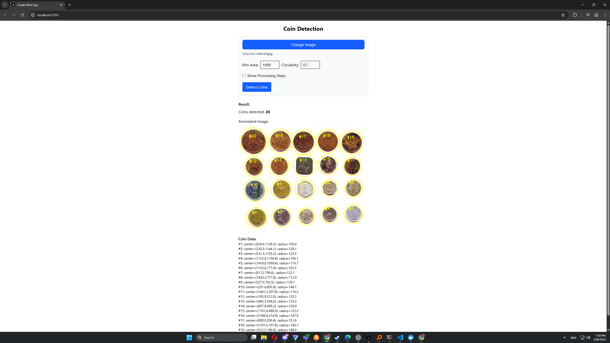

# Coin Detection and Counting App

This project is a web application for detecting and counting coins in images using computer vision techniques. The backend is built with **FastAPI** and **OpenCV**, while the frontend uses **Next.js** (React).

## How It Works

1. **Frontend**: Users upload an image via the web interface.
2. **Backend**: The image is sent to the FastAPI server, which uses OpenCV to detect and count coins.
3. **Results**: The backend returns the count, coin data, and annotated images, which are displayed in the frontend.

---

## Running the Project

### Prerequisites

- [Docker](https://www.docker.com/) and [Docker Compose](https://docs.docker.com/compose/) installed.

### Quick Start (Recommended)

From the root of the project (`2GZAV_PocitaniMinci`):

```bash
docker compose up
```

- The **backend** will be available at [http://localhost:8000](http://localhost:8000)
- The **frontend** will be available at [http://localhost:3000](http://localhost:3000)

Open your browser and go to [http://localhost:3000](http://localhost:3000) to use the app.

---

### Manual Start (For Development)

#### Backend

1. Install Python 3.12 and [pip](https://pip.pypa.io/en/stable/).
2. Install dependencies:

    ```bash
    cd backend
    pip install -r requirements.txt
    ```

3. Run the backend:

    ```bash
    python app.py
    ```

#### Frontend

1. Install [Node.js](https://nodejs.org/) (v18+ recommended) and [pnpm](https://pnpm.io/).
2. Install dependencies:

    ```bash
    cd frontend
    pnpm install
    ```

3. Run the frontend:

    ```bash
    pnpm dev
    ```

---

## API Endpoints

- `POST /detect` — Detect and count coins in an image.
- `POST /detect/steps` — Get detection steps and annotated images.

---

## Technologies Used

- **Python**, **FastAPI**, **OpenCV**, **NumPy**
- **React**, **Next.js**, **TypeScript**
- **Docker**, **Docker Compose**


